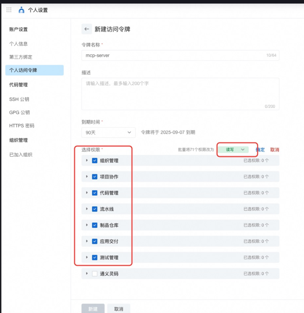
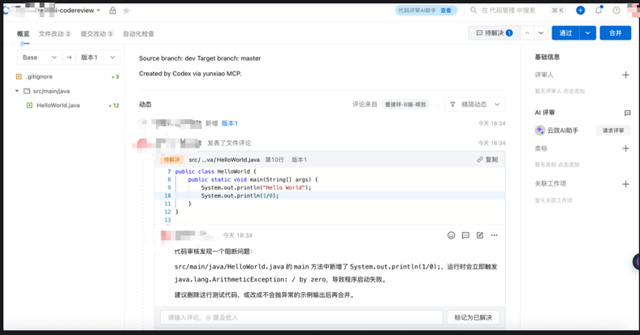

# codex cli中安装云效 Yunxiao MCP ：实现 Merge Request 与代码审查评论

1. 创建 Codeup Merge Request，例如 `dev` -> `master`。
2. 审查代码变更，并把问题作为 MR 全局评论或行内评论写回云效。

## 1. 适用场景

适合以下工作流：

- 需要让 Codex 直接访问云效 Codeup、查询仓库、创建 MR、读取 MR patch set、提交审查评论。
- 需要把 AI 审查结果沉淀在云效 MR 页面，而不是只停留在本地对话里。
- 希望每个项目独立启用云效 MCP，不影响其他仓库。

不建议让 MCP 自动合并代码。创建 MR 和评论可以自动化，最终合并仍建议由维护者确认。

## 2.云效中创建个人访问令牌
可以参考文档：参考：https://www.modelscope.cn/mcp/servers/bowenhuang/alibabacloud-devops-mcp-server

阿里巴巴云开发 个人访问令牌， 单击此处获取.向组织管理、项目协作、代码管理、管道管理、工件存储库管理、应用程序交付和测试管理下的所有API授予读写权限。


## 3.codex/codex cli 或者其他AI编码工具中安装  mcp：alibabacloud-devops-mcp-server
- MCP可以理解为：提供了一个接口API，codex 通过调用MCP暴露的接口可以对代码发起MR和代码审查评论
- MCP文档参考：https://www.modelscope.cn/mcp/servers/bowenhuang/alibabacloud-devops-mcp-server


## 4. codex中配置项目级 MCP 配置

Codex 支持在用户级 `~/.codex/config.toml` 配置 MCP，也支持在仓库内使用项目级 `.codex/config.toml`。

团队落地建议：

- 只在某个项目使用云效 MCP：放到项目 `.codex/config.toml`。
- 所有项目都要使用：再考虑用户级 `~/.codex/config.toml`。
- 项目级配置只在 trusted project 中生效。

这样可以避免云效 MCP 在不相关仓库中出现，也能降低误操作范围。

### 4.1 推荐目录结构

```text
your-repo/
  .codex/
    config.toml
  .gitignore
```

`.codex/config.toml` 可以只保存在个人本地，不提交到仓库。

 `.codex/config.toml` 文件内容配置MCP：

```toml
[mcp_servers.yunxiao]
command = "npx"
args = ["-y", "alibabacloud-devops-mcp-server"]

[mcp_servers.yunxiao.env]
YUNXIAO_ACCESS_TOKEN = "<YOUR_TOKEN>"
```

### 4.2 忽略本地 token 文件（可选）

在 `.gitignore` 中加入：

```gitignore
# Local Codex MCP config may contain access tokens.
.codex/config.toml
```

如果团队希望提交一个模板，可以提交 `.codex/config.example.toml`，但真实 `.codex/config.toml` 必须留在每个人本地。

模板示例：

```toml
[mcp_servers.yunxiao]
command = "npx"
args = ["-y", "alibabacloud-devops-mcp-server"]

[mcp_servers.yunxiao.env]
YUNXIAO_ACCESS_TOKEN = "<REPLACE_WITH_YOUR_PERSONAL_TOKEN>"
```

### 4.3 更安全的可选方式：只转发环境变量

如果团队允许环境变量，可以改用：

```toml
[mcp_servers.yunxiao]
command = "npx"
args = ["-y", "alibabacloud-devops-mcp-server"]
env_vars = ["YUNXIAO_ACCESS_TOKEN"]
```

然后在本地 shell 中设置：

```sh
export YUNXIAO_ACCESS_TOKEN='<YOUR_TOKEN>'
```

这种方式更适合企业统一管理密钥，但不是必须。

## 5. 验证配置

在项目根目录执行：

```sh
codex mcp list
```

应该能看到：

```text
yunxiao  npx  -y alibabacloud-devops-mcp-server  YUNXIAO_ACCESS_TOKEN=*****  enabled
```

继续查看单个 MCP：

```sh
codex mcp get yunxiao
```

正常输出会把 token 掩码为 `*****`。

在其他目录执行 `codex mcp list`，如果看不到 `yunxiao`，说明项目级隔离生效。

## 6. 创建 MR 的标准流程

在项目根目录启动 Codex：

```sh
codex
```

然后输入：

```text
请使用 yunxiao MCP，在当前 Codeup 仓库创建一个 Merge Request：源分支 dev，目标分支 master，并检查一下代码是否有隐藏bug，如果有问题你增加代码评论。
创建前先检查是否已经存在打开状态的 dev -> master MR，避免重复创建。
创建后返回 MR localId、状态和详情链接。
```
结果：


## 7. 代码审查并写回评论

审查时建议使用下面的提示词：

```text
请使用 yunxiao MCP 审查这个 MR 的代码变更。
重点找会导致编译失败、运行时异常、数据错误、安全问题或明显回归的问题。
如果发现阻断问题，请优先提交行内评论；如果行内评论失败，再提交全局评论。
评论需要包含：问题、影响、建议修改方式。
不要只写泛泛的 LGTM。
```

推荐流程：

1. `get_change_request`：确认 MR 信息。
2. `list_change_request_patch_sets`：获取源分支和目标分支 patch set。
3. 本地或通过 MCP `compare` 查看变更。
4. 审查问题。
5. `create_change_request_comment`：提交评论。

常用 MCP 工具：

| 工具 | 用途 |
| --- | --- |
| `list_change_request_patch_sets` | 获取 MR 版本 ID，行内评论需要 |
| `compare` | 比较分支或提交差异 |
| `create_change_request_comment` | 创建全局评论或行内评论 |
| `list_change_request_comments` | 查询已有评论，避免重复评论 |

## 8. 审查评论模板

阻断问题模板：

```md
代码审核发现一个阻断问题：

`<file>` 的第 `<line>` 行存在 `<problem>`。

影响：<说明会导致什么后果，例如启动失败、运行时异常、数据错误、安全风险>。

建议：<说明如何修改>。
```

示例：

```md
代码审核发现一个阻断问题：

`src/main/java/HelloWorld.java` 中新增了 `System.out.println(1/0);`。

影响：程序运行到这里会立即抛出 `java.lang.ArithmeticException: / by zero`，导致启动失败。

建议：删除这行测试代码，或改成不会抛异常的示例输出后再合并。
```

无阻断问题模板：

```md
已完成代码审查，未发现阻断合并的问题。

检查范围：
- 编译/运行时风险
- 明显逻辑回归
- 安全风险
- MR 变更范围内的可维护性问题
```

## 9. 常见问题

### `codex mcp list` 看不到 `yunxiao`

检查：

- 是否在项目根目录或项目子目录执行。
- 项目是否已经 trusted。
- `.codex/config.toml` 是否在仓库内。
- TOML 表名是否是 `[mcp_servers.yunxiao]`。
- 修改配置后是否重启了 Codex 会话。

### token 明明写了，仍然认证失败

检查：

- token 是否过期。
- token 是否有代码管理读写权限。
- 是否写错变量名，必须是 `YUNXIAO_ACCESS_TOKEN`。
- Region 站点是否需要配置 `YUNXIAO_API_BASE_URL`。

### `git fetch` 失败，但 MCP 可以创建 MR

这通常是 Codeup Git 服务开启了 IP 白名单，当前网络出口 IP 不在白名单中。

处理方式：

- 创建 MR 和评论可以继续走云效 OpenAPI/MCP。
- 如果需要本地同步远端分支，联系企业管理员加白名单，或切换到允许访问 Codeup Git 的网络。

### 行内评论失败

常见原因：

- `from_patchset_biz_id` 和 `to_patchset_biz_id` 传反或为空。
- `file_path` 不在当前 MR diff 中。
- `line_number` 不是 diff 中可定位的新增/变更行。

处理方式：

- 重新调用 `list_change_request_patch_sets` 获取 patch set。
- 优先选择 `MERGE_TARGET` 作为 `from_patchset_biz_id`，`MERGE_SOURCE` 作为 `to_patchset_biz_id`。
- 如果仍失败，提交 `GLOBAL_COMMENT` 兜底。

### 不希望 MCP 自动执行写操作

可以在 `.codex/config.toml` 中增加审批策略，让工具调用前提示确认：

```toml
[mcp_servers.yunxiao]
command = "npx"
args = ["-y", "alibabacloud-devops-mcp-server"]
default_tools_approval_mode = "prompt"
```

如果只想开放部分工具，可以使用 allow list：

```toml
[mcp_servers.yunxiao]
command = "npx"
args = ["-y", "alibabacloud-devops-mcp-server"]
enabled_tools = [
  "get_repository",
  "list_change_requests",
  "get_change_request",
  "list_change_request_patch_sets",
  "create_change_request",
  "create_change_request_comment"
]
```

## 10. 团队落地建议

建议分三步推进：

1. 试点项目先只启用 Codeup MR 和评论能力。
2. 固化提示词和审查标准，例如“必须评论阻断问题，不写泛泛 LGTM”。
3. 再扩展到工作项关联、流水线触发、发布单等更高风险操作。

安全要求：

- 不提交真实 token。
- 不在公共文档中写真实 token。
- 写操作类工具调用前保留人工确认。
- 默认只创建 MR 和评论，不自动 merge。
- 重要审查结论必须包含可定位文件、行号、影响和修复建议。

## 11. 参考资料

- OpenAI Codex Manual：Codex 支持用户级和项目级 `.codex/config.toml`，并支持在其中配置 MCP server。
- 云效 MCP 本地包 README：`alibabacloud-devops-mcp-server` 支持 `npx -y alibabacloud-devops-mcp-server` 启动，使用 `YUNXIAO_ACCESS_TOKEN` 访问云效 OpenAPI。
- https://www.modelscope.cn/mcp/servers/bowenhuang/alibabacloud-devops-mcp-server
- https://help.aliyun.com/zh/yunxiao/developer-reference/cloud-effect-mcp-tool-instructions