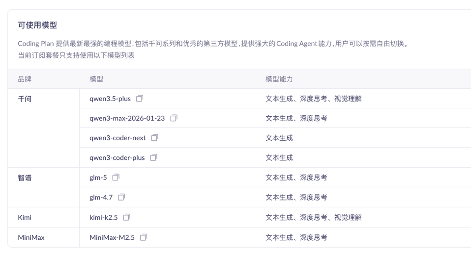

## 1.claude code 安装、升级、卸载

安装或更新 Node.js（v18.0 或更高版本）。
使用 Homebrew (最常用，如果你已经安装了 brew)
```shell
brew install node
```

在终端中执行下列命令，安装 Claude Code。
```shell
npm install -g @anthropic-ai/claude-code
```

运行以下命令验证安装。若有版本号输出，则表示安装成功。
```shell
claude --version
```

claude 升级
```shell
npm update -g @anthropic-ai/claude-code
```

claude 卸载
```shell
npm uninstall -g @anthropic-ai/claude-code
```

## 2.~/.claude/settings.json 配置api环境变量
创建并打开配置文件~/.claude/settings.json。

~ 代表用户主目录。如果 .claude 目录不存在，需要先行创建。可在终端执行 mkdir -p ~/.claude 来创建。

```shell
vi ~/.claude/settings.json
```

编辑配置文件。将 YOUR_API_KEY 替换为 Coding Plan 专属 API Key。
```shell
{    
  "env": {
    "ANTHROPIC_AUTH_TOKEN": "YOUR_API_KEY",
    "ANTHROPIC_BASE_URL": "https://coding.dashscope.aliyuncs.com/apps/anthropic",
    "ANTHROPIC_MODEL": "qwen3.5-plus"
  }
}
```
保存配置文件，重新打开一个终端即可生效。

## 3.环境变量优先级
具体的优先级顺序（从高到低）：
1. 命令行直接传入的环境变量 (最高)
例如：ANTHROPIC_BASE_URL="..." claude 或你在 alias 中定义的临时变量。

2. 当前 Shell 会话中的环境变量 (高 - 即 .zshrc 中 export 的变量)
如果你已经在终端 export 了变量，或者它们在 .zshrc 中被加载，它们会覆盖配置文件中的设置。

3. ~/.claude/settings.json 配置文件 (低)
只有当上述环境变量不存在时，Claude Code 才会去读取这个文件里的配置。


## 4.claude code 切换不同产商的模型

在 .zshrc 文件末尾追加如下内容，默认是野卡的模型
```shell
vi .zshrc 

# 野卡key 默认
export ANTHROPIC_BASE_URL="https://aicoding.2233.ai"
export ANTHROPIC_API_KEY="sk-x"
export ANTHROPIC_AUTH_TOKEN="sk-x"
export OPENAI_API_KEY_0011AI="sk-x"

# 其他国内模型 claude-bailian 或者 claude-kimi
export BAILIAN_KEY="sk-sp-x"
export KIMI_KEY="sk-x"

# 为百炼模型创建一个启动命令别名
alias claude-bailian='ANTHROPIC_AUTH_TOKEN="$BAILIAN_KEY" ANTHROPIC_BASE_URL="https://coding.dashscope.aliyuncs.com/apps/anthropic" ANTHROPIC_MODEL="qwen3.5-plus" claude'

# 为Kimi模型创建一个启动命令别名
alias claude-kimi='ANTHROPIC_AUTH_TOKEN="$KIMI_KEY" ANTHROPIC_BASE_URL="https://api.moonshot.cn/anthropic" ANTHROPIC_MODEL="kimi-k2.5" claude'
```

保存 .zshrc  文件后
```shell
source .zshrc
```

使用
1. claude 使用默认的模型，这里是野卡的
2. claude-bailian 使用阿里云百炼大模型
3. claude-kimi 使用kimi的模型


## 4.同一个服务商内的切换模型（可行）
假设我们使用 claude-bailian 使用了阿里云百炼大模型启动，可以切换到使用 /model 命令切换到百炼的其他模型
```shell
claude-bailian

# 使用/model 通过上下按键选择模型
> /model                                                                        
      
────────────────────────────────────────────────────────────────────────────────
  Select model                                                                
  Switch between Claude models. Applies to this session and future Claude Code
   sessions. For other/previous model names, specify with --model.            
                                                                              
    1. Default (recommended)  Use the default model (currently Sonnet 4.6) · 
                              $3/$15 per Mtok                                 
    2. Sonnet (1M context)    Sonnet 4.6 for long sessions · $3/$15 per Mtok
    3. Opus (1M context)      Opus 4.6 with 1M context · Most capable for
                              complex work
    4. Haiku                  Haiku 4.5 · Fastest for quick answers · $1/$5
                              per Mtok
  ❯ 5. qwen3.5-plus ✔         Custom model

# 自己写模型名字切换，只能切换同一个厂家的模型
❯ /model glm-4.7                                                                                                                
  ⎿  Set model to glm-4.7

❯ /model glm-5                                                                                                                  
  ⎿  Set model to glm-5 
```
https://bailian.console.aliyun.com/cn-beijing/?tab=coding-plan#/efm/coding-plan-detail

