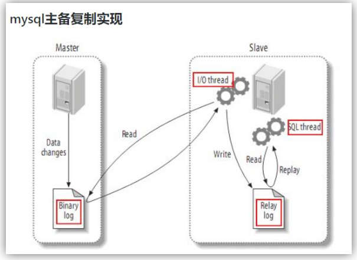
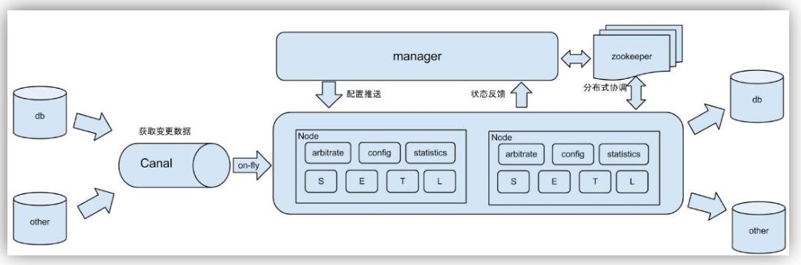
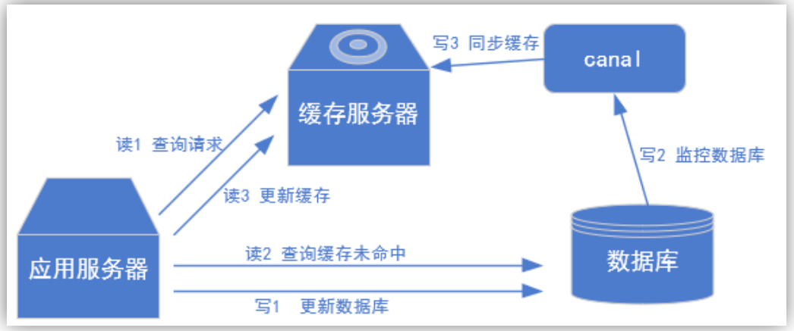
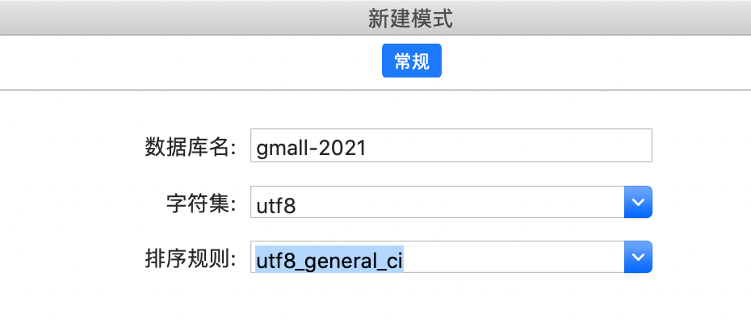
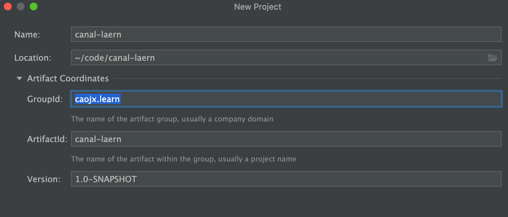
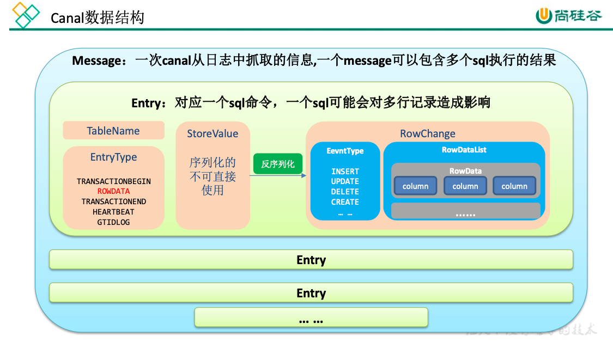

# 尚硅谷大数据技术之Canal学习


视频教程：https://www.bilibili.com/video/BV1aL4y1E7Tb?p=1

学习代码：https://github.com/caojx-git/canal-learn


**前置知识**

- Kafka
- Zookeeper
- MySQL
- Java


# 第1章 Canal入门 


## 1.1什么是 Canal

​		阿里巴巴 B2B 公司，因为业务的特性，卖家主要集中在国内，买家主要集中在国外，不希望数据都存在国外，所以衍生出了<font color=red>同步杭州和美国异地机房数据的</font>需求，从 2010 年开始，阿里系公司开始逐步的尝试基于数据库的日志解析，获取增量变更进行同步，由此衍生出了增量订阅&消费的业务。

​		Canal 是用 Java 开发的基于数据库增量日志解析，提供增量数据订阅&消费的中间件。 目前，<font color=red>Canal 主要支持了 MySQL 的 Binlog 解析，解析完成后才利用 Canal Client 来处理获得的相关数据，进而实现数据同步。</font>(数据库同步需要阿里的 Otter 中间件，基于 Canal)。


## 1.2.MySQL的Binlog


### 1.2.1.什么是Binlog

​		MySQL 的二进制日志可以说 MySQL 最重要的日志了，它记录了所有的 DDL 和 DML(除了数据查询语句)语句，以事件形式记录，还包含语句所执行的消耗的时间，MySQL 的二进 制日志是事务安全型的。

​		一般来说开启二进制日志大概会有 1%的性能损耗，开启二进制日志，可以有2个好处（二进制有两个最重要的使用场景）:

​		<font color=red>其一</font>：在MySQL主从环境时，MySQL Replication 在 Master 端开启 Binlog，Master 把它的二进制日志传递给 Slaves 来达到 Master-Slave 数据一致的目的。

​		<font color=red>其二</font>：自然就是数据恢复了，通过使用 MySQL Binlog 工具来使恢复数据。

​	

**二进制日志包括两类文件**:

- 二进制日志索引文件(文件名后缀为.index)用于记录所有的二进制文件，方便我们快速的去查找到我们当前写到哪个日志了，哪一条数据是什么位置。
- 二进制日志文件(文件名后缀为.00000*)记录数据库所有的 DDL 和 DML(除 了数据查询语句)语句事件。


### 1.2.2.Binlog的分类

​		MySQL Binlog 有三种格式，分别是 STATEMENT,MIXED,ROW。在配置文件中可以选择配置 binlog_format= statement|mixed|row，三种格式的区别如下:


<font color=red>1）statement</font>：语句级，binlog 会记录每次一执行写操作的SQL语句，一条SQL语句就可能改变很多条数据，相对 row 模式节省空间，但是可能产生不一致性，比如“`update tt set create_date=now()`”，如果用 binlog 日志进行恢复，比如主节点和从节点由于执行时间不同就可能产生数据不一致问题，还有一些随机函数等等。

- 优点：节省空间。
- 缺点：有可能造成数据不一致。


<font color=red>2）row</font>：行级， binlog 会记录每次操作后每行记录的变化。

- 优点：保持数据的绝对一致性。因为不管 sql 是什么，引用了什么函数，他只记录执行后的效果。

- 缺点：占用较大空间。


<font color=red> 3）mixed</font>：statement 的升级版，一定程度上解决了因为一些情况而造成的 statement模式不一致问题，默认使用 statement，在某些情况下譬如：当函数中包含 UUID() 时；包含 AUTO_INCREMENT 字段的表被更新时；执行 INSERT DELAYED 语句时；用 UDF（自定义函数） 时；会按照 ROW 的方式进行处理

- 优点：节省空间，同时兼顾了一定的一致性。

- 缺点：还有些极个别情况依旧会造成不一致，另外 statement 和 mixed 对于需要对 binlog 的监控的情况都不方便。


<font color=red>**综合上面对比，Canal 想做监控分析，选择 row 格式比较合适。**</font>


## 1.3.Canal的工作原理


### 1.3.1.MySQL 主从复制过程

1) Master 主库将改变记录，写到二进制日志(Binary Log)中;
2) Slave 从库向 MySQL Master 发送 dump 协议，将 Master 主库的 binary log 事件拷贝到它的中继日志(relay log);
3) Slave 从库读取并重做中继日志中的事件，将改变的数据同步到自己的数据库。





### 1.3.2.Canal 的工作原理

​	很简单，Canal把自己<font color=red>伪装成 Slave</font>，假装从 Master 复制数据，给Master发送dump协议，拿到binlog日志，然后同时由阿里官方写的一些解析的方式，将这个二进制文件解析出来，形成我们所需要的数据格式。

​	它工作原理跟我们MySQL本身的主从复制是一样的，只不过说Canal 它并不是真的从节点，也就是说它并没有MySQL 的计算引擎。
所以之前我们也提到了，你要是给Canal这种像 statement 语句级别的SQL语句，Canal是没有办法将它恢复成数据的。所以如果用Canal 做数据分析的时候，我们必须要用row格式。


## 1.4.使用场景

1）原始场景: 阿里 Otter 中间件的一部分

Otter 是阿里用于进行异地数据库之间的同步框架，Canal 读取binlog日志，写到传输管道中，从而实现数据同步到另外一个库的目的。




2）常见场景 1:更新缓存

MySQL数据同步到缓存




3）常见场景 2:抓取业务表的新增变化数据，用于实时数据分析统计，比如canal将数据传输到消息中间件，然后消费者监听消息队列的数据，从而写到数据仓库中(我们就是这种场景)


# 第2章 MySQL的准备

## 2.1.创建数据库




## 2.2.创建数据表

```sql
CREATE TABLE user_info (
	`id` VARCHAR ( 255 ),
	`name` VARCHAR ( 255 ), 
	`sex` VARCHAR ( 255 )
);	
```


## 2.3.修改配置文件开启Binlog

```shell
[caojx@centos-linux mysql]$ sudo vim /etc/my.cnf
server_id=1
# binlog名称
log-bin=mysql-binlog
# 行级别
binlog-format=ROW
# 开启binlog的数据库，如果不写就表示所有的数据库都开启bin-log
binlog_do_db=gmall-2021
# 如果多可数据库需要开启，写多行即可
#binlog_do_db=gmall-2022
#binlog_do_db=gmall-2023
```

注意：binlog-do-db 根据自己的情况进行修改，指定具体要同步的数据库，如果不配置则表示所有数据库均开启 Binlog


## 2.4.重启MySQL使配置生效

```shell
# centos mariadb
systemctl restart mariadb.service
# centos 或linux
# sudo systemctl restart mysqld

# mac
#sudo mysql.server restart
```


**到/var/lib/mysql 目录下查看初始文件大小 154**

```
[caojx@centos-linux mysql]$ ps -ef | grep mysql
mysql     4540     1  0 5月25 ?       00:00:00 /bin/sh /usr/bin/mysqld_safe --basedir=/usr
mysql     4753  4540  0 5月25 ?       00:00:00 /usr/libexec/mysqld --basedir=/usr --datadir=/var/lib/mysql --plugin-dir=/usr/lib64/mysql/plugin --log-error=/var/log/mariadb/mariadb.log --pid-file=/var/run/mariadb/mariadb.pid --socket=/var/lib/mysql/mysql.sock
caojx     4798  1868  0 00:00 pts/0    00:00:00 grep --color=auto mysql

[caojx@centos-linux mysql]$ ls -l /var/lib/mysql/
...
-rw-r-----. 1 mysql mysql  154 12 月 13 08:45 mysql-bin.000001
...
```


## 2.5.测试Binlog是否开启

1）插入数据

```sql
INSERT INTO user_info VALUES('1001','zhangsan','male');
```

2）再次到/var/lib/mysql 目录下，查看 index 文件的大小

```
[caojx@centos-linux mysql]$ ls -l /var/lib/mysql/
...
-rw-r-----. 1 mysql mysql  452 12 月 13 08:45 mysql-bin.000001
...
```


## 2.6.赋权限

这里给canal用户授予读取数据SELECT权限、复制数据权限，在mysql中执行


```shell
MariaDB [(none)]> SELECT VERSION();
+----------------+
| VERSION()      |
+----------------+
| 5.5.68-MariaDB |
+----------------+
1 row in set (0.00 sec)
mysql> GRANT SELECT, REPLICATION SLAVE, REPLICATION CLIENT ON *.* TO 'canal'@'%' IDENTIFIED BY 'canal';
```


高版本

```sql
mysql> SELECT VERSION();
+-----------+
| VERSION() |
+-----------+
| 8.0.19    |
+-----------+
1 row in set (0.00 sec)

# 创建canal用户
mysql>create user 'canal'@'%' identified by 'canal';
mysql>grant SELECT, REPLICATION SLAVE, REPLICATION CLIENT ON *.* TO 'canal'@'%' with grant option;
msyql>flush privileges;

# 查看用户信息
mysql> use mysql;
mysql> select User,Host from user;
+------------------+-----------+
| User             | Host      |
+------------------+-----------+
| canal            | %         |
| root             | %         |
| mysql.infoschema | localhost |
| mysql.session    | localhost |
| mysql.sys        | localhost |
+------------------+-----------+
```


# 第3章 Canal的下载和安装


## 3.1.下载并解压jar包

https://github.com/alibaba/canal/releases

https://github.com/alibaba/canal/releases/download/canal-1.1.2/canal.deployer-1.1.2.tar.gz


我们直接 canal.deployer-1.1.2.tar.gz 拷贝到对应的目录下，然后解压到/Users/caojx/Downloads/canal 包下

<font color=red>注意：canal 解压后是分散的，我们在指定解压目录的时候需要将 canal 指定上</font>


## 3.2.修改conf/canal.properties的配置

```properties
~$ pwd
/Users/caojx/Downloads/canal/conf
~$ vi canal.properties
#################################################
######### 		common argument		############# 
#################################################
canal.id = 1
canal.ip =
canal.port = 11111
canal.metrics.pull.port = 11112
canal.zkServers =
# flush data to zk
canal.zookeeper.flush.period = 1000
canal.withoutNetty = false
# tcp, kafka, RocketMQ
canal.serverMode = tcp
# flush meta cursor/parse position to file
```

<font color=red>说明：</font>

​		这个文件是 canal 的基本通用配置，canal 端口号默认就是 11111，修改 canal 的 输出 model，默认 tcp，改为输出到 kafka

​		多实例配置如果创建多个实例，通过前面 canal 架构，我们可以知道，一个 canal 服务 中可以有多个 instance，conf/下的每一个 example 即是一个实例，每个实例下面都有独立的 配置文件。默认只有一个实例 example，如果需要多个实例处理不同的 MySQL 数据的话，直 接拷贝出多个 example，并对其重新命名，命名和配置文件中指定的名称一致，

然后修改 **canal.properties** 中的 canal.destinations=example1,example2,example3

```properties
#################################################
######### 		destinations		############# 
#################################################
canal.destinations = example
```


## 3.3.修改example/instance.properties

我们这里只读取一个 MySQL 数据，所以只有一个实例，这个实例的配置文件在conf/example 目录下

```properties
~$ cd example
~$ vi instance.properties
```


1）配置MySQL服务器地址

canal.instance.mysql.slaveId 为从节点id，不能和主节点一致

```properties
#################################################
## mysql serverId , v1.0.26+ will autoGen 
canal.instance.mysql.slaveId=20

# enable gtid use true/false
canal.instance.gtidon=false

# position info，mysql主节点地址
canal.instance.master.address=127.0.0.1:3306
```


2）配置连接 MySQL 的用户名和密码，默认就是我们前面授权的 canal

```properties
# username/password
canal.instance.dbUsername=canal
canal.instance.dbPassword=canal
canal.instance.connectionCharset = UTF-8
canal.instance.defaultDatabaseName =test
# enable druid Decrypt database password
canal.instance.enableDruid=false
```


# 第4章 实时监控测试


## 4.1.TCP模式测试


### 4.1.1.创建canal-learn项目




### 4.1.2.在canal-learn模块中配置pom.xml

```xml
<dependency>
    <groupId>com.alibaba.otter</groupId>
    <artifactId>canal.client</artifactId>
    <version>1.1.2</version>
</dependency>
<dependency>
    <groupId>org.apache.kafka</groupId>
    <artifactId>kafka-clients</artifactId>
    <version>2.4.1</version>
</dependency>
```


### 4.1.3.Canal 封装的数据结构

1. Message：一次canal从日志中抓取的信息，一个message可以包含多个sql执行的结果，一个message内部包含多个Entry
2. Entry：对应一条sql执行的结果，一个sql可能会影响多行记录，Entry内部数据如下TableName：表名

​		2.1. EntryType：Entry类型（事务开启、事务结束、行数据、心跳、GTIDLOG）等类型

​		2.2. StoreValue：当前这条sql所有影响的所有的序列化数据

​		2.3. RowChange：反序列化后得到的行改变数据

​				2.3.1.EevntType：数据类型 INSERT、UPDATE、DELETE、CREATE...

​				2.3.2.RowDataList：当前sql影响的多行数

​						2.3.2.1 RowData：一行数据，内部有更新前，更新后的数据





一会我们就根据这个来写我们的代码，解析canal抓取的数据


### 4.1.4通用监视类-CanalClient

```java
package caojx.learn.tcp;

import com.alibaba.fastjson.JSONObject;
import com.alibaba.otter.canal.client.CanalConnector;
import com.alibaba.otter.canal.client.CanalConnectors;
import com.alibaba.otter.canal.protocol.CanalEntry;
import com.alibaba.otter.canal.protocol.Message;
import com.google.protobuf.ByteString;
import com.google.protobuf.InvalidProtocolBufferException;

import java.net.InetSocketAddress;
import java.util.List;

/**
 * TCP模式抓取canal数据测试类
 *
 * @author caojx created on 2022/5/26 10:55 AM
 */
public class CanalClient {

    public static void main(String[] args) throws InterruptedException, InvalidProtocolBufferException {
        //1.获取 canal 连接对象
        CanalConnector canalConnector = CanalConnectors.newSingleConnector(new InetSocketAddress("localhost", 11111), "example", "", "");

        while (true) {
            // 2.连接
            canalConnector.connect();

            // 3.订阅数据库
            canalConnector.subscribe("gmall.*");

            // 4.获取Message数据
            Message message = canalConnector.get(100);

            // 5.获取Entry集合
            List<CanalEntry.Entry> entries = message.getEntries();

            // 6.判断集合是否为空如果为空则等待一会继续拉取数据
            if (entries.size() <= 0) {
                System.out.println("没有数据，休息一会");
                Thread.sleep(1000);
            } else {
                // 遍历entries，单条机械
                for (CanalEntry.Entry entry : entries) {
                    // 获取表名
                    String tableName = entry.getHeader().getTableName();

                    // 获取类型
                    CanalEntry.EntryType entryType = entry.getEntryType();

                    // 获取序列化后的数据
                    ByteString storeValue = entry.getStoreValue();

                    // 判断当前entryType是否为ROWDATA
                    if (CanalEntry.EntryType.ROWDATA.equals(entryType)) {
                        // 反序列化数据
                        CanalEntry.RowChange rowChange = CanalEntry.RowChange.parseFrom(storeValue);

                        // 获取当前事件的操作类型
                        CanalEntry.EventType eventType = rowChange.getEventType();

                        // 获取数据集
                        List<CanalEntry.RowData> rowDataList = rowChange.getRowDatasList();

                        // 遍历rowDataList，并打印数据
                        for (CanalEntry.RowData rowData : rowDataList) {
                            JSONObject beforeData = new JSONObject();
                            List<CanalEntry.Column> beforeColumnsList = rowData.getBeforeColumnsList();
                            for (CanalEntry.Column column : beforeColumnsList) {
                                beforeData.put(column.getName(), column.getValue());
                            }

                            JSONObject afterData = new JSONObject();
                            List<CanalEntry.Column> afterColumnsList = rowData.getAfterColumnsList();
                            for (CanalEntry.Column column : afterColumnsList) {
                                afterData.put(column.getName(), column.getValue());
                            }

                            System.out.println("TableName:" + tableName
                                    + ",EventType:" + eventType +
                                    ",After:" + beforeData +
                                    ",After:" + afterData);
                        }

                    } else {
                        System.out.println("当期操作类型为：" + entryType);
                    }
                }
            }
        }
    }
}
```


### 4.1.5CP插入数据测试

插入数据

```sql
INSERT INTO user_info VALUES('1001','zhangsan','male');
```


CanalClient日志

```tex
没有数据，休息一会
没有数据，休息一会
当期操作类型为：TRANSACTIONBEGIN
TableName:user_info,EventType:INSERT,After:{},After:{"sex":"male","name":"zhangsan","id":"1001"}
```


## 4.2.Kafka模块测试

将数据输出到MQ 指定的topic，我们可以直接拿到反序列化后的数据


1）修改 <font color=red>canal.properties</font> 中 canal 的输出 model，默认 tcp，改为输出到 kafka

```properties
#################################################
######### 		common argument		############# 
#################################################
canal.id = 1
canal.ip =
canal.port = 11111
canal.metrics.pull.port = 11112
canal.zkServers =
# flush data to zk
canal.zookeeper.flush.period = 1000
canal.withoutNetty = false
# tcp, kafka, RocketMQ
canal.serverMode = kafka
```


2）修改kafka集群地址

```properties
##################################################
######### 		     MQ 		     #############
##################################################
canal.mq.servers = kafka地址:9092,kafka地址:9092,kafka地址:9092
```


3）修改 instance.properties 输出到 Kafka 的主题以及分区数

```properties
# mq config
canal.mq.topic=canal_test
canal.mq.partition=0
# hash partition config
#canal.mq.partitionsNum=3
#canal.mq.partitionHash=mytest.person:id,mytest.role:id
```


注意：默认还是输出到指定 Kafka 主题的一个 kafka 分区，因为多个分区并行可能会打乱 binlog 的顺序，如果要提高并行度，首先设置 kafka 的分区数>1，然后设置 canal.mq.partitionHash 属性


4）启动canal，启动后mq主题一般会自动创建

```shell
~$: cd /Users/caojx/Downloads/canal/bin
~$: ./startup.sh
```


5）启动kafka集群

略。。


6）启动kafka消费者客户端测试，查看消费情况

```shell
kafka]$: bin/kafka-console-consumer.sh --bootstrap-server kafka地址:9002 --topic canal_test
```


7）插入数据测试

```
INSERT INTO user_info VALUES('1001','zhangsan','male'),('1002','lisi','female');
```


kafka消费控制台输出

```
{"data":[{"id":"1001","name":"zhangsan","sex":"male"},{"id":"1002","name":"lisi","sex":"female"}],"database":"gmall- 2021","es":1639360729000,"id":1,"isDdl":false,"mysqlType":{"id":" varchar(255)","name":"varchar(255)","sex":"varchar(255)"},"old":null,"sql":"","sqlType":{"id":12,"name":12,"sex":12},"table":"user _info","ts":1639361038454,"type":"INSERT"}
```

