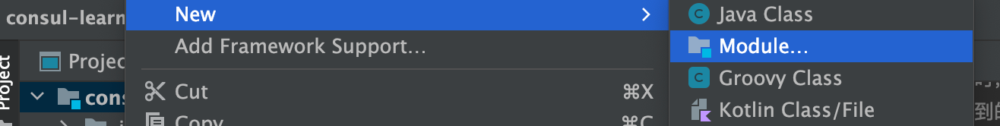

#  Consul服务注册中心学习


视频教程：https://www.bilibili.com/video/BV1rp4y1n7Dk?p=2


# Consul服务注册中心

Netflix Eureka2.X [https://github.com/Netflix/eureka/wiki](https://github.com/Netflix/eureka/wiki) 官方宣告停止开发，但其实对国内的用户影响甚小，一方面国内大都使用的是Eureka1.X系列，并且宫方也在积极维护1.X [https://github.com/Netflix/eureka/releases](https://github.com/Netflix/eureka/releases) 。

> The existing open source work on eureka 2.0 is discontinued. The code base and artifacts that were released as part of the existing  repository of work on the 2.x branch is considered use at your own risk.
>
> Eureka 1.x is a core part of Netflix's service discovery system and is still an active project.


翻译

>有关eureka2.0的现有开源工作已停止。在2.x分支上作为现有工作资料库的一部分发布的代码库和工件被视为使用后果自负。
>
>Eureka 1.x是Netflix服务发现系统的核心部分，仍然是一个活跃的项目。

>虽然Eureka，Hystriⅸ等不再继续开发或维护，但是目前来说不影响使用，不管怎么说感谢开源，向Netflix公司的开源致敬


另一方面Spring Cloud支特很多服务发现的软件，Eureka只是其中之一，下面是Spring Cloud支持的服务发现软件以及特性对比。


## 1.学习目标


## 2.常见的注册中心

- Netflix Eureka
- Alibaba Nacos
- HashiCorp Consul
- Apache ZooKeeper
- CoreOS Etcd
- CNCF CoreDNS


| 特性            | Eureka      | Nacos                      | Consul            | Zookeeper  |
| --------------- | ----------- | -------------------------- | ----------------- | ---------- |
| CAP             | AP          | CP+AP                      | CP                | CP         |
| 健康检查        | Client Beat | TCP/HTTP/MYSQL/Client Beat | TCP/HTTP/gRPC/cmd | Keep Alive |
| 雪崩保护        | 有          | 有                         | 无                | 无         |
| 自动注销实例    | 支持        | 支持                       | 不支持            | 支持       |
| 访问协议        | HTTP        | HTTP/DNS                   | HTTP/DNS          | TCP        |
| 监听支持        | 支持        | 支持                       | 支持              | 支持       |
| 多数据中心      | 支持        | 支持                       | 支持              | 不支持     |
| 跨注册中心同步  | 不支持      | 支持                       | 支持              | 不支持     |
| SpringCloud集成 | 支持        | 支持                       | 支持              | 支持       |


## 3.Consul介绍

官网：https://www.consul.io/

​	

​	Consul是HashiCorp公司推出的开源工具，用于实现分布式系统的服务发现与配置。与其它分布式服务注册与发现的方案，Consul的方案更“一站式”，内置了服务注册与发现框架、分布一致性协议实现、健康检查、Key/Value存储、多数据中心方案，不再需要依赖其它工具（比如ZooKeeper等），使用起来也较为简单。

​	Consul使用Go语言编写，因此具有天然可移植性（支持LiuX、Windows和Mac OS)；安装包仅包含一个可执行文件，方便部署，与Docker等轻量级容器可无缝配合。


## 4.Consul特性

- 基于Raft分布式一致协议的算法实现

  > zookeper 基于paxos算法实现

- 服务发现

- 健康检查

- Key/Value存储

- 多数据中心

- 支持http和dns协议接口

- 官方提供web管理界面


## 5.Consul角色

​	在讲consul角色之前我们先来聊聊eureka，其实eureka就是一个Beat程序，我们通过简单的编码，然后将它部署运行起来，完成我们服务注册中心的搭建。

​	而consul是go语言开发的，不需要依赖其他第三方，有一个非常小的可执行文件，直接双击运行就可以完成注册中心的搭建，使用起来特别方便。


consul启动命主要有三种模式：

- -dev：一般本地开发使用dev模式，完成consul服务发现注册的一套流程

  >  如果我们的编码没有问题，功能开发完成后，需要部署时，我们就会切换到client、server模式进行部署

- -client：客户端，无状态，将HTTP和DNS接口请求转发给局域网内的服务端集群。

- -server：服务端，保存配置信息，高可用集群，每个数据中心的sevr数量推荐为3个或者5个。


我们先看一下启动命令，方便大家更好的理解

比如单节点，本地开发阶段时，使用开发模式，启动命令如下

```shell
#-dev表示开发模式试运行，另外还有-server表示服务模式运行 
consul agent -dev -client=0.0.0.0
```


然后功能都开发完了，没有bug，现在要部署，比如启动3个server构建成一组集群，他们内部自己会选举主节点

```shell
#node-01
./consul agent -erver -bind=192.168.10.101 -client=0.0.0.0 -ui -bootstrap-expect=3 -data-dir=/usr/local/consul/data/-node=server-01 

#node-02
./consul agent -server -bind=192.168.10.102 -client=0.0.0.0 -ui -bootstrap-expect=3 -data-dir=/usr/local/consul/data/-node=server-02 

#node-03
./consul agent -server -bind=192.168.10.103 -client=0.0.0.0 -ui -bootstrap-expect=3 -data-dir=/usr/local/consul/data/-node=server-03
```


然后再启动客户端

```shell
consul agent -client=0.0.0.0-bind=192.168.10.1 -data-dir=D:\Example\consol\data -node=client-01
```

server 和client客户端他们俩共同构建完成consul注册中心的环境。


**关于dev**

​	一般单节点dev模式跟eureka模式类似，consul集群环境，官方推荐我们搭一个高可用的server集群，避免单节点故障，果说主节点的宕机或者挂掉了，其他节点可以重新选举成为新的主节点顶上来，从而实现高可用。


**关于server**

​	server一般部署3到5个节点，server间会进行数据数据同步，节点太多会导致数据同步消耗太多，consul注册中心基于CP模式（C一致性、P分区容错），在数据一致过程中，肯定会A（可用性）不可用，没法保证，节点过多我们拿到的数据要等很久才会给我们响应，所以server集群推荐3到5个。

​	在搭建集群环境时，推荐奇数台服务器，因为如果集群中有大于等于一半服务器不可用，那么整个集群就不可用。比如说我们搭建4台服务器，如果2个挂掉了，就意味着整个集群不能用了。假如部署3台，整个集群不可用，也需要挂掉2台，4台和3台都要挂掉2台才能导致整个集群不可用，所以使用3台还能节省一台资源。


**关于client**

​	consul注册中心，真正工作的时候，包括server和client两部分。

​	client就是一个代理，假如我们有一个商品微服务服，商品微服务现在发起了一个HTTP或者DNS的请求，这个请求过来了之后，client负责接收请求并将请求转发给server，server在收到了请求之后，把商品微服务的信息注册到server中，然后server会将注册信息同步到其他的server，同步完之后，比如现在我们有一个订单的微服务，订单微服务要拉取服务列表，client接收请求，再转发给server，server处理完之后，就返回给client，client再返回给订单微服务。

​	server里边的数据信息，会通过留言协议（LAN COSSIP），分发给下边client客户端。


## 6.consul工作原理


producer：服务提供者

consumer：服务消费者

consul：服务注册中心，内部有client、server两种角色


### 6.1.服务发现以及注册

​	当服务Producer启动时，会将自己的Ip/host等信息通过发送请求告知Consul，Consul接收到Producer的注册信息后，每隔 10s(默认)会向Producer发送一个健康检查的请求，检验Producer是否健康，如果服务提供者不可用就从注册中心服务列表中剔除，防止消费者找到不可用的服务。


### 6.2.服务调用

​	当Consumer请求Producer时，会先从Consul中拿到存储Producer服务的IP和Port的临时表(temp table)，从temp table表中选一个Producer的IP和Port，然后根据这个IP和Port 发送访问请求；temp table表只包含通过了健康检查的Producer信息，并且每隔10s(默认)更新。

​	

## 7.consul 安装

Eureka其实就是个Servlet程序，跑在Servlet容器中；Consul则是用go语言编写的第三方工具需要单独安装使用。


### 7.1下载

访问Consul官网 https://www.consul.io/下载Consul的最新版本.


### 7.2.安装

为了让大家学习到不同环境的安装，单节点我们在Windows安装，集群环境在Liu以安装。


#### 7.2.1.单节点

压缩包中就只有一个**consul.exe**的执行文件。

 


cd到对应的目录下，使用cmd启动Consul，这里我们先使用-dev模式【一般本地开发时使用dev模式即可】，后边集群的时候，我们再使用-server模式

```shell
#-dev表示开发模式试运行，另外还有-server表示服务模式运行，-client 表示谁可以向我们注册中心注册，拉取信息，0.0.0.0 表示所有的都可以访问，正常配置具体的ip
consul agent -dev -client=0.0.0.0
```


为了方便启动，也可以在consul。exe同级目录下创建一个脚本来启动，脚本内容如下：

```shell
consul agent -dev -client=0.0.0.0
pause
```


访问管理后台：http://localhost:8500/ 看到下图意味着我们的Consul服务启动成功了，可以看到consul把自己注册到注册中心了。


## 8.consul入门案例


### 8.1.创建项目

我们创建聚合项目来讲解Consul，首先创建一个pom父工程。

 


### 8.2添加依赖

pom.xml

```xml
<?xml version="1.0" encoding="UTF-8"?>
<project xmlns="http://maven.apache.org/POM/4.0.0"
         xmlns:xsi="http://www.w3.org/2001/XMLSchema-instance"
         xsi:schemaLocation="http://maven.apache.org/POM/4.0.0 http://maven.apache.org/xsd/maven-4.0.0.xsd">
    <modelVersion>4.0.0</modelVersion>

    <groupId>caojx.learn</groupId>
    <artifactId>consul-learn</artifactId>
    <version>1.0-SNAPSHOT</version>
    <packaging>pom</packaging>

    <modules>
        <module>service-provider</module>
    </modules>

    <!--继承spring-boot-starter-parent依赖 -->
    <!--使用继承方式，实现复用，符合继承的都可以被使用-->
    <parent>
        <groupId>org.springframework.boot</groupId>
        <artifactId>spring-boot-starter-parent</artifactId>
        <version>2.2.4.RELEASE</version>
        <relativePath/> <!-- lookup parent from repository -->
    </parent>

    <!--
      集中定义依赖组件版本号，但不引入，
      在子工程中用到声明的依赖时，可以不加依赖的版本号，
      这样可以统一管理工程中用到的依赖版本
      -->
    <properties>
        <maven.compiler.source>8</maven.compiler.source>
        <maven.compiler.target>8</maven.compiler.target>
        <!--Spring cloud Hoxton.SR1依赖-->
        <spring-cloud.version>Hoxton.SR1</spring-cloud.version>
    </properties>

    <!--项目依赖管理父项目只是声明依赖，子项目需要写明需要的依赖（可以省略版本信息）-->
    <dependencyManagement>
        <dependencies>
            <!--spring cloud依赖-->
            <dependency>
                <groupId>org.springframework.cloud</groupId>
                <artifactId>spring-cloud-dependencies</artifactId>
                <version>${spring-cloud.version}</version>
                <type>pom</type>
                <scope>import</scope>
            </dependency>
        </dependencies>
    </dependencyManagement>
</project>
```


### 8.3.服务提供者service-provider


#### 8.3.1.创建项目

在刚才的父工程下创建一个service-provider服务提供者的项目。





#### 8.3.2.添加依赖

pom.xml

```xml
<?xml version="1.0" encoding="UTF-8"?>

<project xmlns="http://maven.apache.org/POM/4.0.0" xmlns:xsi="http://www.w3.org/2001/XMLSchema-instance"
         xsi:schemaLocation="http://maven.apache.org/POM/4.0.0 http://maven.apache.org/xsd/maven-4.0.0.xsd">
    <modelVersion>4.0.0</modelVersion>

    <artifactId>service-provider</artifactId>
    <version>1.0-SNAPSHOT</version>

    <!--继承父依赖-->
    <parent>
        <artifactId>consul-learn</artifactId>
        <groupId>caojx.learn</groupId>
        <version>1.0-SNAPSHOT</version>
    </parent>

    <!--项目依赖-->
    <dependencies>
        <!--spring-cloud consul 依赖-->
        <dependency>
            <groupId>org.springframework.cloud</groupId>
            <artifactId>spring-cloud-starter-consul-discovery</artifactId>
        </dependency>
        <!--spring boot actuator 依赖-->
        <dependency>
            <groupId>org.springframework.boot</groupId>
            <artifactId>spring-boot-starter-actuator</artifactId>
        </dependency>
        <!--spring boot web 依赖-->
        <dependency>
            <groupId>org.springframework.boot</groupId>
            <artifactId>spring-boot-starter-web</artifactId>
        </dependency>
        <!-- lombok 依赖-->
        <dependency>
            <groupId>org.projectlombok</groupId>
            <artifactId>lombok</artifactId>
            <scope>provided</scope>
        </dependency>
        <!--spring-boot 依赖-->
        <dependency>
            <groupId>org.springframework.boot</groupId>
            <artifactId>spring-boot-starter-test</artifactId>
            <scope>test</scope>
            <exclusions>
                <exclusion>
                    <groupId>org.junit.vintage</groupId>
                    <artifactId>junit-vintage-engine</artifactId>
                </exclusion>
            </exclusions>
        </dependency>
    </dependencies>

    <build>
        <plugins>
            <plugin>
                <groupId>org.springframework.boot</groupId>
                <artifactId>spring-boot-maven-plugin</artifactId>
            </plugin>
        </plugins>
    </build>
</project>

```


#### 8.3.3.配置文件

application.yml

```yaml
server:
  port: 7070 #端口

spring:
  application:
    name: service-provider #应用名称
    # 配置consul注册中心
  cloud:
    consul:
      # 注册中心访问地址
      host: localhost
      port: 8500
      # 服务提供者信息
      discovery:
        deregister: true                               # 当前应用是否需要注册到注册中心
        instance-id: ${spring.application.name}-01     # 注册实例 id 必须唯一
        service-name: ${spring.application.name}       # 服务名称
        port: ${server.port}                           # 服务端口
        prefer-ip-address: true                        # 是否使用ip地址注册
        ip-address: ${spring.cloud.client.ip-address}  # 服务请求ip
```


#### 8.3.4.实体类

Product.java

```java
package caojx.learn.pojo;

import lombok.AllArgsConstructor;
import lombok.Data;
import lombok.NoArgsConstructor;

import java.io.Serializable;

/**
 * 商品实体类
 *
 * @author caojx created on 2022/5/22 5:58 PM
 */
@Data
@NoArgsConstructor
@AllArgsConstructor
public class Product implements Serializable {

    /**
     * 主键
     */
    private Integer id;

    /**
     * 商品名称
     */
    private String productName;

    /**
     * 商品数量
     */
    private Integer productNum;

    /**
     * 商品价格
     */
    private Double productPrice;
}
```


#### 8.3.5.编写服务

ProductService.java

```java
package caojx.learn.service;

import caojx.learn.pojo.Product;

import java.util.List;

/**
 * 商品服务
 *
 * @author caojx created on 2022/5/22 5:59 PM
 */
public interface ProductService {

    /**
     * 查询商品列表
     *
     * @return
     */
    List<Product> selectProductList();
}

```


ProductServiceImpl.java

```java
package caojx.learn.service.impl;

import caojx.learn.pojo.Product;
import caojx.learn.service.ProductService;
import org.springframework.stereotype.Service;

import java.util.Arrays;
import java.util.List;

/**
 * 商品服务
 *
 * @author caojx created on 2022/5/22 6:00 PM
 */
@Service
public class ProductServiceImpl implements ProductService {

    /**
     * 查询商品列表
     *
     * @return
     */
    @Override
    public List<Product> selectProductList() {
        return Arrays.asList(
                new Product(1, "华为手机", 1, 5800D),
                new Product(2, "联想笔记本", 1, 6888D),
                new Product(3, "小米平板", 5, 2020D)
        );
    }
}
```


#### 8.3.6.控制层

ProductController.java

```java
package caojx.learn.controller;

import caojx.learn.pojo.Product;
import caojx.learn.service.ProductService;
import org.springframework.web.bind.annotation.GetMapping;
import org.springframework.web.bind.annotation.RequestMapping;
import org.springframework.web.bind.annotation.RequestParam;
import org.springframework.web.bind.annotation.RestController;

import javax.annotation.Resource;
import java.util.List;

/**
 * 商品controller
 *
 * @author caojx created on 2022/5/22 6:01 PM
 */
@RestController
@RequestMapping("/product")
public class ProductController {

    @Resource
    private ProductService productService;

    /**
     * 查询商品列表
     *
     * @return
     */
    @GetMapping("/list")
    public List<Product> selectProductList() {
        return productService.selectProductList();
    }

}
```


#### 8.3.7.启动类

ServiceProviderApplication.java

```java
package caojx.learn;

import org.springframework.boot.SpringApplication;
import org.springframework.boot.autoconfigure.SpringBootApplication;

/**
 * 启动类，不需要添加注册到consul的相关注解
 *
 * @author caojx created on 2022/5/22 6:03 PM
 */
@SpringBootApplication
public class ServiceProviderApplication {

    public static void main(String[] args) {
        SpringApplication.run(ServiceProviderApplication.class, args);
    }
}
```


#### 8.3.8.启动服务访问

http://localhost:7070/product/list


### 8.4.服务消费者service-consumer


#### 8.4.1.创建项目


#### 8.4.2.添加依赖

pom.xml

```xml
<?xml version="1.0" encoding="UTF-8"?>

<project xmlns="http://maven.apache.org/POM/4.0.0" xmlns:xsi="http://www.w3.org/2001/XMLSchema-instance"
         xsi:schemaLocation="http://maven.apache.org/POM/4.0.0 http://maven.apache.org/xsd/maven-4.0.0.xsd">
    <modelVersion>4.0.0</modelVersion>

    <artifactId>service-consumer</artifactId>
    <version>1.0-SNAPSHOT</version>

    <!--继承父依赖-->
    <parent>
        <artifactId>consul-learn</artifactId>
        <groupId>caojx.learn</groupId>
        <version>1.0-SNAPSHOT</version>
    </parent>

    <!--项目依赖-->
    <dependencies>
        <!--spring-cloud consul 依赖-->
        <dependency>
            <groupId>org.springframework.cloud</groupId>
            <artifactId>spring-cloud-starter-consul-discovery</artifactId>
        </dependency>
        <!--spring boot actuator 依赖-->
        <dependency>
            <groupId>org.springframework.boot</groupId>
            <artifactId>spring-boot-starter-actuator</artifactId>
        </dependency>
        <!--spring boot web 依赖-->
        <dependency>
            <groupId>org.springframework.boot</groupId>
            <artifactId>spring-boot-starter-web</artifactId>
        </dependency>
        <!-- lombok 依赖-->
        <dependency>
            <groupId>org.projectlombok</groupId>
            <artifactId>lombok</artifactId>
            <scope>provided</scope>
        </dependency>
        <!--spring-boot 依赖-->
        <dependency>
            <groupId>org.springframework.boot</groupId>
            <artifactId>spring-boot-starter-test</artifactId>
            <scope>test</scope>
            <exclusions>
                <exclusion>
                    <groupId>org.junit.vintage</groupId>
                    <artifactId>junit-vintage-engine</artifactId>
                </exclusion>
            </exclusions>
        </dependency>
    </dependencies>

    <build>
        <plugins>
            <plugin>
                <groupId>org.springframework.boot</groupId>
                <artifactId>spring-boot-maven-plugin</artifactId>
            </plugin>
        </plugins>
    </build>
</project>

```


#### 8.4.2.配置文件

application.yml

```yaml
server:
  port: 9090 #端口

spring:
  application:
    name: service-consumer #应用名称
    # 配置consul注册中心
  cloud:
    consul:
      # 注册中心访问地址
      host: localhost
      port: 8500
      # 服务提供者信息
      discovery:
        deregister: false                               # 当前应用是否需要注册到注册中心
        instance-id: ${spring.application.name}-01     # 注册实例 id 必须唯一
        service-name: ${spring.application.name}       # 服务名称
        port: ${server.port}                           # 服务端口
        prefer-ip-address: true                        # 是否使用ip地址注册
        ip-address: ${spring.cloud.client.ip-address}  # 服务请求ip
```


#### 8.4.2.实体类

Product.java

```java
package caojx.learn.pojo;

import lombok.AllArgsConstructor;
import lombok.Data;
import lombok.NoArgsConstructor;

import java.io.Serializable;

/**
 * 商品实体类
 *
 * @author caojx created on 2022/5/22 5:58 PM
 */
@Data
@NoArgsConstructor
@AllArgsConstructor
public class Product implements Serializable {

    /**
     * 主键
     */
    private Integer id;

    /**
     * 商品名称
     */
    private String productName;

    /**
     * 商品数量
     */
    private Integer productNum;

    /**
     * 商品价格
     */
    private Double productPrice;
}

```


Order.java

```java
package caojx.learn.pojo;

import lombok.AllArgsConstructor;
import lombok.Data;
import lombok.NoArgsConstructor;

import java.io.Serializable;
import java.util.List;

/**
 * 订单实体
 *
 * @author caojx created on 2022/5/22 6:15 PM
 */
@Data
@NoArgsConstructor
@AllArgsConstructor
public class Order implements Serializable {

    /**
     * 主键
     */
    private Integer id;

    /**
     * 订单编号
     */
    private String orderNo;

    /**
     * 地址
     */
    private String orderAddress;

    /**
     * 总金额
     */
    private Double totalPrice;

    /**
     * 购买商品列表
     */
    private List<Product> productList;
}
```


#### 8.4.2.编写服务

OrderService.java

```java
package caojx.learn.service;

import caojx.learn.pojo.Order;

/**
 * 订单服务
 *
 * @author caojx created on 2022/5/22 6:16 PM
 */
public interface OrderService {

    /**
     * 根据主键查询订单
     *
     * @param id
     * @return
     */
    Order selectOrderById(Integer id);
}
```


OrderServiceImpl.java

```java
package caojx.learn.service.impl;

import caojx.learn.pojo.Order;
import caojx.learn.pojo.Product;
import caojx.learn.service.OrderService;
import org.springframework.core.ParameterizedTypeReference;
import org.springframework.http.HttpMethod;
import org.springframework.http.ResponseEntity;
import org.springframework.stereotype.Service;
import org.springframework.web.client.RestTemplate;

import javax.annotation.Resource;
import java.util.List;

/**
 * 订单服务
 *
 * @author caojx created on 2022/5/22 6:17 PM
 */
@Service
public class OrderServiceImpl implements OrderService {

    @Resource
    private RestTemplate restTemplate;

    /**
     * 根据主键查询订单
     *
     * @param id
     * @return
     */
    @Override
    public Order selectOrderById(Integer id) {
        return new Order(id, "order-001", "中国", 22788D, selectProductListByLoadBalancerAnnotation());
    }

    private List<Product> selectProductListByLoadBalancerAnnotation() {
        //ResponseEntity:封装了返回数据
        ResponseEntity<List<Product>> response = restTemplate.exchange(
                "http://service-provider/product/list",
                HttpMethod.GET,
                null,
                new ParameterizedTypeReference<List<Product>>() {
                });
        return response.getBody();
    }
}
```


#### 8.4.2.控制层

OrderController.java

```java
package caojx.learn.controller;

import caojx.learn.pojo.Order;
import caojx.learn.service.OrderService;
import org.springframework.web.bind.annotation.GetMapping;
import org.springframework.web.bind.annotation.PathVariable;
import org.springframework.web.bind.annotation.RequestMapping;
import org.springframework.web.bind.annotation.RestController;

import javax.annotation.Resource;

/**
 * 订单contrller
 *
 * @author caojx created on 2022/5/22 6:20 PM
 */
@RestController
@RequestMapping("/order")
public class OrderController {

    @Resource
    private OrderService orderService;

    /**
     * 根据主键查询订单
     *
     * @param id
     * @return
     */
    @GetMapping("/{id}")
    public Order selectOrderById(@PathVariable("id") Integer id) {
        return orderService.selectOrderById(id);
    }
}
```


#### 8.4.2.启动类

ServiceConsumerApplication.java

```java
package caojx.learn;

import org.springframework.boot.SpringApplication;
import org.springframework.boot.autoconfigure.SpringBootApplication;
import org.springframework.cloud.client.loadbalancer.LoadBalanced;
import org.springframework.context.annotation.Bean;
import org.springframework.web.client.RestTemplate;

/**
 * 启动类
 *
 * @author caojx created on 2022/5/22 6:22 PM
 */
@SpringBootApplication
public class ServiceConsumerApplication {

    @Bean
    @LoadBalanced
    public RestTemplate restTemplate() {
        return new RestTemplate();
    }

    public static void main(String[] args) {
        SpringApplication.run(ServiceConsumerApplication.class, args);
    }
}
```


#### 8.4.2.启动消费者访问测试

http://localhost:9090/order/1

  


http://localhost:8500/ui/dc1/services

两个服务都注册到consul注册中心了


入门案例，还是比较容易的，结合我们之前的eureka来说，我们现在无非就是少了eureka项目的构建过程，consul它完全就是一个第三方的组件，我们只需要把它通过具体的指令运行起来，然后只需要编写我们的微服务应用，然后通过配置文件关联我们的consul注册中心即可。


## 9.consul集群


​		上图是一个简单的Consul Cluster架构，Consul Cluster有Server和Client两种角色。不管是Server还是Client，统称为Agent。Consul Client是相对无状态的，只负责转发RPC到Server 资源开销很少。Server是一个有一组扩展功能的代理，这些功能包括参与Raft选举，维护集群状态，响应RPC查询，与其他数据中心交互WAN Gossip和转发查询给leader或者远程数据中心。

​		每个数据中心，Client和Server是混合的。一般建议有3~5台Server。这是基于有故障情况下的可用性和性能之间的权衡结果，因为越多的机器加入达成共识越慢，Server之间会选举出一个Leader。然而并不限制Client的数量，一般建议一个服务对应一个Client，它们可以很容易的扩展到数千或者数万台。在开发时我们绑定一组服务注册中心中的客户端即可。

 

### 9.1.环境准备

| 服务器IP       | Consul类型 | Node节点  |
| -------------- | ---------- | --------- |
| 192.168.10.101 | server     | server-01 |
| 192.168.10.102 | server     | server-02 |
| 192.168.10.103 | server     | server-03 |
| 192.168.10.1   | client     | client-01 |


准备3台虚拟机，用作server端


192.168.10.1 client是本地机器


### 9.2.安装

将安装包上传至3台虚拟机服务器。

安装unzip命令，创建consul目录，将consul解压至指定目录，3台机器都做同样的操作

```shell
yum -y install unzip 																				#安装unzip
mkdir -p /usr/local/consul 																  #创健 consul 目录
unzip consul_1.7.0_linux_amd64.zip -d /usr/local/consul/ 		#解压至 consu1目录
mkdir -p /usr/local/consul/data 														#创建consu1数据目录
```


### 9.3.启动


#### 9.3.1.注册中心服务端启动

以server服务模式运行三台注册中心。

```shell
#node-01，第1台虚拟机
./consul agent -server -bind=192.168.10.101 -client=0.0.0.0 -ui -bootstrap-expect=3 -data-dir=/usr/local/consul/data/ -node=server-01 

#node-02，第2台虚拟机
./consul agent -server -bind=192.168.10.102 -client=0.0.0.0 -ui -bootstrap-expect=3 -data-dir=/usr/local/consul/data/ -node=server-02 

#node-03，第3台虚拟机
./consul agent -server -bind=192.168.10.103 -client=0.0.0.0 -ui -bootstrap-expect=3 -data-dir=/usr/local/consul/data/ -node=server-03
```

参数含义如下

- agent：不管server还是client 都是agent

- -server：以服务端身份启动（注册中心）
- -bind：表示绑定到哪个ip，这里绑定到自己的机器上
- -client：指定客户端访问的ip，0.0.0.0表示不限客户端ip
- -ui：开启web界面访问
- -bootstrap-expect=3：表示server集群最低节点数为3，低于这个值将工作不正常（注：类似ZooKeeper-一样，通常集群数为奇数方便选举，Consul采用的是Raft算法)
- -data-dir：表示指定数据的存放目录（该目录必须存在，需提前创建好）
- -node：表示节点在web ui中显示的名称


**注意：这里启动之后，他们还没有构成一个集群**


#### 9.3.2.注册中心客户端

启动命令

```shell
consul agent -client=0.0.0.0 -bind=192.168.10.1 -data-dir=D:\Example\consol\data -node=client-01
```


#### 9.3.3.关联集群

前面我们启动了3台server，和1台client，但是他们还没有相互关系，这里我们还要把他们关联起来，才能形成集群。

在server-02和server-03和client-01节点中输入以下命令建立集群关系，即显示的指定谁是主节点，这里我们指定server-01是主节点

```
./consul-join 192.168.10.181
```


#### 9.3.4.集群状态

集群关系建立好之后，我们可以在任意一台服务器中【server-01、server-02、server-03、client-01】输入以下命令可查看集群中所有节点信息。

```shell
./consul members
```


这样我们的集群就搭建完毕了

#### 9.3.5.访问界面查看信息


访问：http://192.168.10.101:8500


可以在nodes目录下看到各个节点信息


## 9.3.测试

service-provider和service-consumer项目的配置文件和代码都无需更改，直接启动测试。

因为我们现在在虚拟中部署了3台server，在本机部署了一台client，server是我们的集群，我们的微服务跟server交互不需要配置server的地址的，配置的是client的地址【这里也是localhost】，即client-01，client作为代理存在，接收我们的微服务的请求转发到server，即如果我们后边有购物车微服务、订单微服务、用户微服务，支付微服务，你每增加一个微服务，你只需要去扩展client，你只需要把这个client和你的微服务绑定在一个机器上，然后同时发布，只需要扩展client，让client跟server进行一个关联就可以了。


访问：http://192.168.10.101:8500 结果如下


访问：http://localhost:9090/order/1 结果如下


 


经过测试服务正常可用，至此consul服务注册中心所有的知识点就讲解结束了。非常感谢你可以认真学习至此，加油少年~
