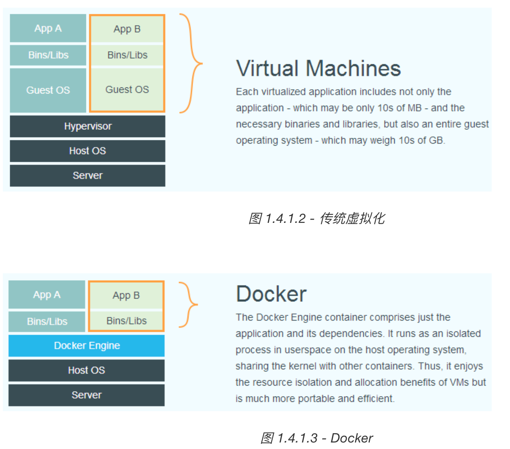
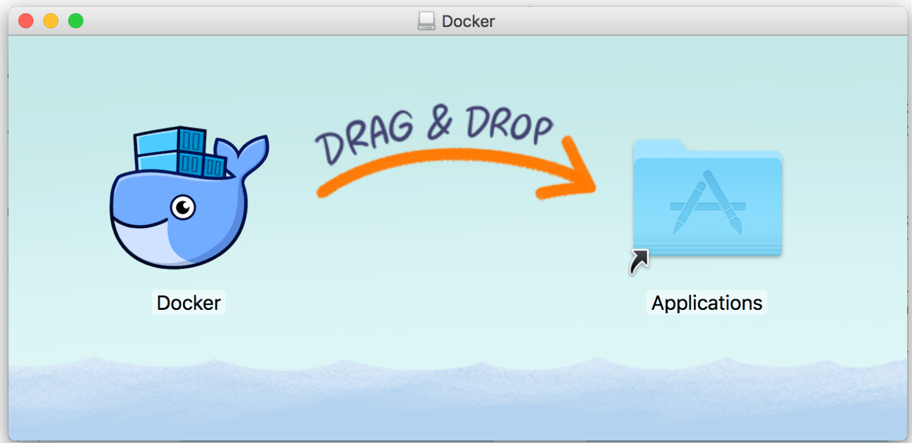
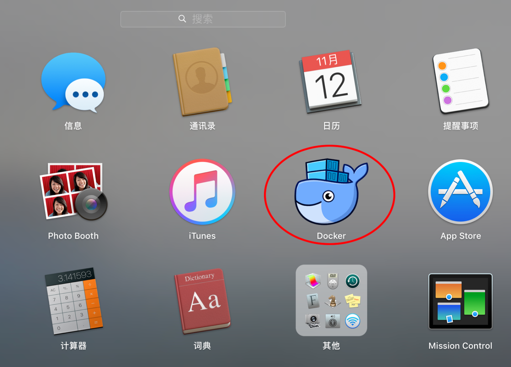
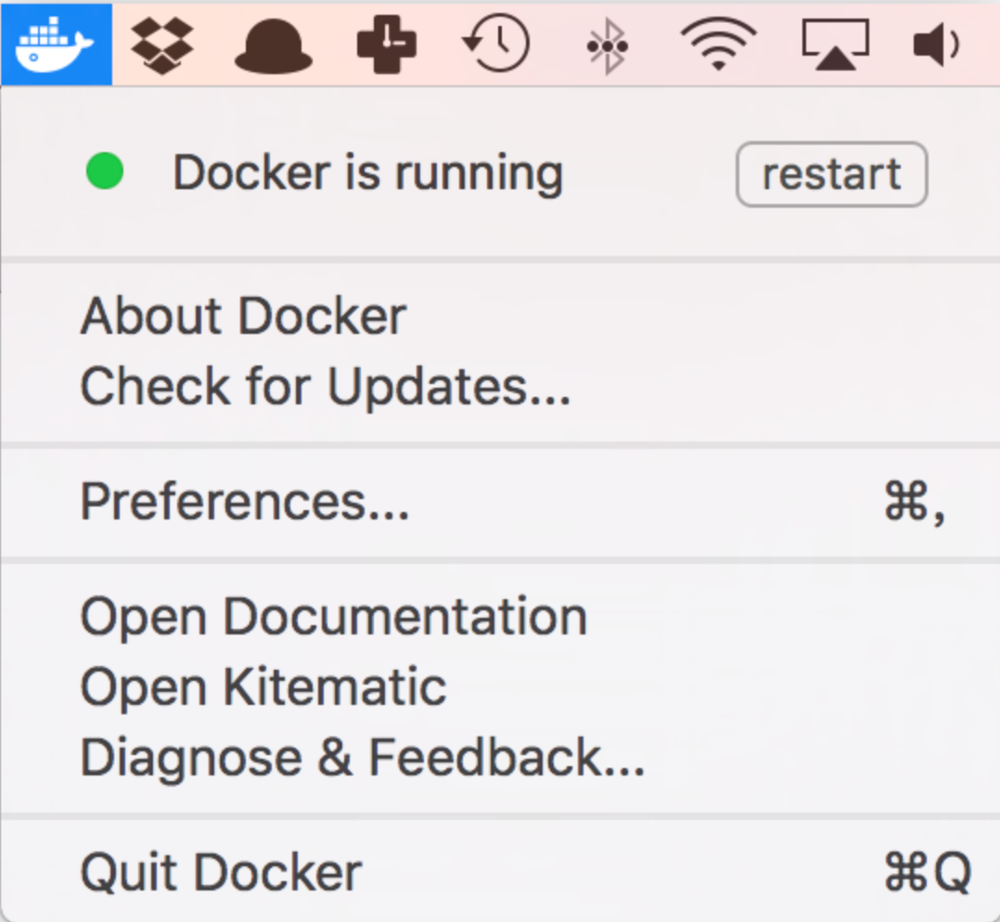
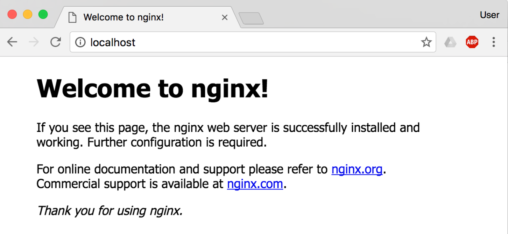
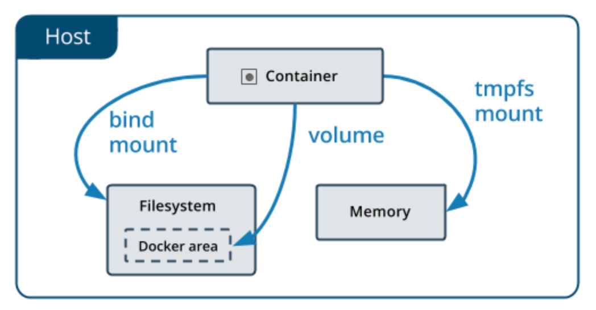

# Docker — 从入门到实践学习笔记


- [Docker — 从入门到实践学习笔记](#docker--从入门到实践学习笔记)
- [一、Docker 简介](#一docker-简介)
  - [1.1 Docker Vs 和传统虚拟化](#11-docker-vs-和传统虚拟化)
- [二、基本概念](#二基本概念)
  - [镜像](#镜像)
  - [容器](#容器)
  - [Docker Registry](#docker-registry)
- [三、docker 安装](#三docker-安装)
  - [macos 安装](#macos-安装)
    - [系统要求](#系统要求)
    - [安装](#安装)
      - [使用 Homebrew 安装](#使用-homebrew-安装)
      - [手动下载安装](#手动下载安装)
    - [运行](#运行)
  - [镜像加速器](#镜像加速器)
- [四、使用镜像](#四使用镜像)
  - [获取镜像](#获取镜像)
  - [运行](#运行-1)
  - [列出镜像](#列出镜像)
    - [镜像的体积](#镜像的体积)
    - [虚悬镜像](#虚悬镜像)
    - [中间层镜像](#中间层镜像)
    - [列出部分镜像](#列出部分镜像)
    - [以特定格式显示](#以特定格式显示)
  - [删除本地镜像](#删除本地镜像)
    - [用 ID、镜像名、摘要删除镜像](#用-id镜像名摘要删除镜像)
    - [用 docker image ls 命令来配合](#用-docker-image-ls-命令来配合)
  - [使用 Dockerfile 定制镜像](#使用-dockerfile-定制镜像)
    - [FROM 指定基础镜像](#from-指定基础镜像)
    - [RUN 执行命令](#run-执行命令)
    - [利用 commit 理解镜像构成](#利用-commit-理解镜像构成)
    - [构建镜像](#构建镜像)
    - [镜像构建上下文（Context）](#镜像构建上下文context)
    - [其它 docker build 的用法](#其它-docker-build-的用法)
      - [直接用 Git repo 进行构建](#直接用-git-repo-进行构建)
      - [用给定的 tar 压缩包构建](#用给定的-tar-压缩包构建)
      - [从标准输入中读取 Dockerfile 进行构建](#从标准输入中读取-dockerfile-进行构建)
      - [从标准输入中读取上下文压缩包进行构建](#从标准输入中读取上下文压缩包进行构建)
    - [Dockerfile 指令](#dockerfile-指令)
      - [COPY 赋值文件](#copy-赋值文件)
      - [ADD 更高级的复制文件](#add-更高级的复制文件)
      - [CMD 容器启动命令](#cmd-容器启动命令)
      - [ENTRYPOINT 入口点](#entrypoint-入口点)
      - [ENV 设置环境变量](#env-设置环境变量)
      - [ARG 构建参数](#arg-构建参数)
      - [VOLUME 定义匿名卷](#volume-定义匿名卷)
      - [EXPOSE 声明端口](#expose-声明端口)
      - [WORKDIR 指定工作目录](#workdir-指定工作目录)
      - [USER 指定当前用户](#user-指定当前用户)
      - [HEALTHCHECK 健康检查](#healthcheck-健康检查)
      - [ONBUILD 为他人做嫁衣裳](#onbuild-为他人做嫁衣裳)
      - [LABEL 指令](#label-指令)
      - [SHELL 指令](#shell-指令)
      - [参考文档](#参考文档)
- [五、操作Docker容器](#五操作docker容器)
  - [启动容器](#启动容器)
    - [新建并启动](#新建并启动)
    - [启动已终止容器](#启动已终止容器)
  - [后台运行](#后台运行)
  - [终止容器](#终止容器)
  - [进入容器](#进入容器)
    - [attach 命令](#attach-命令)
    - [exec 命令](#exec-命令)
  - [导出和导入容器](#导出和导入容器)
    - [导出容器](#导出容器)
    - [导入容器快照](#导入容器快照)
  - [删除容器](#删除容器)
- [六、仓库访问](#六仓库访问)
  - [Docker Hub](#docker-hub)
    - [注册](#注册)
    - [登录退出](#登录退出)
    - [拉取镜像](#拉取镜像)
    - [推送镜像](#推送镜像)
    - [自动构建](#自动构建)
  - [私有仓库](#私有仓库)
    - [安装运行 docker-registry](#安装运行-docker-registry)
      - [容器运行](#容器运行)
    - [在私有仓库上传、搜索、下载镜像](#在私有仓库上传搜索下载镜像)
      - [先在本机查看已有的镜像。](#先在本机查看已有的镜像)
      - [使用 docker tag 将 ubuntu:latest 这个镜像标记为 127.0.0.1:5000/ubuntu:latest。](#使用-docker-tag-将-ubuntulatest-这个镜像标记为-1270015000ubuntulatest)
      - [使用 docker push 上传标记的镜像。](#使用-docker-push-上传标记的镜像)
      - [先删除已有镜像，再尝试从私有仓库中下载这个镜像。](#先删除已有镜像再尝试从私有仓库中下载这个镜像)
      - [配置非 https 仓库地址](#配置非-https-仓库地址)
  - [私有仓库高级配置](#私有仓库高级配置)
  - [Nexus3.x 的私有仓库](#nexus3x-的私有仓库)
- [七、Docker 数据管理](#七docker-数据管理)
  - [数据卷](#数据卷)
    - [创建一个数据卷](#创建一个数据卷)
    - [启动一个挂载数据卷的容器](#启动一个挂载数据卷的容器)
    - [查看数据卷的具体信息](#查看数据卷的具体信息)
    - [删除数据卷](#删除数据卷)
  - [挂载主机目录](#挂载主机目录)
    - [挂载一个主机目录作为数据卷](#挂载一个主机目录作为数据卷)
    - [挂载一个本地主机文件作为数据卷](#挂载一个本地主机文件作为数据卷)
- [八、使用网络](#八使用网络)
  - [外部访问容器](#外部访问容器)
    - [外部访问容器](#外部访问容器-1)
    - [查看映射端口配置](#查看映射端口配置)
  - [容器互联](#容器互联)
    - [新建网络](#新建网络)
    - [连接容器](#连接容器)
    - [Docker Compose](#docker-compose)
  - [DNS 配置](#dns-配置)
- [九、高级网络配置](#九高级网络配置)
- [十、Docker Compose 项目](#十docker-compose-项目)
  - [Compose 简介](#compose-简介)
  - [安装与卸载](#安装与卸载)
    - [Docker Desktop for Mac/Windows 自带 compose，安装 Docker 之后可以直接使用。](#docker-desktop-for-macwindows-自带-compose安装-docker-之后可以直接使用)
    - [二进制包](#二进制包)
  - [使用](#使用)
    - [术语](#术语)
    - [场景](#场景)
    - [web 应用](#web-应用)
  - [Compose 命令说明](#compose-命令说明)
    - [命令对象与格式](#命令对象与格式)
    - [命令选项](#命令选项)
    - [命令使用说明](#命令使用说明)
    - [build](#build)
    - [config](#config)
    - [ls](#ls)
    - [down](#down)
    - [exec](#exec)
    - [help](#help)
    - [images](#images)
    - [kill](#kill)
    - [logs](#logs)
    - [pause](#pause)
    - [port](#port)
    - [ps](#ps)
    - [pull](#pull)
    - [push](#push)
    - [restart](#restart)
    - [rm](#rm)
    - [run](#run)
    - [start](#start)
    - [stop](#stop)
    - [top](#top)
    - [unpause](#unpause)
    - [up](#up)
    - [version](#version)
    - [参考资料](#参考资料)
  - [Compose 模板文件](#compose-模板文件)
    - [build](#build-1)
    - [cap\_add, cap\_drop](#cap_add-cap_drop)
    - [command](#command)
    - [configs](#configs)
    - [cgroup\_parent](#cgroup_parent)
    - [container\_name](#container_name)
    - [deploy](#deploy)
    - [devices](#devices)
    - [depends\_on](#depends_on)
    - [dns](#dns)
    - [dns\_search](#dns_search)
    - [tmpfs](#tmpfs)
    - [env\_file](#env_file)
    - [environment](#environment)
    - [expose](#expose)
    - [external\_links](#external_links)
    - [extra\_hosts](#extra_hosts)
    - [healthcheck](#healthcheck)
    - [image](#image)
    - [labels](#labels)
    - [links](#links)
    - [logging](#logging)
    - [network\_mode](#network_mode)
    - [networks](#networks)
    - [pid](#pid)
    - [ports](#ports)
    - [secrets](#secrets)
    - [security\_opt](#security_opt)
    - [stop\_signal](#stop_signal)
    - [sysctls](#sysctls)
    - [ulimits](#ulimits)
    - [volumes](#volumes)
    - [其它指令](#其它指令)
    - [读取变量](#读取变量)
    - [参考资料](#参考资料-1)


# 一、Docker 简介

## 1.1 Docker Vs 和传统虚拟化
Docker 在容器的基础上，进行了进一步的封装，从文件系统、网络互联到进程隔离等等，极大的简化了容器的创建和维护。使得 Docker 技术比虚拟机技术更为轻便、快捷。

下面的图片比较了 Docker 和传统虚拟化方式的不同之处。传统虚拟机技术是虚拟出一套硬件后，在其上运行一个完整操作系统，在该系统上再运行所需应用进程；而容器内的应用进程直接运行于宿主的内核，容器内没有自己的内核，而且也没有进行硬件虚拟。因此容器要比传统虚拟机更为轻便。




**对比传统虚拟机总结**

| 特性       | 容器               | 虚拟机     |
| :--------- | :----------------- | :--------- |
| 启动       | 秒级               | 分钟级     |
| 硬盘使用   | 一般为 MB          | 一般为 GB  |
| 性能       | 接近原生           | 弱于       |
| 系统支持量 | 单机支持上千个容器 | 一般几十个 |

# 二、基本概念
## 镜像
我们都知道，操作系统分为 内核 和 用户空间。对于 Linux 而言，内核启动后，会挂载 root 文件系统为其提供用户空间支持。而 Docker 镜像（Image），就相当于是一个 root 文件系统。比如官方镜像 ubuntu:18.04 就包含了完整的一套 Ubuntu 18.04 最小系统的 root 文件系统。

Docker 镜像 是一个特殊的文件系统，除了提供容器运行时所需的程序、库、资源、配置等文件外，还包含了一些为运行时准备的一些配置参数（如匿名卷、环境变量、用户等）。镜像 不包含 任何动态数据，其内容在构建之后也不会被改变。

## 容器
镜像（Image）和容器（Container）的关系，就像是面向对象程序设计中的 类 和 实例 一样，镜像是静态的定义，容器是镜像运行时的实体。容器可以被创建、启动、停止、删除、暂停等。

每一个容器运行时，是以镜像为基础层，在其上创建一个当前容器的存储层，我们可以称这个为容器运行时读写而准备的存储层为 容器存储层。

容器存储层的生存周期和容器一样，容器消亡时，容器存储层也随之消亡。因此，任何保存于容器存储层的信息都会随容器删除而丢失。

按照 Docker 最佳实践的要求，容器不应该向其存储层内写入任何数据，容器存储层要保持无状态化。所有的文件写入操作，都应该使用 数据卷（Volume）、或者 绑定宿主目录，在这些位置的读写会跳过容器存储层，直接对宿主（或网络存储）发生读写，其性能和稳定性更高。

数据卷的生存周期独立于容器，容器消亡，数据卷不会消亡。因此，使用数据卷后，容器删除或者重新运行之后，数据却不会丢失。


## Docker Registry

镜像构建完成后，可以很容易的在当前宿主机上运行，但是，如果需要在其它服务器上使用这个镜像，我们就需要一个集中的存储、分发镜像的服务，Docker Registry 就是这样的服务。

一个 Docker Registry 中可以包含多个 仓库（Repository）；每个仓库可以包含多个 标签（Tag）；每个标签对应一个镜像。

通常，一个仓库会包含同一个软件不同版本的镜像，而标签就常用于对应该软件的各个版本。我们可以通过 <仓库名>:<标签> 的格式来指定具体是这个软件哪个版本的镜像。如果不给出标签，将以 latest 作为默认标签。

以 Ubuntu 镜像 为例，ubuntu 是仓库的名字，其内包含有不同的版本标签，如，16.04, 18.04。我们可以通过 ubuntu:16.04，或者 ubuntu:18.04 来具体指定所需哪个版本的镜像。如果忽略了标签，比如 ubuntu，那将视为 ubuntu:latest。

仓库名经常以 两段式路径 形式出现，比如 jwilder/nginx-proxy，前者往往意味着 Docker Registry 多用户环境下的用户名，后者则往往是对应的软件名。但这并非绝对，取决于所使用的具体 Docker Registry 的软件或服务。

**Docker Registry 公开服务**  

Docker Registry 公开服务是开放给用户使用、允许用户管理镜像的 Registry 服务。一般这类公开服务允许用户免费上传、下载公开的镜像，并可能提供收费服务供用户管理私有镜像。

最常使用的 Registry 公开服务是官方的 Docker Hub，这也是默认的 Registry，并拥有大量的高质量的 官方镜像。

由于某些原因，在国内访问这些服务可能会比较慢。国内的一些云服务商提供了针对 Docker Hub 的镜像服务（Registry Mirror），这些镜像服务被称为 加速器。常见的有 阿里云加速器、DaoCloud 加速器 等。使用加速器会直接从国内的地址下载 Docker Hub 的镜像，比直接从 Docker Hub 下载速度会提高很多。在 安装 Docker 一节中有详细的配置方法。

国内也有一些云服务商提供类似于 Docker Hub 的公开服务。比如 网易云镜像服务、DaoCloud 镜像市场、阿里云镜像库 等。

**私有 Docker Registry**  

除了使用公开服务外，用户还可以在本地搭建私有 Docker Registry。


# 三、docker 安装
Ubuntu安装参考： https://docker-practice.github.io/zh-cn/install/ubuntu.html  
CentOs安装参考： https://docker-practice.github.io/zh-cn/install/centos.html  
windows安装：https://docker-practice.github.io/zh-cn/install/windows.html  

## macos 安装
https://docker-practice.github.io/zh-cn/install/mac.html  

### 系统要求  
Docker Desktop for Mac 要求系统最低为 macOS Mojave 10.14。

### 安装  
#### 使用 Homebrew 安装  
Homebrew 的 Cask 已经支持 Docker Desktop for Mac，因此可以很方便的使用 Homebrew Cask 来进行安装：

```shell 
$ brew install --cask docker
```

#### 手动下载安装
如果需要手动下载，请点击以下 链接 下载 Docker Desktop for Mac。

>如果你的电脑搭载的是 M1 芯片（arm64 架构），请点击以下 链接 下载 Docker Desktop for Mac。你可以在 官方文档 查阅已知的问题。

如同 macOS 其它软件一样，安装也非常简单，双击下载的 .dmg 文件，然后将那只叫 Moby 的鲸鱼图标拖拽到 Application 文件夹即可（其间需要输入用户密码）。



### 运行
从应用中找到 Docker 图标并点击运行。



运行之后，会在右上角菜单栏看到多了一个鲸鱼图标，这个图标表明了 Docker 的运行状态。


每次点击鲸鱼图标会弹出操作菜单。



之后，你可以在终端通过命令检查安装后的 Docker 版本。

```shell $ docker --version
Docker version 20.10.0, build 7287ab3
```
如果 docker version、docker info 都正常的话，可以尝试运行一个 Nginx 服务器：
```shell
$ docker run -d -p 80:80 --name webserver nginx
```
- -d 标志用于表示“后台运行”（daemon）。当你使用 docker run -d 命令启动一个容器时，这个容器将在后台运行，不会阻塞你的终端或命令行界面。这样你可以继续在当前终端执行其他命令，而容器则在后台运行并执行其指定的任务。
- -p <宿主端口>:<容器端口>

服务运行后，可以访问 http://localhost，如果看到了 "Welcome to nginx!"，就说明 Docker Desktop for Mac 安装成功了。



要停止 Nginx 服务器并删除执行下面的命令：

```shell
$ docker stop webserver
$ docker rm webserver
```

## 镜像加速器
如果在使用过程中发现拉取 Docker 镜像十分缓慢，可以配置 Docker 国内镜像加速。

[参考链接](https://docker-practice.github.io/zh-cn/install/mirror.html)


# 四、使用镜像

## 获取镜像
之前提到过，Docker Hub 上有大量的高质量的镜像可以用，这里我们就说一下怎么获取这些镜像。

从 Docker 镜像仓库获取镜像的命令是 docker pull。其命令格式为：
```shell
$ docker pull [选项] [Docker Registry 地址[:端口号]/]仓库名[:标签]
```

具体的选项可以通过 docker pull --help 命令看到，这里我们说一下镜像名称的格式。

- Docker 镜像仓库地址：地址的格式一般是 <域名/IP>[:端口号]。默认地址是 Docker Hub(docker.io)。
- 仓库名：如之前所说，这里的仓库名是两段式名称，即 <用户名>/<软件名>。对于 Docker Hub，如果不给出用户名，则默认为 library，也就是官方镜像。

比如： 
```shell
$ docker pull ubuntu:18.04   # ubuntu 仓库名，18.04 为标签一般标签达标版本
18.04: Pulling from library/ubuntu
92dc2a97ff99: Pull complete
be13a9d27eb8: Pull complete
c8299583700a: Pull complete
Digest: sha256:4bc3ae6596938cb0d9e5ac51a1152ec9dcac2a1c50829c74abd9c4361e321b26
Status: Downloaded newer image for ubuntu:18.04
docker.io/library/ubuntu:18.04
```

上面的命令中没有给出 Docker 镜像仓库地址，因此将会从 Docker Hub （docker.io）获取镜像。而镜像名称是 ubuntu:18.04，因此将会获取官方镜像 library/ubuntu 仓库中标签为 18.04 的镜像。docker pull 命令的输出结果最后一行给出了镜像的完整名称，即： docker.io/library/ubuntu:18.04。


从下载过程中可以看到我们之前提及的分层存储的概念，镜像是由多层存储所构成。下载也是一层层的去下载，并非单一文件。下载过程中给出了每一层的 ID 的前 12 位。并且下载结束后，给出该镜像完整的 sha256 的摘要，以确保下载一致性。

在使用上面命令的时候，你可能会发现，你所看到的层 ID 以及 sha256 的摘要和这里的不一样。这是因为官方镜像是一直在维护的，有任何新的 bug，或者版本更新，都会进行修复再以原来的标签发布，这样可以确保任何使用这个标签的用户可以获得更安全、更稳定的镜像。

如果从 Docker Hub 下载镜像非常缓慢，可以参照 [镜像加速器](#镜像加速器) 一节配置加速器。


## 运行
有了镜像后，我们就能够以这个镜像为基础启动并运行一个容器。以上面的 ubuntu:18.04 为例，如果我们打算启动里面的 bash 并且进行交互式操作的话，可以执行下面的命令。
```shell
$ docker run -it --rm ubuntu:18.04 bash

root@e7009c6ce357:/# cat /etc/os-release
NAME="Ubuntu"
VERSION="18.04.1 LTS (Bionic Beaver)"
ID=ubuntu
ID_LIKE=debian
PRETTY_NAME="Ubuntu 18.04.1 LTS"
VERSION_ID="18.04"
HOME_URL="https://www.ubuntu.com/"
SUPPORT_URL="https://help.ubuntu.com/"
BUG_REPORT_URL="https://bugs.launchpad.net/ubuntu/"
PRIVACY_POLICY_URL="https://www.ubuntu.com/legal/terms-and-policies/privacy-policy"
VERSION_CODENAME=bionic
UBUNTU_CODENAME=bionic
```

docker run 就是运行容器的命令，具体格式我们会在 容器 一节进行详细讲解，我们这里简要的说明一下上面用到的参数。
- -it：这是两个参数，一个是 -i：交互式操作，一个是 -t 终端。我们这里打算进入 bash 执行一些命令并查看返回结果，因此我们需要交互式终端。
- --rm：这个参数是说容器退出后随之将其删除。默认情况下，为了排障需求，退出的容器并不会立即删除，除非手动 docker rm。我们这里只是随便执行个命令，看看结果，不需要排障和保留结果，因此使用 --rm 可以避免浪费空间。
- ubuntu:18.04：这是指用 ubuntu:18.04 镜像为基础来启动容器。
- bash：放在镜像名后的是 命令，这里我们希望有个交互式 Shell，因此用的是 bash。

进入容器后，我们可以在 Shell 下操作，执行任何所需的命令。这里，我们执行了 cat /etc/os-release，这是 Linux 常用的查看当前系统版本的命令，从返回的结果可以看到容器内是 Ubuntu 18.04.1 LTS 系统。  

最后我们通过 exit 退出了这个容器。

## 列出镜像
要想列出已经下载下来的镜像，可以使用 docker image ls 命令。
```shell
$ docker image ls
REPOSITORY           TAG                 IMAGE ID            CREATED             SIZE
redis                latest              5f515359c7f8        5 days ago          183 MB
nginx                latest              05a60462f8ba        5 days ago          181 MB
mongo                3.2                 fe9198c04d62        5 days ago          342 MB
<none>               <none>              00285df0df87        5 days ago          342 MB
ubuntu               18.04               329ed837d508        3 days ago          63.3MB
ubuntu               bionic              329ed837d508        3 days ago          63.3MB
```
列表包含了 仓库名、标签、镜像 ID、创建时间 以及 所占用的空间。  

其中仓库名、标签在之前的基础概念章节已经介绍过了。镜像 ID 则是镜像的唯一标识，一个镜像可以对应多个 标签。因此，在上面的例子中，我们可以看到 ubuntu:18.04 和 ubuntu:bionic 拥有相同的 ID，因为它们对应的是同一个镜像。

### 镜像的体积
如果仔细观察，会注意到，这里标识的所占用空间和在 Docker Hub 上看到的镜像大小不同。比如，ubuntu:18.04 镜像大小，在这里是 63.3MB，但是在 Docker Hub 显示的却是 25.47 MB。这是因为 Docker Hub 中显示的体积是压缩后的体积。在镜像下载和上传过程中镜像是保持着压缩状态的，因此 Docker Hub 所显示的大小是网络传输中更关心的流量大小。而 docker image ls 显示的是镜像下载到本地后，展开的大小，准确说，是展开后的各层所占空间的总和，因为镜像到本地后，查看空间的时候，更关心的是本地磁盘空间占用的大小。

另外一个需要注意的问题是，docker image ls 列表中的镜像体积总和并非是所有镜像实际硬盘消耗。由于 Docker 镜像是多层存储结构，并且可以继承、复用，因此不同镜像可能会因为使用相同的基础镜像，从而拥有共同的层。由于 Docker 使用 Union FS，相同的层只需要保存一份即可，因此实际镜像硬盘占用空间很可能要比这个列表镜像大小的总和要小的多。


你可以通过 docker system df 命令来便捷的查看镜像、容器、数据卷所占用的空间。
```shell
$ docker system df

TYPE                TOTAL               ACTIVE              SIZE                RECLAIMABLE
Images              24                  0                   1.992GB             1.992GB (100%)
Containers          1                   0                   62.82MB             62.82MB (100%)
Local Volumes       9                   0                   652.2MB             652.2MB (100%)
Build Cache                                                 0B                  0B
```

### 虚悬镜像
上面的镜像列表中，还可以看到一个特殊的镜像，这个镜像既没有仓库名，也没有标签，均为 <none>。：

```shell
<none>               <none>              00285df0df87        5 days ago          342 MB
```
这个镜像原本是有镜像名和标签的，原来为 mongo:3.2，随着官方镜像维护，发布了新版本后，重新 docker pull mongo:3.2 时，mongo:3.2 这个镜像名被转移到了新下载的镜像身上，而旧的镜像上的这个名称则被取消，从而成为了 <none>。除了 docker pull 可能导致这种情况，docker build 也同样可以导致这种现象。由于新旧镜像同名，旧镜像名称被取消，从而出现仓库名、标签均为 <none> 的镜像。这类无标签镜像也被称为 虚悬镜像(dangling image) ，可以用下面的命令专门显示这类镜像：
```shell
$ docker image ls -f dangling=true
REPOSITORY          TAG                 IMAGE ID            CREATED             SIZE
<none>              <none>              00285df0df87        5 days ago          342 MB
```
一般来说，虚悬镜像已经失去了存在的价值，是可以随意删除的，可以用下面的命令删除。
```shell
$ docker image prune
```


### 中间层镜像
为了加速镜像构建、重复利用资源，Docker 会利用 中间层镜像。所以在使用一段时间后，可能会看到一些依赖的中间层镜像。默认的 docker image ls 列表中只会显示顶层镜像，如果希望显示包括中间层镜像在内的所有镜像的话，需要加 -a 参数。
```shell
$ docker image ls -a
```
这样会看到很多无标签的镜像，与之前的虚悬镜像不同，这些无标签的镜像很多都是中间层镜像，是其它镜像所依赖的镜像。这些无标签镜像不应该删除，否则会导致上层镜像因为依赖丢失而出错。实际上，这些镜像也没必要删除，因为之前说过，相同的层只会存一遍，而这些镜像是别的镜像的依赖，因此并不会因为它们被列出来而多存了一份，无论如何你也会需要它们。只要删除那些依赖它们的镜像后，这些依赖的中间层镜像也会被连带删除。


### 列出部分镜像
不加任何参数的情况下，docker image ls 会列出所有顶层镜像，但是有时候我们只希望列出部分镜像。docker image ls 有好几个参数可以帮助做到这个事情。

根据仓库名列出镜像
```shell
$ docker image ls ubuntu
REPOSITORY          TAG                 IMAGE ID            CREATED             SIZE
ubuntu              18.04               329ed837d508        3 days ago          63.3MB
ubuntu              bionic              329ed837d508        3 days ago          63.3MB
```

列出特定的某个镜像，也就是说指定仓库名和标签
```shell
$ docker image ls ubuntu:18.04
REPOSITORY          TAG                 IMAGE ID            CREATED             SIZE
ubuntu              18.04               329ed837d508        3 days ago          63.3MB
```

除此以外，docker image ls 还支持强大的过滤器参数 --filter，或者简写 -f。之前我们已经看到了使用过滤器来列出虚悬镜像的用法，它还有更多的用法。比如，我们希望看到在 mongo:3.2 之后建立的镜像，可以用下面的命令：

```shell
$ docker image ls -f since=mongo:3.2
REPOSITORY          TAG                 IMAGE ID            CREATED             SIZE
redis               latest              5f515359c7f8        5 days ago          183 MB
nginx               latest              05a60462f8ba        5 days ago          181 MB
```
想查看某个位置之前的镜像也可以，只需要把 since 换成 before 即可。

此外，如果镜像构建时，定义了 LABEL，还可以通过 LABEL 来过滤。
```shell
$ docker image ls -f label=com.example.version=0.1
...
```


### 以特定格式显示
默认情况下，docker image ls 会输出一个完整的表格，但是我们并非所有时候都会需要这些内容。比如，刚才删除虚悬镜像的时候，我们需要利用 docker image ls 把所有的虚悬镜像的 ID 列出来，然后才可以交给 docker image rm 命令作为参数来删除指定的这些镜像，这个时候就用到了 -q 参数。
```shell
$ docker image ls -q
5f515359c7f8
05a60462f8ba
fe9198c04d62
00285df0df87
329ed837d508
329ed837d508
```
 -q, --quiet           Only show image IDs

--filter 配合 -q 产生出指定范围的 ID 列表，然后送给另一个 docker 命令作为参数，从而针对这组实体成批的进行某种操作的做法在 Docker 命令行使用过程中非常常见，不仅仅是镜像，将来我们会在各个命令中看到这类搭配以完成很强大的功能。因此每次在文档看到过滤器后，可以多注意一下它们的用法。

另外一些时候，我们可能只是对表格的结构不满意，希望自己组织列；或者不希望有标题，这样方便其它程序解析结果等，这就用到了 Go 的模板语法。

比如，下面的命令会直接列出镜像结果，并且只包含镜像ID和仓库名：
```shell
$ docker image ls --format "{{.ID}}: {{.Repository}}"
5f515359c7f8: redis
05a60462f8ba: nginx
fe9198c04d62: mongo
00285df0df87: <none>
329ed837d508: ubuntu
329ed837d508: ubuntu
```

或者打算以表格等距显示，并且有标题行，和默认一样，不过自己定义列：
```shell
$ docker image ls --format "table {{.ID}}\t{{.Repository}}\t{{.Tag}}"
IMAGE ID            REPOSITORY          TAG
5f515359c7f8        redis               latest
05a60462f8ba        nginx               latest
fe9198c04d62        mongo               3.2
00285df0df87        <none>              <none>
329ed837d508        ubuntu              18.04
329ed837d508        ubuntu              bionic
```

## 删除本地镜像
如果要删除本地的镜像，可以使用 docker image rm 命令，其格式为：
```shell
$ docker image rm [选项] <镜像1> [<镜像2> ...]
```

### 用 ID、镜像名、摘要删除镜像
其中，<镜像> 可以是 镜像短 ID、镜像长 ID、镜像名 或者 镜像摘要。

比如我们有这么一些镜像：
```shell
$ docker image ls
REPOSITORY                  TAG                 IMAGE ID            CREATED             SIZE
centos                      latest              0584b3d2cf6d        3 weeks ago         196.5 MB
redis                       alpine              501ad78535f0        3 weeks ago         21.03 MB
docker                      latest              cf693ec9b5c7        3 weeks ago         105.1 MB
nginx                       latest              e43d811ce2f4        5 weeks ago         181.5 MB
```
我们可以用镜像的完整 ID，也称为 长 ID，来删除镜像。使用脚本的时候可能会用长 ID，但是人工输入就太累了，所以更多的时候是用 短 ID 来删除镜像。docker image ls 默认列出的就已经是短 ID 了，一般取前3个字符以上，只要足够区分于别的镜像就可以了。

比如这里，如果我们要删除 redis:alpine 镜像，可以执行：
```shell
$ docker image rm 501
Untagged: redis:alpine
Untagged: redis@sha256:f1ed3708f538b537eb9c2a7dd50dc90a706f7debd7e1196c9264edeea521a86d
Deleted: sha256:501ad78535f015d88872e13fa87a828425117e3d28075d0c117932b05bf189b7
Deleted: sha256:96167737e29ca8e9d74982ef2a0dda76ed7b430da55e321c071f0dbff8c2899b
Deleted: sha256:32770d1dcf835f192cafd6b9263b7b597a1778a403a109e2cc2ee866f74adf23
Deleted: sha256:127227698ad74a5846ff5153475e03439d96d4b1c7f2a449c7a826ef74a2d2fa
Deleted: sha256:1333ecc582459bac54e1437335c0816bc17634e131ea0cc48daa27d32c75eab3
Deleted: sha256:4fc455b921edf9c4aea207c51ab39b10b06540c8b4825ba57b3feed1668fa7c7
```
我们也可以用镜像名，也就是 <仓库名>:<标签>，来删除镜像。

```shell
$ docker image rm centos
Untagged: centos:latest
Untagged: centos@sha256:b2f9d1c0ff5f87a4743104d099a3d561002ac500db1b9bfa02a783a46e0d366c
Deleted: sha256:0584b3d2cf6d235ee310cf14b54667d889887b838d3f3d3033acd70fc3c48b8a
Deleted: sha256:97ca462ad9eeae25941546209454496e1d66749d53dfa2ee32bf1faabd239d38
```

当然，更精确的是使用 镜像摘要 删除镜像。
```shell
$ docker image ls --digests
REPOSITORY                  TAG                 DIGEST                                                                    IMAGE ID            CREATED             SIZE
node                        slim                sha256:b4f0e0bdeb578043c1ea6862f0d40cc4afe32a4a582f3be235a3b164422be228   6e0c4c8e3913        3 weeks ago         214 MB

$ docker image rm node@sha256:b4f0e0bdeb578043c1ea6862f0d40cc4afe32a4a582f3be235a3b164422be228
Untagged: node@sha256:b4f0e0bdeb578043c1ea6862f0d40cc4afe32a4a582f3be235a3b164422be228
```


### 用 docker image ls 命令来配合
像其它可以承接多个实体的命令一样，可以使用 docker image ls -q 来配合使用 docker image rm，这样可以成批的删除希望删除的镜像。我们在“镜像列表”章节介绍过很多过滤镜像列表的方式都可以拿过来使用。

比如，我们需要删除所有仓库名为 redis 的镜像：
```shell
$ docker image rm $(docker image ls -q redis)
```
或者删除所有在 mongo:3.2 之前的镜像：
```shell
$ docker image rm $(docker image ls -q -f before=mongo:3.2)
```
充分利用你的想象力和 Linux 命令行的强大，你可以完成很多非常赞的功能。


## 使用 Dockerfile 定制镜像
从刚才的 docker commit 的学习中，我们可以了解到，镜像的定制实际上就是定制每一层所添加的配置、文件。如果我们可以把每一层修改、安装、构建、操作的命令都写入一个脚本，用这个脚本来构建、定制镜像，那么之前提及的无法重复的问题、镜像构建透明性的问题、体积的问题就都会解决。这个脚本就是 Dockerfile。

Dockerfile 是一个文本文件，其内包含了一条条的 指令(Instruction)，每一条指令构建一层，因此每一条指令的内容，就是描述该层应当如何构建。

还以之前定制 nginx 镜像为例，这次我们使用 Dockerfile 来定制。

在一个空白目录中，建立一个文本文件，并命名为 Dockerfile：

```shell
$ mkdir mynginx
$ cd mynginx
$ touch Dockerfile
```
其内容为：

```shell
FROM nginx
RUN echo '<h1>Hello, Docker!</h1>' > /usr/share/nginx/html/index.html
```
这个 Dockerfile 很简单，一共就两行。涉及到了两条指令，FROM 和 RUN。

### FROM 指定基础镜像
所谓定制镜像，那一定是以一个镜像为基础，在其上进行定制。就像我们之前运行了一个 nginx 镜像的容器，再进行修改一样，基础镜像是必须指定的。而 FROM 就是指定 基础镜像，因此一个 Dockerfile 中 FROM 是必备的指令，并且必须是第一条指令。

在 Docker Hub 上有非常多的高质量的官方镜像，有可以直接拿来使用的服务类的镜像，如 nginx、redis、mongo、mysql、httpd、php、tomcat 等；也有一些方便开发、构建、运行各种语言应用的镜像，如 node、openjdk、python、ruby、golang 等。可以在其中寻找一个最符合我们最终目标的镜像为基础镜像进行定制。

如果没有找到对应服务的镜像，官方镜像中还提供了一些更为基础的操作系统镜像，如 ubuntu、debian、centos、fedora、alpine 等，这些操作系统的软件库为我们提供了更广阔的扩展空间。

除了选择现有镜像为基础镜像外，Docker 还存在一个特殊的镜像，名为 scratch。这个镜像是虚拟的概念，并不实际存在，它表示一个空白的镜像。

```shell
FROM scratch
...
```
如果你以 scratch 为基础镜像的话，意味着你不以任何镜像为基础，接下来所写的指令将作为镜像第一层开始存在。

不以任何系统为基础，直接将可执行文件复制进镜像的做法并不罕见，对于 Linux 下静态编译的程序来说，并不需要有操作系统提供运行时支持，所需的一切库都已经在可执行文件里了，因此直接 FROM scratch 会让镜像体积更加小巧。使用 Go 语言 开发的应用很多会使用这种方式来制作镜像，这也是为什么有人认为 Go 是特别适合容器微服务架构的语言的原因之一。

### RUN 执行命令
RUN 指令是用来执行命令行命令的。由于命令行的强大能力，RUN 指令在定制镜像时是最常用的指令之一。其格式有两种：

shell 格式：RUN <命令>，就像直接在命令行中输入的命令一样。刚才写的 Dockerfile 中的 RUN 指令就是这种格式。
```shell
RUN echo '<h1>Hello, Docker!</h1>' > /usr/share/nginx/html/index.html
```
exec 格式：RUN ["可执行文件", "参数1", "参数2"]，这更像是函数调用中的格式。
既然 RUN 就像 Shell 脚本一样可以执行命令，那么我们是否就可以像 Shell 脚本一样把每个命令对应一个 RUN 呢？比如这样：

```shell
FROM debian:stretch

RUN apt-get update
RUN apt-get install -y gcc libc6-dev make wget
RUN wget -O redis.tar.gz "http://download.redis.io/releases/redis-5.0.3.tar.gz"
RUN mkdir -p /usr/src/redis
RUN tar -xzf redis.tar.gz -C /usr/src/redis --strip-components=1
RUN make -C /usr/src/redis
RUN make -C /usr/src/redis install
```
之前说过，Dockerfile 中每一个指令都会建立一层，RUN 也不例外。每一个 RUN 的行为，就和刚才我们手工建立镜像的过程一样：新建立一层，在其上执行这些命令，执行结束后，commit 这一层的修改，构成新的镜像。

而上面的这种写法，创建了 7 层镜像。这是完全没有意义的，而且很多运行时不需要的东西，都被装进了镜像里，比如编译环境、更新的软件包等等。结果就是产生非常臃肿、非常多层的镜像，不仅仅增加了构建部署的时间，也很容易出错。 这是很多初学 Docker 的人常犯的一个错误。

Union FS 是有最大层数限制的，比如 AUFS，曾经是最大不得超过 42 层，现在是不得超过 127 层。

上面的 Dockerfile 正确的写法应该是这样：

```shell
FROM debian:stretch

RUN set -x; buildDeps='gcc libc6-dev make wget' \
    && apt-get update \
    && apt-get install -y $buildDeps \
    && wget -O redis.tar.gz "http://download.redis.io/releases/redis-5.0.3.tar.gz" \
    && mkdir -p /usr/src/redis \
    && tar -xzf redis.tar.gz -C /usr/src/redis --strip-components=1 \
    && make -C /usr/src/redis \
    && make -C /usr/src/redis install \
    && rm -rf /var/lib/apt/lists/* \
    && rm redis.tar.gz \
    && rm -r /usr/src/redis \
    && apt-get purge -y --auto-remove $buildDeps
```
首先，之前所有的命令只有一个目的，就是编译、安装 redis 可执行文件。因此没有必要建立很多层，这只是一层的事情。因此，这里没有使用很多个 RUN 一一对应不同的命令，而是仅仅使用一个 RUN 指令，并使用 && 将各个所需命令串联起来。将之前的 7 层，简化为了 1 层。在撰写 Dockerfile 的时候，要经常提醒自己，这并不是在写 Shell 脚本，而是在定义每一层该如何构建。

并且，这里为了格式化还进行了换行。Dockerfile 支持 Shell 类的行尾添加 \ 的命令换行方式，以及行首 # 进行注释的格式。良好的格式，比如换行、缩进、注释等，会让维护、排障更为容易，这是一个比较好的习惯。

此外，还可以看到这一组命令的最后添加了清理工作的命令，删除了为了编译构建所需要的软件，清理了所有下载、展开的文件，并且还清理了 apt 缓存文件。这是很重要的一步，我们之前说过，镜像是多层存储，每一层的东西并不会在下一层被删除，会一直跟随着镜像。因此镜像构建时，一定要确保每一层只添加真正需要添加的东西，任何无关的东西都应该清理掉。

很多人初学 Docker 制作出了很臃肿的镜像的原因之一，就是忘记了每一层构建的最后一定要清理掉无关文件。

### 利用 commit 理解镜像构成
略：请看原文
https://docker-practice.github.io/zh-cn/image/commit.html

### 构建镜像
好了，让我们再回到之前定制的 nginx 镜像的 Dockerfile 来。现在我们明白了这个 Dockerfile 的内容，那么让我们来构建这个镜像吧。

在 Dockerfile 文件所在目录执行：

```shell
$ docker build -t nginx:v3 .
Sending build context to Docker daemon 2.048 kB
Step 1 : FROM nginx
 ---> e43d811ce2f4
Step 2 : RUN echo '<h1>Hello, Docker!</h1>' > /usr/share/nginx/html/index.html
 ---> Running in 9cdc27646c7b
 ---> 44aa4490ce2c
Removing intermediate container 9cdc27646c7b
Successfully built 44aa4490ce2c
```
从命令的输出结果中，我们可以清晰的看到镜像的构建过程。在 Step 2 中，如同我们之前所说的那样，RUN 指令启动了一个容器 9cdc27646c7b，执行了所要求的命令，并最后提交了这一层 44aa4490ce2c，随后删除了所用到的这个容器 9cdc27646c7b。

这里我们使用了 docker build 命令进行镜像构建。其格式为：

```shell
docker build [选项] <上下文路径/URL/->
```
在这里我们指定了最终镜像的名称 -t nginx:v3，构建成功后，我们可以像之前运行 nginx:v2 那样来运行这个镜像，其结果会和 nginx:v2 一样。

### 镜像构建上下文（Context）
如果注意，会看到 docker build 命令最后有一个 .。. 表示当前目录，而 Dockerfile 就在当前目录，因此不少初学者以为这个路径是在指定 Dockerfile 所在路径，这么理解其实是不准确的。如果对应上面的命令格式，你可能会发现，这是在指定 上下文路径。那么什么是上下文呢？

首先我们要理解 docker build 的工作原理。Docker 在运行时分为 Docker 引擎（也就是服务端守护进程）和客户端工具。Docker 的引擎提供了一组 REST API，被称为 Docker Remote API，而如 docker 命令这样的客户端工具，则是通过这组 API 与 Docker 引擎交互，从而完成各种功能。因此，虽然表面上我们好像是在本机执行各种 docker 功能，但实际上，一切都是使用的远程调用形式在服务端（Docker 引擎）完成。也因为这种 C/S 设计，让我们操作远程服务器的 Docker 引擎变得轻而易举。

当我们进行镜像构建的时候，并非所有定制都会通过 RUN 指令完成，经常会需要将一些本地文件复制进镜像，比如通过 COPY 指令、ADD 指令等。而 docker build 命令构建镜像，其实并非在本地构建，而是在服务端，也就是 Docker 引擎中构建的。那么在这种客户端/服务端的架构中，如何才能让服务端获得本地文件呢？

这就引入了上下文的概念。当构建的时候，用户会指定构建镜像上下文的路径，docker build 命令得知这个路径后，会将路径下的所有内容打包，然后上传给 Docker 引擎。这样 Docker 引擎收到这个上下文包后，展开就会获得构建镜像所需的一切文件。

如果在 Dockerfile 中这么写：

```shell
COPY ./package.json /app/
```
这并不是要复制执行 docker build 命令所在的目录下的 package.json，也不是复制 Dockerfile 所在目录下的 package.json，而是复制 上下文（context） 目录下的 package.json。

因此，COPY 这类指令中的源文件的路径都是相对路径。这也是初学者经常会问的为什么 COPY ../package.json /app 或者 COPY /opt/xxxx /app 无法工作的原因，因为这些路径已经超出了上下文的范围，Docker 引擎无法获得这些位置的文件。如果真的需要那些文件，应该将它们复制到上下文目录中去。

现在就可以理解刚才的命令 docker build -t nginx:v3 . 中的这个 .，实际上是在指定上下文的目录，docker build 命令会将该目录下的内容打包交给 Docker 引擎以帮助构建镜像。

如果观察 docker build 输出，我们其实已经看到了这个发送上下文的过程：
```shell
$ docker build -t nginx:v3 .
Sending build context to Docker daemon 2.048 kB
...
```
理解构建上下文对于镜像构建是很重要的，避免犯一些不应该的错误。比如有些初学者在发现 COPY /opt/xxxx /app 不工作后，于是干脆将 Dockerfile 放到了硬盘根目录去构建，结果发现 docker build 执行后，在发送一个几十 GB 的东西，极为缓慢而且很容易构建失败。那是因为这种做法是在让 docker build 打包整个硬盘，这显然是使用错误。

一般来说，应该会将 Dockerfile 置于一个空目录下，或者项目根目录下。如果该目录下没有所需文件，那么应该把所需文件复制一份过来。如果目录下有些东西确实不希望构建时传给 Docker 引擎，那么可以用 .gitignore 一样的语法写一个 .dockerignore，该文件是用于剔除不需要作为上下文传递给 Docker 引擎的。

那么为什么会有人误以为 . 是指定 Dockerfile 所在目录呢？这是因为在默认情况下，如果不额外指定 Dockerfile 的话，会将上下文目录下的名为 Dockerfile 的文件作为 Dockerfile。

这只是默认行为，实际上 Dockerfile 的文件名并不要求必须为 Dockerfile，而且并不要求必须位于上下文目录中，比如可以用 -f ../Dockerfile.php 参数指定某个文件作为 Dockerfile。

当然，一般大家习惯性的会使用默认的文件名 Dockerfile，以及会将其置于镜像构建上下文目录中。

### 其它 docker build 的用法
#### 直接用 Git repo 进行构建
或许你已经注意到了，docker build 还支持从 URL 构建，比如可以直接从 Git repo 中构建：

```shell
# $env:DOCKER_BUILDKIT=0
# export DOCKER_BUILDKIT=0

$ docker build -t hello-world https://github.com/docker-library/hello-world.git#master:amd64/hello-world

Step 1/3 : FROM scratch
 --->
Step 2/3 : COPY hello /
 ---> ac779757d46e
Step 3/3 : CMD ["/hello"]
 ---> Running in d2a513a760ed
Removing intermediate container d2a513a760ed
 ---> 038ad4142d2b
Successfully built 038ad4142d2b
```
这行命令指定了构建所需的 Git repo，并且指定分支为 master，构建目录为 /amd64/hello-world/，然后 Docker 就会自己去 git clone 这个项目、切换到指定分支、并进入到指定目录后开始构建。

#### 用给定的 tar 压缩包构建
```shell
$ docker build http://server/context.tar.gz
```
如果所给出的 URL 不是个 Git repo，而是个 tar 压缩包，那么 Docker 引擎会下载这个包，并自动解压缩，以其作为上下文，开始构建。

#### 从标准输入中读取 Dockerfile 进行构建
```shell
docker build - < Dockerfile
或

cat Dockerfile | docker build -
```
如果标准输入传入的是文本文件，则将其视为 Dockerfile，并开始构建。这种形式由于直接从标准输入中读取 Dockerfile 的内容，它没有上下文，因此不可以像其他方法那样可以将本地文件 COPY 进镜像之类的事情。

#### 从标准输入中读取上下文压缩包进行构建
```shell
$ docker build - < context.tar.gz
```
如果发现标准输入的文件格式是 gzip、bzip2 以及 xz 的话，将会使其为上下文压缩包，直接将其展开，将里面视为上下文，并开始构建。


### Dockerfile 指令
 #### COPY 赋值文件
 格式：

COPY [--chown=<user>:<group>] <源路径>... <目标路径>
COPY [--chown=<user>:<group>] ["<源路径1>",... "<目标路径>"]
和 RUN 指令一样，也有两种格式，一种类似于命令行，一种类似于函数调用。

#### ADD 更高级的复制文件

ADD 指令和 COPY 的格式和性质基本一致。但是在 COPY 基础上增加了一些功能。
  - 比如自动解压场景
  
在 Docker 官方的 Dockerfile 最佳实践文档 中要求，尽可能的使用 COPY，因为 COPY 的语义很明确，就是复制文件而已，而 ADD 则包含了更复杂的功能，其行为也不一定很清晰。最适合使用 ADD 的场合，就是所提及的需要自动解压缩的场合。
  
参考：https://docker-practice.github.io/zh-cn/image/dockerfile/add.html


#### CMD 容器启动命令
CMD 指令的格式和 RUN 相似，也是两种格式：

- shell 格式：CMD <命令>
- exec 格式：CMD ["可执行文件", "参数1", "参数2"...]
  
参数列表格式：CMD ["参数1", "参数2"...]。在指定了 ENTRYPOINT 指令后，用 CMD 指定具体的参数。
之前介绍容器的时候曾经说过，Docker 不是虚拟机，容器就是进程。既然是进程，那么在启动容器的时候，需要指定所运行的程序及参数。CMD 指令就是用于指定默认的容器主进程的启动命令的。

#### ENTRYPOINT 入口点
ENTRYPOINT 的格式和 RUN 指令格式一样，分为 exec 格式和 shell 格式。

ENTRYPOINT 的目的和 CMD 一样，都是在指定容器启动程序及参数。ENTRYPOINT 在运行时也可以替代，不过比 CMD 要略显繁琐，需要通过 docker run 的参数 --entrypoint 来指定。

当指定了 ENTRYPOINT 后，CMD 的含义就发生了改变，不再是直接的运行其命令，而是将 CMD 的内容作为参数传给 ENTRYPOINT 指令，换句话说实际执行时，将变为：
```shell
<ENTRYPOINT> "<CMD>"
```


#### ENV 设置环境变量
格式有两种：

```shell
ENV <key> <value>
ENV <key1>=<value1> <key2>=<value2>...
```
这个指令很简单，就是设置环境变量而已，无论是后面的其它指令，如 RUN，还是运行时的应用，都可以直接使用这里定义的环境变量。

```shell
ENV VERSION=1.0 DEBUG=on \
    NAME="Happy Feet"
```
这个例子中演示了如何换行，以及对含有空格的值用双引号括起来的办法，这和 Shell 下的行为是一致的。


#### ARG 构建参数
```shell
格式：ARG <参数名>[=<默认值>]
```

构建参数和 ENV 的效果一样，都是设置环境变量。所不同的是，ARG 所设置的构建环境的环境变量，在将来容器运行时是不会存在这些环境变量的。但是不要因此就使用 ARG 保存密码之类的信息，因为 docker history 还是可以看到所有值的。

Dockerfile 中的 ARG 指令是定义参数名称，以及定义其默认值。该默认值可以在构建命令 docker build 中用 --build-arg <参数名>=<值> 来覆盖。

灵活的使用 ARG 指令，能够在不修改 Dockerfile 的情况下，构建出不同的镜像。

ARG 指令有生效范围，如果在 FROM 指令之前指定，那么只能用于 FROM 指令中。


#### VOLUME 定义匿名卷
格式为：
```shell
VOLUME ["<路径1>", "<路径2>"...]
VOLUME <路径>
```
之前我们说过，容器运行时应该尽量保持容器存储层不发生写操作，对于数据库类需要保存动态数据的应用，其数据库文件应该保存于卷(volume)中，后面的章节我们会进一步介绍 Docker 卷的概念。为了防止运行时用户忘记将动态文件所保存目录挂载为卷，在 Dockerfile 中，我们可以事先指定某些目录挂载为匿名卷，这样在运行时如果用户不指定挂载，其应用也可以正常运行，不会向容器存储层写入大量数据。

```shell
VOLUME /data
```
这里的 /data 目录就会在容器运行时自动挂载为匿名卷，任何向 /data 中写入的信息都不会记录进容器存储层，从而保证了容器存储层的无状态化。当然，运行容器时可以覆盖这个挂载设置。比如：

```shell
$ docker run -d -v mydata:/data xxxx
```
在这行命令中，就使用了 mydata 这个命名卷挂载到了 /data 这个位置，替代了 Dockerfile 中定义的匿名卷的挂载配置。


#### EXPOSE 声明端口
```shell
格式为 EXPOSE <端口1> [<端口2>...]。
```

EXPOSE 指令是声明容器运行时提供服务的端口，这只是一个声明，在容器运行时并不会因为这个声明应用就会开启这个端口的服务。在 Dockerfile 中写入这样的声明有两个好处，一个是帮助镜像使用者理解这个镜像服务的守护端口，以方便配置映射；另一个用处则是在运行时使用随机端口映射时，也就是 docker run -P 时，会自动随机映射 EXPOSE 的端口。

要将 EXPOSE 和在运行时使用 -p <宿主端口>:<容器端口> 区分开来。-p，是映射宿主端口和容器端口，换句话说，就是将容器的对应端口服务公开给外界访问，而 EXPOSE 仅仅是声明容器打算使用什么端口而已，并不会自动在宿主进行端口映射。


#### WORKDIR 指定工作目录
```shell
格式为 WORKDIR <工作目录路径>。
```
使用 WORKDIR 指令可以来指定工作目录（或者称为当前目录），以后各层的当前目录就被改为指定的目录，如该目录不存在，WORKDIR 会帮你建立目录。


#### USER 指定当前用户
```shell
格式：USER <用户名>[:<用户组>]
```
USER 指令和 WORKDIR 相似，都是改变环境状态并影响以后的层。WORKDIR 是改变工作目录，USER 则是改变之后层的执行 RUN, CMD 以及 ENTRYPOINT 这类命令的身份。

注意，USER 只是帮助你切换到指定用户而已，这个用户必须是事先建立好的，否则无法切换。


#### HEALTHCHECK 健康检查
格式：

```shell
HEALTHCHECK [选项] CMD <命令>：设置检查容器健康状况的命令
```
HEALTHCHECK NONE：如果基础镜像有健康检查指令，使用这行可以屏蔽掉其健康检查指令
HEALTHCHECK 指令是告诉 Docker 应该如何进行判断容器的状态是否正常，这是 Docker 1.12 引入的新指令。


HEALTHCHECK 支持下列选项：

- --interval=<间隔>：两次健康检查的间隔，默认为 30 秒；
- --timeout=<时长>：健康检查命令运行超时时间，如果超过这个时间，本次健康检查就被视为失败，默认 30 秒；
- --retries=<次数>：当连续失败指定次数后，则将容器状态视为 unhealthy，默认 3 次。
和 CMD, ENTRYPOINT 一样，HEALTHCHECK 只可以出现一次，如果写了多个，只有最后一个生效。

在 HEALTHCHECK [选项] CMD 后面的命令，格式和 ENTRYPOINT 一样，分为 shell 格式，和 exec 格式。命令的返回值决定了该次健康检查的成功与否：0：成功；1：失败；2：保留，不要使用这个值。


假设我们有个镜像是个最简单的 Web 服务，我们希望增加健康检查来判断其 Web 服务是否在正常工作，我们可以用 curl 来帮助判断，其 Dockerfile 的 HEALTHCHECK 可以这么写：
```shell
FROM nginx
RUN apt-get update && apt-get install -y curl && rm -rf /var/lib/apt/lists/*
HEALTHCHECK --interval=5s --timeout=3s \
  CMD curl -fs http://localhost/ || exit 1
  ```
这里我们设置了每 5 秒检查一次（这里为了试验所以间隔非常短，实际应该相对较长），如果健康检查命令超过 3 秒没响应就视为失败，并且使用 curl -fs http://localhost/ || exit 1 作为健康检查命令。

使用 docker build 来构建这个镜像：
```shell
$ docker build -t myweb:v1 .
```
构建好了后，我们启动一个容器：
```shell
$ docker run -d --name web -p 80:80 myweb:v1
```
当运行该镜像后，可以通过 docker container ls 看到最初的状态为 (health: starting)：
```shell
$ docker container ls
CONTAINER ID        IMAGE               COMMAND                  CREATED             STATUS                            PORTS               NAMES
03e28eb00bd0        myweb:v1            "nginx -g 'daemon off"   3 seconds ago       Up 2 seconds (health: starting)   80/tcp, 443/tcp     web
```
在等待几秒钟后，再次 docker container ls，就会看到健康状态变化为了 (healthy)：
```shell
$ docker container ls
CONTAINER ID        IMAGE               COMMAND                  CREATED             STATUS                    PORTS               NAMES
03e28eb00bd0        myweb:v1            "nginx -g 'daemon off"   18 seconds ago      Up 16 seconds (healthy)   80/tcp, 443/tcp     web
```
如果健康检查连续失败超过了重试次数，状态就会变为 (unhealthy)。

#### ONBUILD 为他人做嫁衣裳
```shell
格式：ONBUILD <其它指令>。
```

ONBUILD 是一个特殊的指令，它后面跟的是其它指令，比如 RUN, COPY 等，而这些指令，在当前镜像构建时并不会被执行。只有当以当前镜像为基础镜像，去构建下一级镜像的时候才会被执行。

Dockerfile 中的其它指令都是为了定制当前镜像而准备的，唯有 ONBUILD 是为了帮助别人定制自己而准备的。


#### LABEL 指令
LABEL 指令用来给镜像以键值对的形式添加一些元数据（metadata）。

```shell
LABEL <key>=<value> <key>=<value> <key>=<value> ...
```
我们还可以用一些标签来申明镜像的作者、文档地址等：
```shell
LABEL org.opencontainers.image.authors="yeasy"

LABEL org.opencontainers.image.documentation="https://yeasy.gitbooks.io"
```
具体可以参考 https://github.com/opencontainers/image-spec/blob/master/annotations.md


#### SHELL 指令
```shell
格式：SHELL ["executable", "parameters"]
```

SHELL 指令可以指定 RUN ENTRYPOINT CMD 指令的 shell，Linux 中默认为 ["/bin/sh", "-c"]

```shell
SHELL ["/bin/sh", "-c"]

RUN lll ; ls

SHELL ["/bin/sh", "-cex"]

RUN lll ; ls
```
两个 RUN 运行同一命令，第二个 RUN 运行的命令会打印出每条命令并当遇到错误时退出。

当 ENTRYPOINT CMD 以 shell 格式指定时，SHELL 指令所指定的 shell 也会成为这两个指令的 shell
```shell
SHELL ["/bin/sh", "-cex"]

# /bin/sh -cex "nginx"
ENTRYPOINT nginx
```

```shell
SHELL ["/bin/sh", "-cex"]

# /bin/sh -cex "nginx"
CMD nginx
```

#### 参考文档

Dockerfie 官方文档：https://docs.docker.com/engine/reference/builder/

Dockerfile 最佳实践文档：https://docs.docker.com/develop/develop-images/dockerfile_best-practices/

Docker 官方镜像 Dockerfile：https://github.com/docker-library/docs

# 五、操作Docker容器


## 启动容器
启动容器有两种方式，一种是基于镜像新建一个容器并启动，另外一个是将在终止状态（exited）的容器重新启动。

因为 Docker 的容器实在太轻量级了，很多时候用户都是随时删除和新创建容器。

### 新建并启动
所需要的命令主要为 docker run。

例如，下面的命令输出一个 “Hello World”，之后终止容器。

```shell
$ docker run ubuntu:18.04 /bin/echo 'Hello world'
Hello world
```
这跟在本地直接执行 /bin/echo 'hello world' 几乎感觉不出任何区别。

下面的命令则启动一个 bash 终端，允许用户进行交互。
```shell
$ docker run -t -i ubuntu:18.04 /bin/bash
root@af8bae53bdd3:/#
```
其中，
- **-t 选项让Docker分配一个伪终端（pseudo-tty）并绑定到容器的标准输入上，**
- **-i 则让容器的标准输入保持打开。**

在交互模式下，用户可以通过所创建的终端来输入命令，例如
```shell
root@af8bae53bdd3:/# pwd
/
root@af8bae53bdd3:/# ls
bin boot dev etc home lib lib64 media mnt opt proc root run sbin srv sys tmp usr var
```
当利用 docker run 来创建容器时，Docker 在后台运行的标准操作包括：

- 检查本地是否存在指定的镜像，不存在就从 registry 下载
- 利用镜像创建并启动一个容器
- 分配一个文件系统，并在只读的镜像层外面挂载一层可读写层
- 从宿主主机配置的网桥接口中桥接一个虚拟接口到容器中去
- 从地址池配置一个 ip 地址给容器
- 执行用户指定的应用程序
- 执行完毕后容器被终止

### 启动已终止容器
可以利用 docker container start 命令，直接将一个已经终止（exited）的容器启动运行。

```shell
# 查看容器      
$ docker container ls -a    
CONTAINER ID   IMAGE                                    COMMAND                   CREATED          STATUS                      PORTS                                      NAMES
2e5fcef4826f   ubuntu:18.04                             "/bin/bash"               11 minutes ago   Exited (0) 3 seconds ago                                               peaceful_kilby

# 重启容器
$ docker container restart 2e5fcef4826f
2e5fcef4826f
```

容器的核心为所执行的应用程序，所需要的资源都是应用程序运行所必需的。除此之外，并没有其它的资源。可以在伪终端中利用 ps 或 top 来查看进程信息。
```shell
root@ba267838cc1b:/# ps
  PID TTY          TIME CMD
    1 ?        00:00:00 bash
   11 ?        00:00:00 ps
```
可见，容器中仅运行了指定的 bash 应用。这种特点使得 Docker 对资源的利用率极高，是货真价实的轻量级虚拟化。


**docker container相关的操作命令**
```shell
➜  ~ docker container --help              

Usage:  docker container COMMAND

Manage containers

Commands:
  attach      Attach local standard input, output, and error streams to a running container
  commit      Create a new image from a container's changes
  cp          Copy files/folders between a container and the local filesystem
  create      Create a new container
  diff        Inspect changes to files or directories on a container's filesystem
  exec        Execute a command in a running container
  export      Export a container's filesystem as a tar archive
  inspect     Display detailed information on one or more containers
  kill        Kill one or more running containers
  logs        Fetch the logs of a container
  ls          List containers
  pause       Pause all processes within one or more containers
  port        List port mappings or a specific mapping for the container
  prune       Remove all stopped containers
  rename      Rename a container
  restart     Restart one or more containers
  rm          Remove one or more containers
  run         Create and run a new container from an image
  start       Start one or more stopped containers
  stats       Display a live stream of container(s) resource usage statistics
  stop        Stop one or more running containers
  top         Display the running processes of a container
  unpause     Unpause all processes within one or more containers
  update      Update configuration of one or more containers
  wait        Block until one or more containers stop, then print their exit codes

Run 'docker container COMMAND --help' for more information on a command.

```


## 后台运行
更多的时候，需要让 Docker 在后台运行而不是直接把执行命令的结果输出在当前宿主机下。此时，可以通过添加 -d 参数来实现。

下面举两个例子来说明一下。

如果不使用 -d 参数运行容器。

```shell
$ docker run ubuntu:18.04 /bin/sh -c "while true; do echo hello world; sleep 1; done"
hello world
hello world
hello world
hello world
```
容器会把输出的结果 (STDOUT) 打印到宿主机上面

如果使用了 -d 参数运行容器。
```shell
$ docker run -d ubuntu:18.04 /bin/sh -c "while true; do echo hello world; sleep 1; done"
77b2dc01fe0f3f1265df143181e7b9af5e05279a884f4776ee75350ea9d8017a
```
此时容器会在后台运行并不会把输出的结果 (STDOUT) 打印到宿主机上面(输出结果可以用 docker logs 查看)。

注： 容器是否会长久运行，是和 docker run 指定的命令有关，和 -d 参数无关。

使用 -d 参数启动后会返回一个唯一的 id，也可以通过 docker container ls 命令来查看容器信息。
```shell
$ docker container ls
CONTAINER ID  IMAGE         COMMAND               CREATED        STATUS       PORTS NAMES
77b2dc01fe0f  ubuntu:18.04  /bin/sh -c 'while tr  2 minutes ago  Up 1 minute        agitated_wright
```
要获取容器的输出信息，可以通过 docker container logs 命令。
```shell
$ docker container logs [container ID or NAMES]
hello world
hello world
hello world
. . .
```


## 终止容器
可以使用 **docker container stop 容器id** 来终止一个运行中的容器。

此外，当 Docker 容器中指定的应用终结时，容器也自动终止。

例如对于上一章节中只启动了一个终端的容器，用户通过 exit 命令或 Ctrl+d 来退出终端时，所创建的容器立刻终止。

终止状态的容器可以用 docker container ls -a 命令看到。例如
```shell
$ docker container ls -a
CONTAINER ID        IMAGE                    COMMAND                CREATED             STATUS                          PORTS               NAMES
ba267838cc1b        ubuntu:18.04             "/bin/bash"            30 minutes ago      Exited (0) About a minute ago                       trusting_newton
```
处于终止状态的容器，可以通过 docker container start 命令来重新启动。

此外，**docker container restart** 命令会将一个运行态的容器终止，然后再重新启动它。


## 进入容器
在使用 -d 参数时，容器启动后会进入后台。

某些时候需要进入容器进行操作，包括使用 docker attach 命令或 docker exec 命令，推荐大家使用 docker exec 命令，原因会在下面说明。

### attach 命令
下面示例如何使用 docker attach 命令。

```shell
$ docker run -dit ubuntu
243c32535da7d142fb0e6df616a3c3ada0b8ab417937c853a9e1c251f499f550

$ docker container ls
CONTAINER ID        IMAGE               COMMAND             CREATED             STATUS              PORTS               NAMES
243c32535da7        ubuntu:latest       "/bin/bash"         18 seconds ago      Up 17 seconds                           nostalgic_hypatia

$ docker attach 243c
root@243c32535da7:/#
```
**注意： 如果从这个 stdin 中 exit，会导致容器的停止。**

### exec 命令
-i -t 参数
docker exec 后边可以跟多个参数，这里主要说明 -i -t 参数。

只用 -i 参数时，由于没有分配伪终端，界面没有我们熟悉的 Linux 命令提示符，但命令执行结果仍然可以返回。

当 -i -t 参数一起使用时，则可以看到我们熟悉的 Linux 命令提示符。
```shell
$ docker run -dit ubuntu
69d137adef7a8a689cbcb059e94da5489d3cddd240ff675c640c8d96e84fe1f6

$ docker container ls
CONTAINER ID        IMAGE               COMMAND             CREATED             STATUS              PORTS               NAMES
69d137adef7a        ubuntu:latest       "/bin/bash"         18 seconds ago      Up 17 seconds                           zealous_swirles

$ docker exec -i 69d1 bash
# 执行命令
ls
bin
boot
dev
...

$ docker exec -it 69d1 bash
root@69d137adef7a:/#
```
**如果从这个 stdin 中 exit**，不会导致容器的停止。这就是为什么推荐大家使用 docker exec 的原因。

更多参数说明请使用 **docker exec --help** 查看。


## 导出和导入容器
### 导出容器
如果要导出本地某个容器，可以使用 docker export 命令。

```shell
$ docker container ls -a
CONTAINER ID        IMAGE               COMMAND             CREATED             STATUS                    PORTS               NAMES
7691a814370e        ubuntu:18.04        "/bin/bash"         36 hours ago        Exited (0) 21 hours ago                       test
$ docker export 7691a814370e > ubuntu.tar
```
这样将导出容器快照到本地文件。

### 导入容器快照
可以使用 docker import 从容器快照文件中再导入为镜像，例如
```shell
$ cat ubuntu.tar | docker import - test/ubuntu:v1.0
$ docker image ls
REPOSITORY          TAG                 IMAGE ID            CREATED              VIRTUAL SIZE
test/ubuntu         v1.0                9d37a6082e97        About a minute ago   171.3 MB
```
此外，也可以通过指定 URL 或者某个目录来导入，例如

```shell
$ docker import http://example.com/exampleimage.tgz example/imagerepo
```
注：用户既可以使用 docker load 来导入镜像存储文件到本地镜像库，也可以使用 docker import 来导入一个容器快照到本地镜像库。这两者的区别在于容器快照文件将丢弃所有的历史记录和元数据信息（即仅保存容器当时的快照状态），而镜像存储文件将保存完整记录，体积也要大。此外，从容器快照文件导入时可以重新指定标签等元数据信息。


## 删除容器
可以使用 **docker container rm** 来删除一个处于终止状态的容器。例如

```shell
$ docker container rm trusting_newton
trusting_newton
```
**如果要删除一个运行中的容器，可以添加 -f 参数。Docker 会发送 SIGKILL 信号给容器。**


**清理所有处于终止状态的容器**
用 docker container ls -a 命令可以查看所有已经创建的包括终止状态的容器，如果数量太多要一个个删除可能会很麻烦，用下面的命令可以清理掉所有处于终止状态的容器。

```shell
$ docker container prune
```

# 六、仓库访问
仓库（Repository）是集中存放镜像的地方。

一个容易混淆的概念是注册服务器（Registry）。实际上注册服务器是管理仓库的具体服务器，每个服务器上可以有多个仓库，而每个仓库下面有多个镜像。

## Docker Hub
目前 Docker 官方维护了一个公共仓库 Docker Hub，其中已经包括了数量超过 2,650,000 的镜像。大部分需求都可以通过在 Docker Hub 中直接下载镜像来实现。

### 注册
你可以在 https://hub.docker.com 免费注册一个 Docker 账号。

### 登录退出
可以通过执行 docker login 命令交互式的输入用户名及密码来完成在命令行界面登录 Docker Hub。

你可以通过 docker logout 退出登录。

### 拉取镜像
**你可以通过 docker search 命令来查找官方仓库中的镜像，并利用 docker pull 命令来将它下载到本地。**

例如以 centos 为关键词进行搜索：

```shell
$ docker search centos
NAME                               DESCRIPTION                                     STARS     OFFICIAL   AUTOMATED
centos                             The official build of CentOS.                   6449      [OK]
ansible/centos7-ansible            Ansible on Centos7                              132                  [OK]
consol/centos-xfce-vnc             Centos container with "headless" VNC session…   126                  [OK]
jdeathe/centos-ssh                 OpenSSH / Supervisor / EPEL/IUS/SCL Repos - …   117                  [OK]
centos/systemd                     systemd enabled base container.                 96                   [OK]
```
可以看到返回了很多包含关键字的镜像，其中包括镜像名字、描述、收藏数（表示该镜像的受关注程度）、是否官方创建（OFFICIAL）、是否自动构建 （AUTOMATED）。

根据是否是官方提供，可将镜像分为两类。

一种是类似 centos 这样的镜像，被称为基础镜像或根镜像。这些基础镜像由 Docker 公司创建、验证、支持、提供。这样的镜像往往使用单个单词作为名字。

还有一种类型，比如 ansible/centos7-ansible 镜像，它是由 Docker Hub 的注册用户创建并维护的，往往带有用户名称前缀。可以通过前缀 username/ 来指定使用某个用户提供的镜像，比如 ansible 用户。

另外，在查找的时候通过 --filter=stars=N 参数可以指定仅显示收藏数量为 N 以上的镜像。

**下载官方 centos 镜像到本地。**
```shell
$ docker pull centos
Using default tag: latest
latest: Pulling from library/centos
7a0437f04f83: Pull complete
Digest: sha256:5528e8b1b1719d34604c87e11dcd1c0a20bedf46e83b5632cdeac91b8c04efc1
Status: Downloaded newer image for centos:latest
docker.io/library/centos:latest
```

### 推送镜像
**用户也可以在登录后通过 docker push 命令来将自己的镜像推送到 Docker Hub。**

以下命令中的 username 请替换为你的 Docker 账号用户名。

```shell
$ docker tag ubuntu:18.04 username/ubuntu:18.04

$ docker image ls

REPOSITORY                                               TAG                    IMAGE ID            CREATED             SIZE
ubuntu                                                   18.04                  275d79972a86        6 days ago          94.6MB
username/ubuntu                                          18.04                  275d79972a86        6 days ago          94.6MB

$ docker push username/ubuntu:18.04

$ docker search username

NAME                      DESCRIPTION                                     STARS               OFFICIAL            AUTOMATED
username/ubuntu
```

### 自动构建
>2021 年 7 月 26 日之后，该项功能仅限付费用户使用。

自动构建（Automated Builds）可以自动触发构建镜像，方便升级镜像。

有时候，用户构建了镜像，安装了某个软件，当软件发布新版本则需要手动更新镜像。

而自动构建允许用户通过 Docker Hub 指定跟踪一个目标网站（支持 GitHub 或 BitBucket）上的项目，一旦项目发生新的提交 （commit）或者创建了新的标签（tag），Docker Hub 会自动构建镜像并推送到 Docker Hub 中。


## 私有仓库
有时候使用 Docker Hub 这样的公共仓库可能不方便，用户可以创建一个本地仓库供私人使用。

本节介绍如何使用本地仓库。

docker-registry 是官方提供的工具，可以用于构建私有的镜像仓库。本文内容基于 docker-registry v2.x 版本。

### 安装运行 docker-registry
#### 容器运行
你可以使用官方 registry 镜像来运行。

```shell
$ docker run -d -p 5000:5000 --restart=always --name registry registry
```


- docker run: 创建并启动一个新的容器。
- -d: 在后台运行容器（分离模式）。
- -p 5000:5000: 映射主机的5000端口到容器内的5000端口。
- --restart=always: 设置容器的重启策略为“总是”。这意味着如果Docker服务重启或者主机重启，这个容器会被自动重新启动。这是为了保证容器的高可用性。
- --name registry: 指定新创建的容器的名称为registry。这样可以通过名称更容易地管理容器。
- registry: 指定要运行的Docker镜像，这里是Docker Registry镜像。

这将使用官方的 registry 镜像来启动私有仓库。默认情况下，仓库会被创建在容器的 /var/lib/registry 目录下。你可以通过 -v 参数来将镜像文件存放在本地的指定路径。例如下面的例子将上传的镜像放到本地的 /opt/data/registry 目录。


```shell
$ docker run -d \
    -p 5000:5000 \
    -v /opt/data/registry:/var/lib/registry \
    registry
```
> -v /opt/data/registry:/var/lib/registry: 这是一个卷挂载标志，它将主机上的目录/opt/data/registry挂载到容器内的/var/lib/registry目录。这样可以确保容器的数据能够持久化，并且可以在容器停止或重启后保留数据。

### 在私有仓库上传、搜索、下载镜像
创建好私有仓库之后，就可以使用 docker tag 来标记一个镜像，然后推送它到仓库。例如私有仓库地址为 127.0.0.1:5000。

#### 先在本机查看已有的镜像。

```shell
$ docker image ls
REPOSITORY                        TAG                 IMAGE ID            CREATED             VIRTUAL SIZE
ubuntu                            latest              ba5877dc9bec        6 weeks ago         192.7 MB
```

#### 使用 docker tag 将 ubuntu:latest 这个镜像标记为 127.0.0.1:5000/ubuntu:latest。

> 格式为 docker tag IMAGE[:TAG] [REGISTRY_HOST[:REGISTRY_PORT]/]REPOSITORY[:TAG]。


```shell
$ docker tag ubuntu:latest 127.0.0.1:5000/ubuntu:latest
$ docker image ls
REPOSITORY                        TAG                 IMAGE ID            CREATED             VIRTUAL SIZE
ubuntu                            latest              ba5877dc9bec        6 weeks ago         192.7 MB
127.0.0.1:5000/ubuntu:latest      latest              ba5877dc9bec        6 weeks ago         192.7 MB
```

这条命令的作用是为现有的ubuntu:latest镜像创建一个新的标签127.0.0.1:5000/ubuntu:latest。这实际上是在本地创建了一个新的镜像引用，使得这个镜像可以在本地的Docker Registry上被识别。


#### 使用 docker push 上传标记的镜像。

```shell
$ docker push 127.0.0.1:5000/ubuntu:latest
The push refers to repository [127.0.0.1:5000/ubuntu]
373a30c24545: Pushed
a9148f5200b0: Pushed
cdd3de0940ab: Pushed
fc56279bbb33: Pushed
b38367233d37: Pushed
2aebd096e0e2: Pushed
latest: digest: sha256:fe4277621f10b5026266932ddf760f5a756d2facd505a94d2da12f4f52f71f5a size: 1568
```
当执行这个命令时，Docker客户端会将本地的ubuntu:latest镜像推送到127.0.0.1:5000这个地址对应的Docker Registry，并且在Registry中以ubuntu:latest的标签存储。


用 curl 查看仓库中的镜像。

```shell
$ curl 127.0.0.1:5000/v2/_catalog
{"repositories":["ubuntu"]}
```
这里可以看到 {"repositories":["ubuntu"]}，表明镜像已经被成功上传了。

#### 先删除已有镜像，再尝试从私有仓库中下载这个镜像。

```shell
$ docker image rm 127.0.0.1:5000/ubuntu:latest

$ docker pull 127.0.0.1:5000/ubuntu:latest
Pulling repository 127.0.0.1:5000/ubuntu:latest
ba5877dc9bec: Download complete
511136ea3c5a: Download complete
9bad880da3d2: Download complete
25f11f5fb0cb: Download complete
ebc34468f71d: Download complete
2318d26665ef: Download complete

$ docker image ls
REPOSITORY                         TAG                 IMAGE ID            CREATED             VIRTUAL SIZE
127.0.0.1:5000/ubuntu:latest       latest              ba5877dc9bec        6 weeks ago         192.7 MB
```


#### 配置非 https 仓库地址
如果你不想使用 127.0.0.1:5000 作为仓库地址，比如想让本网段的其他主机也能把镜像推送到私有仓库。你就得把例如 192.168.199.100:5000 这样的内网地址作为私有仓库地址，这时你会发现无法成功推送镜像。

这是因为 Docker 默认不允许非 HTTPS 方式推送镜像。我们可以通过 Docker 的配置选项来取消这个限制，或者查看下一节配置能够通过 HTTPS 访问的私有仓库。


## 私有仓库高级配置
参考：https://docker-practice.github.io/zh-cn/repository/registry_auth.html


## Nexus3.x 的私有仓库
使用 Docker 官方的 Registry 创建的仓库面临一些维护问题。比如某些镜像删除以后空间默认是不会回收的，需要一些命令去回收空间然后重启 Registry。在企业中把内部的一些工具包放入 Nexus 中是比较常见的做法，最新版本 Nexus3.x 全面支持 Docker 的私有镜像。所以使用 Nexus3.x 一个软件来管理 Docker , Maven , Yum , PyPI 等是一个明智的选择。

参考：https://docker-practice.github.io/zh-cn/repository/nexus3_registry.html


# 七、Docker 数据管理


在容器中管理数据主要有两种方式：
- 数据卷（Volumes）
- 挂载主机目录 (Bind mounts)


## 数据卷
数据卷 是一个可供一个或多个容器使用的特殊目录，它绕过 UFS，可以提供很多有用的特性：

- 数据卷 可以在容器之间共享和重用
- 对 数据卷 的修改会立马生效
- 对 数据卷 的更新，不会影响镜像
- 数据卷 默认会一直存在，即使容器被删除

>注意：数据卷 的使用，类似于 Linux 下对目录或文件进行 mount，镜像中的被指定为挂载点的目录中的文件会复制到数据卷中（仅数据卷为空时会复制）。

### 创建一个数据卷
```shell
$ docker volume create my-vol
```
查看所有的 数据卷

```shell
$ docker volume ls

DRIVER              VOLUME NAME
local               my-vol
```
在主机里使用以下命令可以查看指定 数据卷 的信息

```shell
$ docker volume inspect my-vol
[
    {
        "Driver": "local",
        "Labels": {},
        "Mountpoint": "/var/lib/docker/volumes/my-vol/_data",
        "Name": "my-vol",
        "Options": {},
        "Scope": "local"
    }
]
```

### 启动一个挂载数据卷的容器
在用 docker run 命令的时候，使用 --mount 标记来将 数据卷 挂载到容器里。在一次 docker run 中可以挂载多个 数据卷。

下面创建一个名为 web 的容器，并加载一个 数据卷 到容器的 /usr/share/nginx/html 目录。

```shell
$ docker run -d -P \
    --name web \
    # -v my-vol:/usr/share/nginx/html \
    --mount source=my-vol,target=/usr/share/nginx/html \
    nginx:alpine
```

### 查看数据卷的具体信息
在主机里使用以下命令可以查看 web 容器的信息

```shell
$ docker inspect web
```
数据卷 信息在 "Mounts" Key 下面

```shell
"Mounts": [
    {
        "Type": "volume",
        "Name": "my-vol",
        "Source": "/var/lib/docker/volumes/my-vol/_data",
        "Destination": "/usr/share/nginx/html",
        "Driver": "local",
        "Mode": "",
        "RW": true,
        "Propagation": ""
    }
],
```


根据你提供的docker inspect命令的输出结果，Source字段/var/lib/docker/volumes/my-vol/_data是指定卷在Docker守护进程所在主机上的实际存储位置。这不是容器内部的目录，而是主机上的目录。

具体来说：

- "Type": "volume" 表明这是一个Docker卷。
- "Name": "my-vol" 表明卷的名称是my-vol。
- "Source": "/var/lib/docker/volumes/my-vol/_data" 表明这个卷在主机上的实际存储位置。
- "Destination": "/usr/share/nginx/html" 表明这个卷在容器内部的挂载点是/usr/share/nginx/html。
- "Driver": "local" 表明这是一个使用Docker默认的本地存储驱动管理的卷。

因此，/var/lib/docker/volumes/my-vol/_data是主机上的目录，而不是容器内部的目录。这个目录由Docker守护进程管理，用于存储与卷相关联的数据。当你使用-v或--mount选项将卷挂载到容器时，实际上是将主机上的这个目录映射到容器内的指定路径/usr/share/nginx/html。

这意味着，尽管你在容器内看到的是/usr/share/nginx/html目录中的文件，但实际上这些文件存储在主机上的/var/lib/docker/volumes/my-vol/_data目录中。这种方法的好处是，即使容器停止或被删除，存储在卷中的数据依然会被保留下来。


```shell
cd /var/lib/docker/volumes/my-vol/_data                              
cd: no such file or directory: /var/lib/docker/volumes/my-vol/_data
```
>当你在本地主机上执行cd命令时遇到cd: no such file or directory错误，这通常是因为你试图进入的目录不存在于你的文件系统中。在这种情况下，/var/lib/docker/volumes/my-vol/_data目录可能并不在你的本地文件系统中，而是存在于Docker守护进程管理的特殊目录结构中。

Docker使用自己的存储机制来管理卷和镜像。/var/lib/docker目录及其子目录是Docker守护进程用来存储数据的地方，这些目录通常不会直接暴露给用户的文件系统，除非你明确地挂载了这些目录。

以下是一些原因和解决办法：

```shell

Docker使用自己的存储机制来管理卷和镜像。`/var/lib/docker`目录及其子目录是Docker守护进程用来存储数据的地方，这些目录通常不会直接暴露给用户的文件系统，除非你明确地挂载了这些目录。

以下是一些原因和解决办法：

### 1. Docker 卷的特殊性质
Docker卷（尤其是使用默认驱动的卷）实际上是由Docker守护进程管理的，其数据存储在一个隐藏的、由Docker守护进程管理的目录中。这意味着，即使这个目录看起来像是在`/var/lib/docker/volumes/`下，它也可能不是传统意义上的文件系统路径。

### 2. 文件权限
`/var/lib/docker`目录及其子目录可能是root用户拥有的，并且具有严格的权限设置，普通用户可能没有访问权限。

### 3. 验证Docker卷的存在
你可以通过Docker命令来查看卷的具体信息和状态。例如：
docker volume inspect my-vol

这将显示卷的所有详细信息，包括其实际存储位置等。

### 4. 访问Docker卷中的数据
如果你想访问Docker卷中的数据，通常的做法是通过Docker命令挂载卷到一个新的容器中，以便临时访问或备份数据。例如：
docker run -it -v my-vol:/mnt alpine sh

这将启动一个临时的Alpine容器，并将`my-vol`卷挂载到`/mnt`目录中。然后，你可以在容器中访问`/mnt`目录来查看或操作卷中的文件。

### 5. 直接访问卷数据
如果你想直接访问卷的数据而不启动容器，可以考虑将卷的内容复制到其他地方。例如，你可以使用`docker cp`命令：
docker cp my-vol:/usr/share/nginx/html ./my-backup-dir

这会将卷中`/usr/share/nginx/html`下的所有内容复制到当前目录下的`my-backup-dir`中。

总之，Docker卷的管理是由Docker守护进程处理的，直接通过文件系统访问卷的存储位置并不是常见的做法。通常，通过Docker命令来操作卷更加方便和安全。

```

### 删除数据卷
```shell
$ docker volume rm my-vol
```
数据卷 是被设计用来持久化数据的，它的生命周期独立于容器，Docker 不会在容器被删除后自动删除 数据卷，并且也不存在垃圾回收这样的机制来处理没有任何容器引用的 数据卷。如果需要在删除容器的同时移除数据卷。可以在删除容器的时候使用 docker rm -v 这个命令。

无主的数据卷可能会占据很多空间，要清理请使用以下命令

```shell
$ docker volume prune
```


## 挂载主机目录
### 挂载一个主机目录作为数据卷
使用 --mount 标记可以指定挂载一个本地主机的目录到容器中去。
```shell
$ docker run -d -P \
    --name web \
    # -v /src/webapp:/usr/share/nginx/html \
    --mount type=bind,source=/src/webapp,target=/usr/share/nginx/html \
    nginx:alpine
```
上面的命令加载主机的 /src/webapp 目录到容器的 /usr/share/nginx/html目录。这个功能在进行测试的时候十分方便，比如用户可以放置一些程序到本地目录中，来查看容器是否正常工作。本地目录的路径必须是绝对路径，以前使用 -v 参数时如果本地目录不存在 Docker 会自动为你创建一个文件夹，现在使用 --mount 参数时如果本地目录不存在，Docker 会报错。

Docker 挂载主机目录的默认权限是 **读写**，用户也可以通过增加 **readonly** 指定为 只读。

```shell
$ docker run -d -P \
    --name web \
    # -v /src/webapp:/usr/share/nginx/html:ro \
    --mount type=bind,source=/src/webapp,target=/usr/share/nginx/html,readonly \
    nginx:alpine
```    
加了 readonly 之后，就挂载为 只读 了。如果你在容器内 /usr/share/nginx/html 目录新建文件，会显示如下错误

```shell
/usr/share/nginx/html # touch new.txt
touch: new.txt: Read-only file system
```

查看数据卷的具体信息
在主机里使用以下命令可以查看 web 容器的信息

```shell
$ docker inspect web
```
挂载主机目录 的配置信息在 "Mounts" Key 下面

```shell
"Mounts": [
    {
        "Type": "bind",
        "Source": "/src/webapp",
        "Destination": "/usr/share/nginx/html",
        "Mode": "",
        "RW": true,
        "Propagation": "rprivate"
    }
],
```
### 挂载一个本地主机文件作为数据卷
--mount 标记也可以从主机挂载单个文件到容器中

```shell
$ docker run --rm -it \
   # -v $HOME/.bash_history:/root/.bash_history \
   --mount type=bind,source=$HOME/.bash_history,target=/root/.bash_history \
   ubuntu:18.04 \
   bash

root@2affd44b4667:/# history
1  ls
2  diskutil list

```
这样就可以记录在容器输入过的命令了。


# 八、使用网络
Docker 允许通过外部访问容器或容器互联的方式来提供网络服务。

## 外部访问容器

### 外部访问容器
容器中可以运行一些网络应用，要让外部也可以访问这些应用，**可以通过 -P 或 -p 参数来指定端口映射**。

当使用 -P 标记时，Docker 会随机映射一个端口到内部容器开放的网络端口。

使用 docker container ls 可以看到，本地主机的 32768 被映射到了容器的 80 端口。此时访问本机的 32768 端口即可访问容器内 NGINX 默认页面。

```shell
$ docker run -d -P nginx:alpine

$ docker container ls -l
CONTAINER ID        IMAGE               COMMAND                  CREATED             STATUS              PORTS                   NAMES
fae320d08268        nginx:alpine        "/docker-entrypoint.…"   24 seconds ago      Up 20 seconds       0.0.0.0:32768->80/tcp   bold_mcnulty
```
同样的，可以通过 docker logs 命令来查看访问记录。

```shell
$ docker logs fa
172.17.0.1 - - [25/Aug/2020:08:34:04 +0000] "GET / HTTP/1.1" 200 612 "-" "Mozilla/5.0 (Windows NT 10.0; Win64; x64; rv:80.0) Gecko/20100101 Firefox/80.0" "-"
```

**-p 则可以指定要映射的端口，并且，在一个指定端口上只可以绑定一个容器。支持的格式有**

>ip:hostPort:containerPort | ip::containerPort | hostPort:containerPort。

例如：
```shell
# 使用 hostPort:containerPort 格式本地的 80 端口映射到容器的 80 端口，可以执行
$ docker run -d -p 80:80 nginx:alpine

#映射到指定地址的指定端口
#可以使用 ip:hostPort:containerPort 格式指定映射使用一个特定地址，比如 localhost 地址 127.0.0.1
$ docker run -d -p 127.0.0.1:80:80 nginx:alpine

#映射到指定地址的任意端口
#使用 ip::containerPort 绑定 localhost 的任意端口到容器的 80 端口，本地主机会自动分配一个端口。
$ docker run -d -p 127.0.0.1::80 nginx:alpine

#还可以使用 udp 标记来指定 udp 端口
$ docker run -d -p 127.0.0.1:80:80/udp nginx:alpine
```


### 查看映射端口配置
使用 docker port 来查看当前映射的端口配置，也可以查看到绑定的地址

```shell
$ docker port fa 80
0.0.0.0:32768
```
注意：

- 容器有自己的内部网络和 ip 地址（使用 docker inspect 查看，Docker 还可以有一个可变的网络配置。）
- -p 标记可以多次使用来绑定多个端口

例如
```shell
$ docker run -d \
    -p 80:80 \
    -p 443:443 \
    nginx:alpine
```    


## 容器互联
如果你之前有 Docker 使用经验，你可能已经习惯了使用 --link 参数来使容器互联。

随着 Docker 网络的完善，强烈建议大家将容器加入自定义的 Docker 网络来连接多个容器，而不是使用 --link 参数。

### 新建网络
下面先创建一个新的 Docker 网络。
```shell
$ docker network create -d bridge my-net
```
-d 参数指定 Docker 网络类型，有 bridge overlay。其中 overlay 网络类型用于 Swarm mode，在本小节中你可以忽略它。

### 连接容器
运行一个容器并连接到新建的 my-net 网络
```shell
$ docker run -it --rm --name busybox1 --network my-net busybox sh
```
打开新的终端，再运行一个容器并加入到 my-net 网络

```shell
$ docker run -it --rm --name busybox2 --network my-net busybox sh
```
再打开一个新的终端查看容器信息

```shell
$ docker container ls

CONTAINER ID        IMAGE               COMMAND             CREATED             STATUS              PORTS               NAMES
b47060aca56b        busybox             "sh"                11 minutes ago      Up 11 minutes                           busybox2
8720575823ec        busybox             "sh"                16 minutes ago      Up 16 minutes                           busybox1
```
下面通过 ping 来证明 busybox1 容器和 busybox2 容器建立了互联关系。

在 busybox1 容器输入以下命令
```shell
/ # ping busybox2
PING busybox2 (172.19.0.3): 56 data bytes
64 bytes from 172.19.0.3: seq=0 ttl=64 time=0.072 ms
64 bytes from 172.19.0.3: seq=1 ttl=64 time=0.118 ms
```
用 ping 来测试连接 busybox2 容器，它会解析成 172.19.0.3。

同理在 busybox2 容器执行 ping busybox1，也会成功连接到。

```shell
/ # ping busybox1
PING busybox1 (172.19.0.2): 56 data bytes
64 bytes from 172.19.0.2: seq=0 ttl=64 time=0.064 ms
64 bytes from 172.19.0.2: seq=1 ttl=64 time=0.143 ms
```
这样，busybox1 容器和 busybox2 容器建立了互联关系。

### Docker Compose
如果你有多个容器之间需要互相连接，推荐使用 [Docker Compose](https://docker-practice.github.io/zh-cn/compose)。


## DNS 配置
参考文档：https://docker-practice.github.io/zh-cn/network/dns.html

# 九、高级网络配置
参考：https://docker-practice.github.io/zh-cn/advanced_network/


# 十、Docker Compose 项目
Docker Compose 是 Docker 官方编排（Orchestration）项目之一，负责快速的部署分布式应用。

## Compose 简介
**Docker Compose 是一个在单个服务器或主机上创建多个容器的工具**

Compose 项目是 Docker 官方的开源项目，负责实现对 Docker 容器集群的快速编排。从功能上看，跟 OpenStack 中的 Heat 十分类似。

其代码目前在 https://github.com/docker/compose 上开源。

Compose 定位是 「定义和运行多个 Docker 容器的应用（Defining and running multi-container Docker applications）」，其前身是开源项目 Fig。

**通过第一部分中的介绍，我们知道使用一个 Dockerfile 模板文件，可以让用户很方便的定义一个单独的应用容器。然而，在日常工作中，经常会碰到需要多个容器相互配合来完成某项任务的情况。例如要实现一个 Web 项目，除了 Web 服务容器本身，往往还需要再加上后端的数据库服务容器，甚至还包括负载均衡容器等。**

**Compose 恰好满足了这样的需求。它允许用户通过一个单独的 docker-compose.yml 模板文件（YAML 格式）来定义一组相关联的应用容器为一个项目（project）。**

**Compose 中有两个重要的概念：**

- 服务 (service)：一个应用的容器，实际上可以包括若干运行相同镜像的容器实例。

- 项目 (project)：由一组关联的应用容器组成的一个完整业务单元，在 docker-compose.yml 文件中定义。

Compose 的默认管理对象是项目，通过子命令对项目中的一组容器进行便捷地生命周期管理。

Compose 项目由 Python 编写，实现上调用了 Docker 服务提供的 API 来对容器进行管理。因此，只要所操作的平台支持 Docker API，就可以在其上利用 Compose 来进行编排管理。


## 安装与卸载
Compose 支持 Linux、macOS、Windows 三大平台。

### Docker Desktop for Mac/Windows 自带 compose，安装 Docker 之后可以直接使用。

```shell
$ docker compose version
```

Docker Compose version v2.6.0
Linux 系统请使用以下介绍的方法安装。

### 二进制包
在 Linux 上的也安装十分简单，从 官方 GitHub Release 处直接下载编译好的二进制文件即可。

例如，在 Linux 64 位系统上直接下载对应的二进制包。
```shell
$ DOCKER_CONFIG=/usr/local/lib/docker/cli-plugins
$ sudo mkdir -p $DOCKER_CONFIG/cli-plugins
$ sudo curl -SL https://github.com/docker/compose/releases/download/v2.6.1/docker-compose-linux-x86_64 -o $DOCKER_CONFIG/cli-plugins/docker-compose
$ sudo chmod +x $DOCKER_CONFIG/cli-plugins
$ docker compose version

# 国内用户可以使用以下方式加快下载
$ sudo curl -SL https://download.fastgit.org/docker/compose/releases/download/v2.6.1/docker-compose-linux-x86_64 -o $DOCKER_CONFIG/cli-plugins/docker-compose
```


## 使用
### 术语
首先介绍几个术语。

- 服务 (service)：一个应用容器，实际上可以运行多个相同镜像的实例。

- 项目 (project)：由一组关联的应用容器组成的一个完整业务单元。

可见，一个项目可以由多个服务（容器）关联而成，Compose 面向项目进行管理。

### 场景
最常见的项目是 web 网站，该项目应该包含 web 应用和缓存。

下面我们用 Python 来建立一个能够记录页面访问次数的 web 网站。

### web 应用
新建文件夹，在该目录中编写 app.py 文件

```python
from flask import Flask
from redis import Redis

app = Flask(__name__)
redis = Redis(host='redis', port=6379)

@app.route('/')
def hello():
    count = redis.incr('hits')
    return 'Hello World! 该页面已被访问 {} 次。\n'.format(count)

if __name__ == "__main__":
    app.run(host="0.0.0.0", debug=True)
```

Dockerfile
编写 Dockerfile 文件，内容为

```Dockerfile
FROM python:3.6-alpine
ADD . /code
WORKDIR /code
RUN pip install redis flask
CMD ["python", "app.py"]
```

docker-compose.yml
编写 docker-compose.yml 文件，这个是 Compose 使用的主模板文件。

```yaml
version: '3'
services:

  web:
    build: .
    ports:
     - "5000:5000"

  redis:
    image: "redis:alpine"
```

运行 compose 项目
```shell
$ docker compose up

$ curl http://127.0.0.1:5000/
Hello World! 该页面已被访问 2 次。
$ curl http://127.0.0.1:5000/
Hello World! 该页面已被访问 3 次。
```
此时访问本地 5000 端口，每次刷新页面，计数就会加 1。


## Compose 命令说明

### 命令对象与格式
对于 Compose 来说，大部分命令的对象既可以是项目本身，也可以指定为项目中的服务或者容器。如果没有特别的说明，命令对象将是项目，这意味着项目中所有的服务都会受到命令影响。

>执行 docker compose [COMMAND] --help 可以查看具体某个命令的使用格式。

docker compose 命令的基本的使用格式是

```shell
docker compose [-f=<arg>...] [options] [COMMAND] 
[ARGS...]
```
### 命令选项
- -f, --file FILE 指定使用的 Compose 模板文件，默认为 docker-compose.yml，可以多次指定。
- -p, --project-name NAME 指定项目名称，默认将使用所在目录名称作为项目名。
- --verbose 输出更多调试信息。
- -v, --version 打印版本并退出。

### 命令使用说明
> docker compose --help  可以查看命令说明


### build
> 格式为 docker compose build [options] [SERVICE...]。

构建（重新构建）项目中的服务容器。

服务容器一旦构建后，将会带上一个标记名，例如对于 web 项目中的一个 db 容器，可能是 web_db。

可以随时在项目目录下运行 docker compose build 来重新构建服务。

选项包括：

- --force-rm 删除构建过程中的临时容器。
- --no-cache 构建镜像过程中不使用 cache（这将加长构建过程）。
- --pull 始终尝试通过 pull 来获取更新版本的镜像。

### config
验证 Compose 文件格式是否正确，若正确则显示配置，若格式错误显示错误原因。

### ls
ls          List running compose projects
```shell
docker compose ls  
```

### down
此命令将会停止 up 命令所启动的容器，并移除网络

### exec
进入指定的容器。
> Usage:  docker compose exec [OPTIONS] SERVICE COMMAND [ARGS...]

```shell
# 指定指定的web容器
docker compose exec web sh
```

### help
获得一个命令的帮助。

### images
列出 Compose 文件中包含的镜像。

### kill
> 格式为 docker compose kill [options] [SERVICE...]。

通过发送 SIGKILL 信号来强制停止服务容器。

支持通过 -s 参数来指定发送的信号，例如通过如下指令发送 SIGINT 信号。

```shell
$ docker compose kill -s SIGINT
```

### logs
>格式为 docker compose logs [options] [SERVICE...]。

查看服务容器的输出。默认情况下，docker compose 将对不同的服务输出使用不同的颜色来区分。可以通过 --no-color 来关闭颜色。

该命令在调试问题的时候十分有用。

### pause
>格式为 docker compose pause [SERVICE...]。

暂停一个服务容器。

### port
>格式为 docker compose port [options] SERVICE PRIVATE_PORT。

打印某个容器端口所映射的公共端口。

选项：

- --protocol=proto 指定端口协议，tcp（默认值）或者 udp。

- --index=index 如果同一服务存在多个容器，指定命令对象容器的序号（默认为 1）。

### ps
>格式为 docker compose ps [options] [SERVICE...]。

列出项目中目前的所有容器。

选项：
- -q 只打印容器的 ID 信息。

### pull
> 格式为 docker compose pull [options] [SERVICE...]。

拉取服务依赖的镜像。

选项：
- --ignore-pull-failures 忽略拉取镜像过程中的错误。

### push
推送服务依赖的镜像到 Docker 镜像仓库。

### restart
>格式为 docker compose restart [options] [SERVICE...]。

重启项目中的服务。

选项：

- -t, --timeout TIMEOUT 指定重启前停止容器的超时（默认为 10 秒）。

### rm
> 格式为 docker compose rm [options] [SERVICE...]。

删除所有（停止状态的）服务容器。推荐先执行 docker compose stop 命令来停止容器。

选项：

- -f, --force 强制直接删除，包括非停止状态的容器。一般尽量不要使用该选项。
- -v 删除容器所挂载的数据卷。

### run
> 格式为 docker compose run [options] [-p PORT...] [-e KEY=VAL...] SERVICE [COMMAND] [ARGS...]。

在指定服务上执行一个命令。

例如：
```shell
$ docker compose run ubuntu ping docker.com
```
将会启动一个 ubuntu 服务容器，并执行 ping docker.com 命令。

默认情况下，如果存在关联，则所有关联的服务将会自动被启动，除非这些服务已经在运行中。

该命令类似启动容器后运行指定的命令，相关卷、链接等等都将会按照配置自动创建。

两个不同点：

- 给定命令将会覆盖原有的自动运行命令；
- 不会自动创建端口，以避免冲突。

如果不希望自动启动关联的容器，可以使用 --no-deps 选项，例如

```shell
$ docker compose run --no-deps web python manage.py shell
```
将不会启动 web 容器所关联的其它容器。

选项：

- -d 后台运行容器。

- --name NAME 为容器指定一个名字。

- --entrypoint CMD 覆盖默认的容器启动指令。

- -e KEY=VAL 设置环境变量值，可多次使用选项来设置多个环境变量。

- -u, --user="" 指定运行容器的用户名或者 uid。

- --no-deps 不自动启动关联的服务容器。

- --rm 运行命令后自动删除容器，d 模式下将忽略。

- -p, --publish=[] 映射容器端口到本地主机。

- --service-ports 配置服务端口并映射到本地主机。

- -T 不分配伪 tty，意味着依赖 tty 的指令将无法运行。

### start
>格式为 docker compose start [SERVICE...]。

启动已经存在的服务容器。

### stop
>格式为 docker compose stop [options] [SERVICE...]。

停止已经处于运行状态的容器，但不删除它。通过 docker compose start 可以再次启动这些容器。

选项：

- -t, --timeout TIMEOUT 停止容器时候的超时（默认为 10 秒）。

### top
查看各个服务容器内运行的进程。

### unpause
>格式为 docker compose unpause [SERVICE...]。

恢复处于暂停状态中的服务。

### up
>格式为 docker compose up [options] [SERVICE...]。

该命令十分强大，它将尝试自动完成包括构建镜像，（重新）创建服务，启动服务，并关联服务相关容器的一系列操作。

链接的服务都将会被自动启动，除非已经处于运行状态。

可以说，大部分时候都可以直接通过该命令来启动一个项目。

默认情况，docker compose up 启动的容器都在前台，控制台将会同时打印所有容器的输出信息，可以很方便进行调试。

当通过 Ctrl-C 停止命令时，所有容器将会停止。

如果使用 docker compose up -d，将会在后台启动并运行所有的容器。一般推荐生产环境下使用该选项。

默认情况，如果服务容器已经存在，docker compose up 将会尝试停止容器，然后重新创建（保持使用 volumes-from 挂载的卷），以保证新启动的服务匹配 docker-compose.yml 文件的最新内容。如果用户不希望容器被停止并重新创建，可以使用 docker compose up --no-recreate。这样将只会启动处于停止状态的容器，而忽略已经运行的服务。如果用户只想重新部署某个服务，可以使用 docker compose up --no-deps -d <SERVICE_NAME> 来重新创建服务并后台停止旧服务，启动新服务，并不会影响到其所依赖的服务。

选项：

- -d 在后台运行服务容器。

- --no-color 不使用颜色来区分不同的服务的控制台输出。

- --no-deps 不启动服务所链接的容器。

- --force-recreate 强制重新创建容器，不能与 --no-recreate 同时使用。

- --no-recreate 如果容器已经存在了，则不重新创建，不能与 - --force-recreate 同时使用。

- --no-build 不自动构建缺失的服务镜像。

- -t, --timeout TIMEOUT 停止容器时候的超时（默认为 10 秒）。

### version
>格式为 docker compose version。

打印版本信息。

### 参考资料
[官方文档](https://docs.docker.com/reference/cli/docker/compose/)


## Compose 模板文件
模板文件是使用 Compose 的核心，涉及到的指令关键字也比较多。但大家不用担心，这里面大部分指令跟 docker run 相关参数的含义都是类似的。

默认的模板文件名称为 docker-compose.yml，格式为 YAML 格式。

```yaml
version: "3"

services:
  webapp:
    image: examples/web
    ports:
      - "80:80"
    volumes:
      - "/data"
```      
注意每个服务都必须通过 image 指令指定镜像或 build 指令（需要 Dockerfile）等来自动构建生成镜像。

如果使用 build 指令，在 Dockerfile 中设置的选项(例如：CMD, EXPOSE, VOLUME, ENV 等) 将会自动被获取，无需在 docker-compose.yml 中重复设置。

下面分别介绍各个指令的用法。

### build
指定 Dockerfile 所在文件夹的路径（可以是绝对路径，或者相对 docker-compose.yml 文件的路径）。 Compose 将会利用它自动构建这个镜像，然后使用这个镜像。

```yaml
version: '3'
services:

  webapp:
    build: ./dir
``` 
你也可以使用 context 指令指定 Dockerfile 所在文件夹的路径。

使用 dockerfile 指令指定 Dockerfile 文件名。

使用 arg 指令指定构建镜像时的变量。

```yaml
version: '3'
services:

  webapp:
    build:
      context: ./dir
      dockerfile: Dockerfile-alternate
      args:
        buildno: 1
``` 
使用 cache_from 指定构建镜像的缓存

```yaml
build:
  context: .
  cache_from:
    - alpine:latest
    - corp/web_app:3.14
``` 
### cap_add, cap_drop
指定容器的内核能力（capacity）分配。

例如，让容器拥有所有能力可以指定为：

```yaml
cap_add:
  - ALL
``` 
去掉 NET_ADMIN 能力可以指定为：

```yaml
cap_drop:
  - NET_ADMIN
  ``` 
### command
覆盖容器启动后默认执行的命令。

```yaml
command: echo "hello world"
``` 

### configs
仅用于 Swarm mode，详细内容请查看 [Swarm mode](https://docker-practice.github.io/zh-cn/swarm_mode/) 一节。

### cgroup_parent
指定父 cgroup 组，意味着将继承该组的资源限制。

例如，创建了一个 cgroup 组名称为 cgroups_1。

```yaml
cgroup_parent: cgroups_1
``` 

### container_name
指定容器名称。默认将会使用 项目名称_服务名称_序号 这样的格式。

```yaml
container_name: docker-web-container
```
>注意: 指定容器名称后，该服务将无法进行扩展（scale），因为 Docker 不允许多个容器具有相同的名称。

### deploy
仅用于 Swarm mode，详细内容请查看 [Swarm mode](https://docker-practice.github.io/zh-cn/swarm_mode) 一节

### devices
指定设备映射关系。
```yaml
devices:
  - "/dev/ttyUSB1:/dev/ttyUSB0"
  ``` 
### depends_on
解决容器的依赖、启动先后的问题。以下例子中会先启动 redis db 再启动 web
```yaml
version: '3'

services:
  web:
    build: .
    depends_on:
      - db
      - redis

  redis:
    image: redis

  db:
    image: postgres
``` 
>注意：web 服务不会等待 redis db 「完全启动」之后才启动。

### dns
自定义 DNS 服务器。可以是一个值，也可以是一个列表。
```yaml
dns: 8.8.8.8

dns:
  - 8.8.8.8
  - 114.114.114.114
``` 

### dns_search
配置 DNS 搜索域。可以是一个值，也可以是一个列表。
```yaml
dns_search: example.com

dns_search:
  - domain1.example.com
  - domain2.example.com
``` 

### tmpfs
挂载一个 tmpfs 文件系统到容器。
```yaml
tmpfs: /run
tmpfs:
  - /run
  - /tmp
  ``` 

### env_file
从文件中获取环境变量，可以为单独的文件路径或列表。

如果通过 docker compose -f FILE 方式来指定 Compose 模板文件，则 env_file 中变量的路径会基于模板文件路径。

如果有变量名称与 environment 指令冲突，则按照惯例，以后者为准。
```yaml
env_file: .env

env_file:
  - ./common.env
  - ./apps/web.env
  - /opt/secrets.env
``` 

环境变量文件中每一行必须符合格式，支持 # 开头的注释行。

```yaml
#common.env: Set development environment
PROG_ENV=development
``` 

### environment
设置环境变量。你可以使用数组或字典两种格式。

只给定名称的变量会自动获取运行 Compose 主机上对应变量的值，可以用来防止泄露不必要的数据。
```yaml
environment:
  RACK_ENV: development
  SESSION_SECRET:

environment:
  - RACK_ENV=development
  - SESSION_SECRET
  ``` 
如果变量名称或者值中用到 true|false，yes|no 等表达 布尔 含义的词汇，最好放到引号里，避免 YAML 自动解析某些内容为对应的布尔语义。这些特定词汇，包括

```txt
y|Y|yes|Yes|YES|n|N|no|No|NO|true|True|TRUE|false|False|FALSE|on|On|ON|off|Off|OFF
```

### expose
暴露端口，但不映射到宿主机，只被连接的服务访问。

仅可以指定内部端口为参数
```yaml
expose:
 - "3000"
 - "8000"
 ``` 

### external_links
>注意：不建议使用该指令。

链接到 docker-compose.yml 外部的容器，甚至并非 Compose 管理的外部容器。
```yaml
external_links:
 - redis_1
 - project_db_1:mysql
 - project_db_1:postgresql
 ``` 

### extra_hosts
类似 Docker 中的 --add-host 参数，指定额外的 host 名称映射信息。

```yaml
extra_hosts:
 - "googledns:8.8.8.8"
 - "dockerhub:52.1.157.61"
 ``` 
会在启动后的服务容器中 /etc/hosts 文件中添加如下两条条目。

```shell
8.8.8.8 googledns
52.1.157.61 dockerhub
```

### healthcheck
通过命令检查容器是否健康运行。
```yaml
healthcheck:
  test: ["CMD", "curl", "-f", "http://localhost"]
  interval: 1m30s
  timeout: 10s
  retries: 3
``` 

### image
指定为镜像名称或镜像 ID。如果镜像在本地不存在，Compose 将会尝试拉取这个镜像。

```yaml
image: ubuntu
image: orchardup/postgresql
image: a4bc65fd
```

### labels
为容器添加 Docker 元数据（metadata）信息。例如可以为容器添加辅助说明信息。
```yaml
labels:
  com.startupteam.description: "webapp for a startup team"
  com.startupteam.department: "devops department"
  com.startupteam.release: "rc3 for v1.0"
  ``` 

### links
>注意：不推荐使用该指令。

### logging
配置日志选项。
```yaml
logging:
  driver: syslog
  options:
    syslog-address: "tcp://192.168.0.42:123"
``` 

目前支持三种日志驱动类型。
```yaml
driver: "json-file"
driver: "syslog"
driver: "none"
```

options 配置日志驱动的相关参数。
```yaml
options:
  max-size: "200k"
  max-file: "10"
``` 

### network_mode
设置网络模式。使用和 docker run 的 --network 参数一样的值。
```yaml
network_mode: "bridge"
network_mode: "host"
network_mode: "none"
network_mode: "service:[service name]"
network_mode: "container:[container name/id]"
``` 

### networks
配置容器连接的网络。
```yaml
version: "3"
services:

  some-service:
    networks:
     - some-network
     - other-network

networks:
  some-network:
  other-network:
``` 

### pid
跟主机系统共享进程命名空间。打开该选项的容器之间，以及容器和宿主机系统之间可以通过进程 ID 来相互访问和操作。

```yaml
pid: "host"
```

### ports
暴露端口信息。

使用宿主端口：容器端口 (HOST:CONTAINER) 格式，或者仅仅指定容器的端口（宿主将会随机选择端口）都可以。
```yaml
ports:
 - "3000"
 - "8000:8000"
 - "49100:22"
 - "127.0.0.1:8001:8001"
``` 
注意：当使用 HOST:CONTAINER 格式来映射端口时，如果你使用的容器端口小于 60 并且没放到引号里，可能会得到错误结果，因为 YAML 会自动解析 xx:yy 这种数字格式为 60 进制。为避免出现这种问题，建议数字串都采用引号包括起来的字符串格式。

### secrets
存储敏感数据，例如 mysql 服务密码。
```yaml
version: "3.1"
services:

mysql:
  image: mysql
  environment:
    MYSQL_ROOT_PASSWORD_FILE: /run/secrets/db_root_password
  secrets:
    - db_root_password
    - my_other_secret

secrets:
  my_secret:
    file: ./my_secret.txt
  my_other_secret:
    external: true
``` 
### security_opt
指定容器模板标签（label）机制的默认属性（用户、角色、类型、级别等）。例如配置标签的用户名和角色名。
```yaml
security_opt:
    - label:user:USER
    - label:role:ROLE
``` 
### stop_signal
设置另一个信号来停止容器。在默认情况下使用的是 SIGTERM 停止容器。
```yaml
stop_signal: SIGUSR1
``` 
### sysctls
配置容器内核参数。
```yaml
sysctls:
  net.core.somaxconn: 1024
  net.ipv4.tcp_syncookies: 0

sysctls:
  - net.core.somaxconn=1024
  - net.ipv4.tcp_syncookies=0
``` 
### ulimits
指定容器的 ulimits 限制值。

例如，指定最大进程数为 65535，指定文件句柄数为 20000（软限制，应用可以随时修改，不能超过硬限制） 和 40000（系统硬限制，只能 root 用户提高）。
```yaml
  ulimits:
    nproc: 65535
    nofile:
      soft: 20000
      hard: 40000
```   
### volumes

数据卷所挂载路径设置。可以设置为宿主机路径(HOST:CONTAINER)或者数据卷名称(VOLUME:CONTAINER)，并且可以设置访问模式 （HOST:CONTAINER:ro）。

该指令中路径支持相对路径。
```yaml
volumes:
 - /var/lib/mysql
 - cache/:/tmp/cache
 - ~/configs:/etc/configs/:ro
 ``` 
如果路径为数据卷名称，必须在文件中配置数据卷。
```yaml
version: "3"

services:
  my_src:
    image: mysql:8.0
    volumes:
      - mysql_data:/var/lib/mysql

volumes:
  mysql_data:
``` 

### 其它指令
此外，还有包括 domainname, entrypoint, hostname, ipc, mac_address, privileged, read_only, shm_size, restart, stdin_open, tty, user, working_dir 等指令，基本跟 docker run 中对应参数的功能一致。

指定服务容器启动后执行的入口文件。
```yaml
entrypoint: /code/entrypoint.sh
``` 
指定容器中运行应用的用户名。
```yaml
user: nginx
``` 
指定容器中工作目录。
```yaml
working_dir: /code
``` 
指定容器中搜索域名、主机名、mac 地址等。
```yaml
domainname: your_website.com
hostname: test
mac_address: 08-00-27-00-0C-0A
``` 
允许容器中运行一些特权命令。
```yaml
privileged: true
``` 
指定容器退出后的重启策略为始终重启。该命令对保持服务始终运行十分有效，在生产环境中推荐配置为 always 或者 unless-stopped。
```yaml
restart: always
``` 
以只读模式挂载容器的 root 文件系统，意味着不能对容器内容进行修改。
```yaml
read_only: true
``` 
打开标准输入，可以接受外部输入。
```yaml
stdin_open: true
``` 
模拟一个伪终端。
```yaml
tty: true
``` 

### 读取变量
Compose 模板文件支持动态读取主机的系统环境变量和当前目录下的 .env 文件中的变量。

例如，下面的 Compose 文件将从运行它的环境中读取变量 ${MONGO_VERSION} 的值，并写入执行的指令中。
```yaml
version: "3"
services:

db:
  image: "mongo:${MONGO_VERSION}"
``` 
如果执行 MONGO_VERSION=3.2 docker compose up 则会启动一个 mongo:3.2 镜像的容器；如果执行 MONGO_VERSION=2.8 docker compose up 则会启动一个 mongo:2.8 镜像的容器。

若当前目录存在 .env 文件，执行 docker compose 命令时将从该文件中读取变量。

在当前目录新建 .env 文件并写入以下内容。

```txt
# 支持 # 号注释
MONGO_VERSION=3.6
```
执行 docker compose up 则会启动一个 mongo:3.6 镜像的容器。

### 参考资料
[官方文档](https://docs.docker.com/reference/compose-file/)
[awesome-compose](https://github.com/docker/awesome-compose)