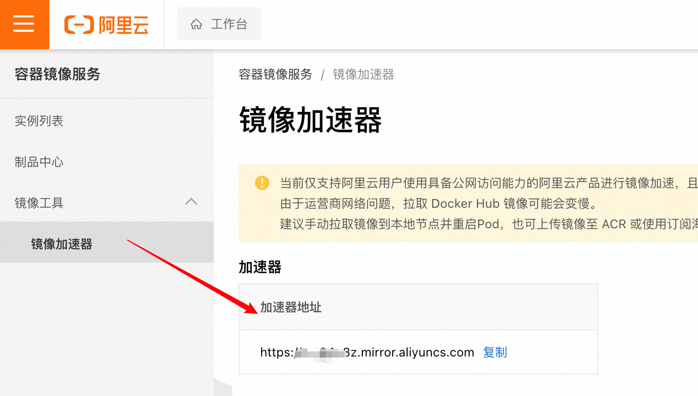
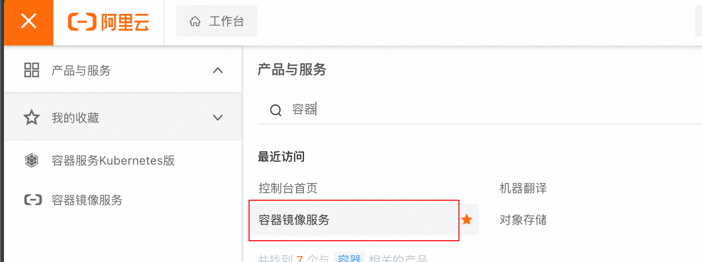
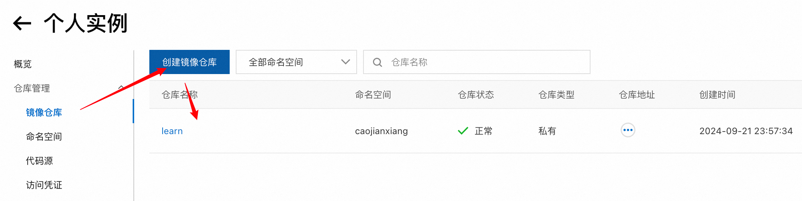
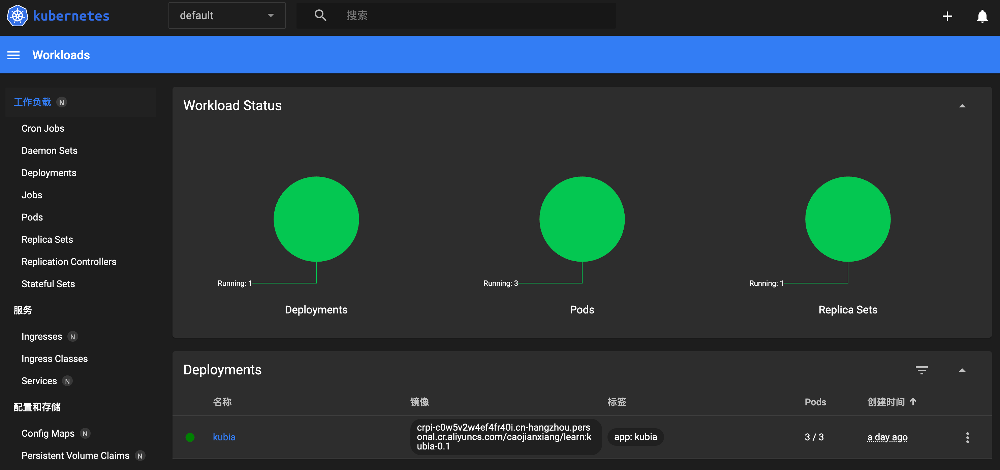
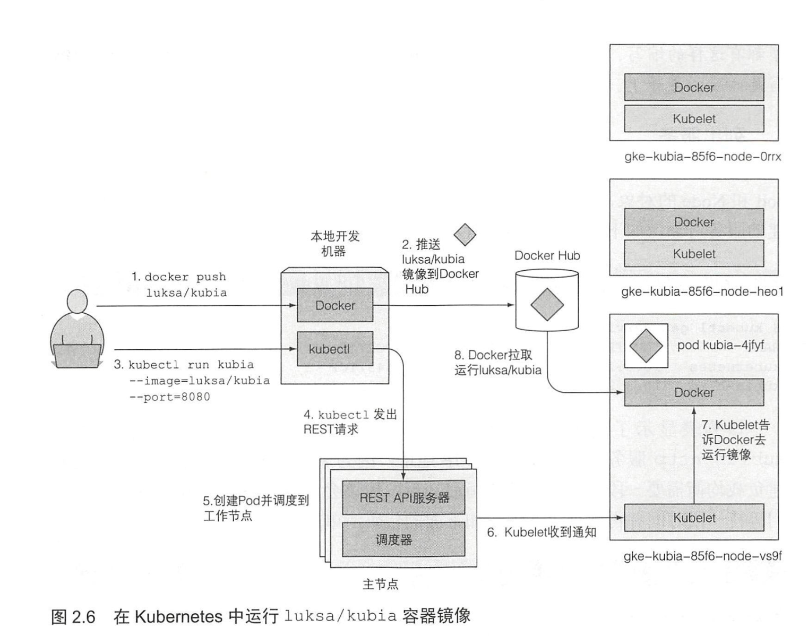
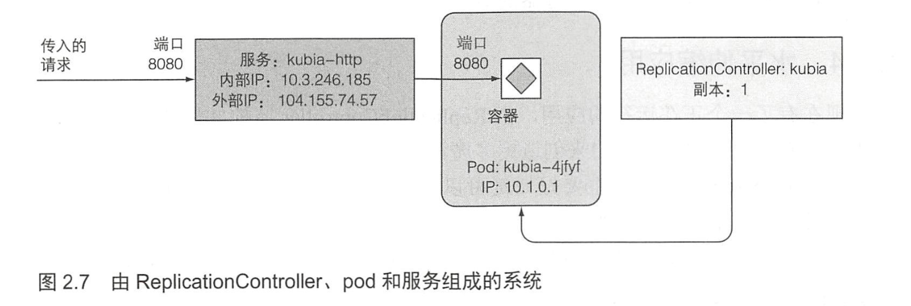
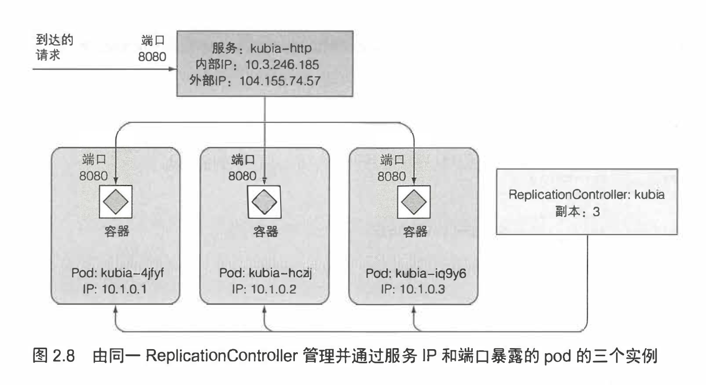

# 使用阿里云镜像仓库
阿里云提供了镜像加速器，和免费的个人镜像仓库

## 阿里云镜像加速器


## 将自己的镜像那个推送到阿里云

容器镜像服务


个人实例


创建个人的镜像仓库



操作指南
**1.登录阿里云Docker Registry**
```shell
$ docker login --username=caoj****@163.com crpi-c0w5v2w4ef4fr40i.cn-hangzhou.personal.cr.aliyuncs.com
```
用于登录的用户名为阿里云账号全名，密码为开通服务时设置的密码。

您可以在访问凭证页面修改凭证密码。

**2.从Registry中拉取镜像**
```shell
$ docker pull crpi-c0w5v2w4ef4fr40i.cn-hangzhou.personal.cr.aliyuncs.com/caojianxiang/learn:[镜像版本号]
```

**3.将镜像推送到Registry**
```shell
$ docker login --username=caoj****@163.com crpi-c0w5v2w4ef4fr40i.cn-hangzhou.personal.cr.aliyuncs.com
$ docker tag [ImageId] crpi-c0w5v2w4ef4fr40i.cn-hangzhou.personal.cr.aliyuncs.com/caojianxiang/learn:[镜像版本号]
$ docker push crpi-c0w5v2w4ef4fr40i.cn-hangzhou.personal.cr.aliyuncs.com/caojianxiang/learn:[镜像版本号]
```
请根据实际镜像信息替换示例中的[ImageId]和[镜像版本号]参数。

**4.选择合适的镜像仓库地址**
从ECS推送镜像时，可以选择使用镜像仓库内网地址。推送速度将得到提升并且将不会损耗您的公网流量。

如果您使用的机器位于VPC网络，请使用 crpi-c0w5v2w4ef4fr40i-vpc.cn-hangzhou.personal.cr.aliyuncs.com 作为Registry的域名登录。

**5.示例**
使用"docker tag"命令重命名镜像，并将它通过专有网络地址推送至Registry。

```shell
$ docker images
REPOSITORY                                                         TAG                 IMAGE ID            CREATED             VIRTUAL SIZE
registry.aliyuncs.com/acs/agent                                    0.7-dfb6816         37bb9c63c8b2        7 days ago          37.89 MB
$ docker tag 37bb9c63c8b2 crpi-c0w5v2w4ef4fr40i-vpc.cn-hangzhou.personal.cr.aliyuncs.com/acs/agent:0.7-dfb6816
```
使用 "docker push" 命令将该镜像推送至远程。

```shell
$ docker push crpi-c0w5v2w4ef4fr40i-vpc.cn-hangzhou.personal.cr.aliyuncs.com/acs/agent:0.7-dfb6816
```


## Docker登录login报错Error saving credentials
原文链接：https://blog.csdn.net/ygq13572549874/article/details/130643648

Mac OS系统，安装了Docker Desktop应用并登录了Docker Hub账号。

想通过第三方阿里云容器镜像仓库来作为Docker镜像的中转站，本地已经制作好了Image，等待上传，需要按照如下阿里云提示指令执行：

```shell
sudo docker login --username=myAliyunAccount registry.cn-beijing.aliyuncs.com
```

此时报错完整信息如下：

```shell
Error saving credentials: error storing credentials - err: exit status 1, out: `Post "http://ipc/registry/credstore-updated": dial unix backend.sock: connect: no such file or directory`
```
解决的方法是，找到docker配置文件：

```shell
~/.docker/config.json
```

打开文件，并删除掉下面这行即可（稍后登录后会自动更新该属性值）：
```shell
"credsStore": "desktop"
```

# 开始使用Kubernetes和Docker

                        


## Docke 使用参考
[Docker-learn.md](./Docker-learn.md)


## 配置Kubernetes集群

### 用Minikube 运行一个本地单节点 Kubernetes 集群
使用minikube 是运行 Kubernetes 集群最简单、 最快捷的途径。 Minikube 是一个构建单节点集群的工具，对于测试 Kubernetes 和本地开发应用都非常有用。

#### 安装Minikube
参考：https://minikube.sigs.k8s.io/docs/start/?arch=%2Fmacos%2Farm64%2Fstable%2Fbinary+download

如下是macos安装
```shell
curl -LO https://storage.googleapis.com/minikube/releases/latest/minikube-darwin-arm64
sudo install minikube-darwin-arm64 /usr/local/bin/minikube
```

#### 使用 Minikue 启动一个 Kubernetes 集群
启动集群需要花费超过一分钟的时间，所以在命令完成之前不要中断它。
```shell
minikube start
```

### 安装 Kubernetes 客户端 （kubectl）
参考：https://kubernetes.io/zh-cn/docs/tasks/tools/install-kubectl-macos/

如果安装了Docker Desktop 会自带kubectl
```shell
# Intel
   curl -LO "https://dl.k8s.io/release/$(curl -L -s https://dl.k8s.io/release/stable.txt)/bin/darwin/amd64/kubectl"

# Apple Silicon
   curl -LO "https://dl.k8s.io/release/$(curl -L -s https://dl.k8s.io/release/stable.txt)/bin/darwin/arm64/kubectl"

# brew 方式安装 
 brew install kubectl
```

### 为 kubectl 配置别名和命令行补齐
kubectl 会被经常使用。很快你就会发现每次不得不打全命令是非常痛苦的。
在继续之前，花一分钟为 kubect1设置别名和 tab 命令补全可让使用变得简单。 

**创建别名**
将下面的代码添加到~/.bashrc 或类似的文件中： 

```shell
alias k=kubect1
```

**kuebctl 配置 tab 补全**

参考：https://blog.csdn.net/Mingcai_Xiong/article/details/135962129

下边介绍方式 Oh My Zsh 历史命令自动提示

安装 zsh-autosuggestions 插件
```shell
cd ~/.oh-my-zsh/custom/plugins/
#中国区gitee.com加速
git clone https://gitee.com/XiongMingcai/zsh-autosuggestions.git
# 验证
 omz plugin list |grep autosuggesti
zsh-autosuggestions
## 启用插件
omz plugin enable zsh-autosuggestions
```

kubectl 命令缩写插件

```shell
## 启用
  omz plugin enable kubectl  
## 查看kubectl 缩写命令
  omz plugin info kubectl  
```

### minikube 加载本地镜像
参考：https://blog.csdn.net/flynetcn/article/details/140871911
```shell
minikube image load second-image
```


### minikube dashboard 启动



#### minikube 启动失败问题
参考：https://blog.csdn.net/qq_42901723/article/details/133500671

```shell

consider@consider-Dell-G15-5511:~$ minikube dashboard
🤔  正在验证 dashboard 运行情况 ...
🚀  正在启动代理...
🤔  正在验证 proxy 运行状况 ...

❌  因 SVC_URL_TIMEOUT 错误而退出：http://127.0.0.1:33619/api/v1/namespaces/kubernetes-dashboard/services/http:kubernetes-dashboard:/proxy/ 不可访问：Temporary Error: unexpected response code: 503
```

排查问题
```shell
consider@consider-Dell-G15-5511:~$ kubectl get pods --all-namespaces
NAMESPACE              NAME                                         READY   STATUS             RESTARTS   AGE
kube-system            coredns-65c54cc984-5vs9p                     1/1     Running            0          37m
kube-system            etcd-minikube                                1/1     Running            0          37m
kube-system            kube-apiserver-minikube                      1/1     Running            0          37m
kube-system            kube-controller-manager-minikube             1/1     Running            0          37m
kube-system            kube-proxy-7qgmq                             1/1     Running            0          37m
kube-system            kube-scheduler-minikube                      1/1     Running            0          37m
kube-system            storage-provisioner                          1/1     Running            0          37m
kubernetes-dashboard   dashboard-metrics-scraper-7db978b848-cjq2q   1/1     Running            0          37m
kubernetes-dashboard   kubernetes-dashboard-6f4c897964-gzmwn        0/1     ImagePullBackOff   0          37m
```
可以看到是这个节点问题，报镜像拉取错误

```shell
consider@consider-Dell-G15-5511:~$ kubectl describe --namespace=kubernetes-dashboard po kubernetes-dashboard-6f4c897964-gzmwn
Name:             kubernetes-dashboard-6f4c897964-gzmwn
Namespace:        kubernetes-dashboard
Priority:         0
Service Account:  kubernetes-dashboard
Node:             minikube/192.168.49.2
Start Time:       Mon, 02 Oct 2023 18:07:57 +0800
Labels:           gcp-auth-skip-secret=true
                  k8s-app=kubernetes-dashboard
                  pod-template-hash=6f4c897964
Annotations:      <none>
Status:           Pending
IP:               172.17.0.3
IPs:
  IP:           172.17.0.3
Controlled By:  ReplicaSet/kubernetes-dashboard-6f4c897964
Containers:
  kubernetes-dashboard:
    Container ID:  
    Image:         docker.io/kubernetesui/dashboard:v2.7.0@sha256:2e500d29e9d5f4a086b908eb8dfe7ecac57d2ab09d65b24f588b1d449841ef93
    Image ID:      
    Port:          9090/TCP
    Host Port:     0/TCP
    Args:
      --namespace=kubernetes-dashboard
      --enable-skip-login
      --disable-settings-authorizer
    State:          Waiting
      Reason:       ImagePullBackOff
    Ready:          False
    Restart Count:  0
    Liveness:       http-get http://:9090/ delay=30s timeout=30s period=10s #success=1 #failure=3
    Environment:    <none>
    Mounts:
      /tmp from tmp-volume (rw)
      /var/run/secrets/kubernetes.io/serviceaccount from kube-api-access-t4grc (ro)
Conditions:
  Type              Status
  Initialized       True 
  Ready             False 
  ContainersReady   False 
  PodScheduled      True 
Volumes:
  tmp-volume:
    Type:       EmptyDir (a temporary directory that shares a pod's lifetime)
    Medium:     
    SizeLimit:  <unset>
  kube-api-access-t4grc:
    Type:                    Projected (a volume that contains injected data from multiple sources)
    TokenExpirationSeconds:  3607
    ConfigMapName:           kube-root-ca.crt
    ConfigMapOptional:       <nil>
    DownwardAPI:             true
QoS Class:                   BestEffort
Node-Selectors:              kubernetes.io/os=linux
Tolerations:                 node-role.kubernetes.io/master:NoSchedule
                             node.kubernetes.io/not-ready:NoExecute op=Exists for 300s
                             node.kubernetes.io/unreachable:NoExecute op=Exists for 300s
Events:
  Type     Reason     Age                  From               Message
  ----     ------     ----                 ----               -------
  Normal   Scheduled  38m                  default-scheduler  Successfully assigned kubernetes-dashboard/kubernetes-dashboard-6f4c897964-gzmwn to minikube
  Warning  Failed     16m (x4 over 32m)    kubelet            Error: ErrImagePull
  Warning  Failed     15m (x8 over 32m)    kubelet            Error: ImagePullBackOff
  Normal   BackOff    15m (x9 over 32m)    kubelet            Back-off pulling image "docker.io/kubernetesui/dashboard:v2.7.0@sha256:2e500d29e9d5f4a086b908eb8dfe7ecac57d2ab09d65b24f588b1d449841ef93"
  Warning  Failed     10m (x5 over 32m)    kubelet            Failed to pull image "docker.io/kubernetesui/dashboard:v2.7.0@sha256:2e500d29e9d5f4a086b908eb8dfe7ecac57d2ab09d65b24f588b1d449841ef93": rpc error: code = Unknown desc = context canceled
  Normal   Pulling    7m42s (x6 over 38m)  kubelet            Pulling image "docker.io/kubernetesui/dashboard:v2.7.0@sha256:2e500d29e9d5f4a086b908eb8dfe7ecac57d2ab09d65b24f588b1d449841ef93"
```

#### 解决思路
修改minikube镜像仓库，重新拉取 docker.io/kubernetesui/dashboard:v2.7.0

```shell
# 登录minikube
$minikube ssh

# 配置镜像仓库
$sudo vi /etc/docker/etc/docker/daemon.json 

# 追加registry-mirrors镜像仓库
{"exec-opts":["native.cgroupdriver=cgroupfs"],"log-driver":"json-file","log-opts":{"max-size":"100m"},"storage-driver":"overlay2","registry-mirrors":["https://xxxx.mirror.aliyuncs.com","https://hub-mirror.c.163.com","https://mirror.baidubce.com","https://docker.m.daocloud.io"]}


# 重启minikube中的docker
sudo systemctl restart docker
```


## 在Kubernetes上运行第一个应用

### 部署一个Node.js 应用

**部署**
```shell
kubectl run kubia --image=luksa/kubia --port=8080

# kubectl run kubia --image=luksa/kubia --port=8080 --generator=run/v1

# kubectl run kubia --image=crpi-c0w5v2w4ef4fr40i.cn-hangzhou.personal.cr.aliyuncs.com/caojianxiang/learn:kubia-0.1 --port=8080
```
- --image=luksa/kubia 显示的是指定要运行的容器镜像，
- --port=8080选项告诉Kubernetes应用正在监昕8080端口
- （--generator）需要 解释一下，通常并不会使用到它，它让 Kubernetes 创建一个 ReplicationController， 而不是 Deployment。稍后你将在本章中了解到什么是 ReplicationController，但是直 到第9章才会介绍 Deployment，所以不会在这里创建 Deployment。**提示：--generator已不支持**




### 查看pod信息

```shell
# 查看pod信息
$ kubectl get pods

# 查看pod ip和运行的节点信息
$ kubectl get pods -O wide

# 查看pod详情
$ kubectl describe pod my-pod
```

### 访问web应用
如何访问正在运行的pod？我们提到过每个pod都有自己的IP地址，但是这个 地址是集群内部的，不能从集群外部访问。要让pod能够从外部访问，需要通过服 务对象公开它，要创建一个特殊的 LoadBalancer 类型的服务。因为如果你创建 一个常规服务（一个 ClusterIP 服务），比如pod，它也只能从集群内部访问。通 过创建 LoadBalancer 类型的服务，将创建一个外部的负载均衡，可以通过负载 均衡的公共IP访问pod。

#### 创建一个服务对象
要创建服务，需要告知 Kubernetes 对外暴露之前创建的 ReplicationController：
```shell
$ kubectl expose rc kubia --type=LoadBalancer --name kubia-http service"kubia-http" exposed
```
> 提示：由于--generator已不支持，上述命令本地没有执行成功

#### 列出服务
expose 命令的输出中提到一个名kubian-http 的服务。服务是类似于 pod 和Node 的对象，因此可以通过运行 kubect1 get services 命令查看新创 建的服务对象，如下面的代码清单所示。

该列表显示了两个服务。暂时忽略 kubernetes 服务，仔细查看创建的 kubian-http 服务。它还没有外部IP 地址，因为 Kubernetes 运行的云基础设施创 建负载均衡需要一段时间。负载均衡启动后，应该会显示服务的外部IP 地址。

```shell
$kubectl get services
NAME        CLUSTER-IP EXTERNAL-IP  PORT （S）      AGE
kubernetes 10.3.240.1   <none>      443/TCP         34m
kubia-http 10.3.246.185 <pending>   8080:31348/TCP  4S


$kubectl get svc
NAME        CLUSTER-IP EXTERNAL-IP      PORT （S）      AGE
kubernetes 10.3.240.1   <none>          443/TCP         34m
kubia-http 10.3.246.185 104.155.74.57   8080:31348/TCP  4S
```
>注意 Minikube 不支持 LoadBalancer 类型的服务，因此服务不会有外部IP。
但是可以通过外部端口访问服务。在下一节的提示中将介绍这是如何做到的。


#### 使用外部IP 访问服务 
现在可以通过服务的外部IP 和端口向 pod 发送请求： 
```shell
$curl 104.155.74.57:8080
You've hit kubia-4jEyf
```

### 系统的逻辑部分
到目前为止，主要介绍了系统实际的物理组件。三个工作节点是运行 Docker 和 Kubelet 的VM，还有一个控制整个系统的主节点。实际上，我们并不知道主节点是 否管理着 Kubernetes 控制层的所有组件，或者它们是否跨多个节点。这并不重要， 因为你只与单点访问的 API服务器进行交互。

除了这个系统的物理视图，还有一个单独的、逻辑的视图。之前已经提到过 pod、ReplicationController 和服务。所有这些都将在后面几章中介绍，但是让我们先 快速地看看它们是如何组合在一起的，以及它们在应用中扮演什么角色。

#### ReplicationController、pod 和服务是如何组合在一起的
正如前面解释过的，没有直接创建和使用容器。相反，Kubernetes 的基本构 件是pod。但是，你并没有真的创建出任何pod，至少不是直接创建。通过运行 kubect1 run 命令，创建了一个 ReplicationController，它用于创建pod实例。为 了使该 pod能够从集群外部访问，需要让 Kubernetes 将该 ReplicationController 管理 的所有 pod 由一个服务对外暴露。图2.7给出了这三种元素组合的大致情况。



#### pod 和它的容器
在你的系统中最重要的组件是pod。它只包含一个容器，但是通常一个 pod 可以包含任意数量的容器。容器内部是 Node.js 进程，该进程绑定到8080端口，等待 HTTP 请求。pod 有自己独立的私有IP 地址和主机名。

#### ReplicationController 的角色
下一个组件是 kubia ReplicationController。它确保始终存在一个运行中的pod 实例。通常，ReplicationController 用于复制pod（即创建pod 的多个副本）并让它 们保持运行。示例中没有指定需要多少pod副本，所以 ReplicationController 创建了 一个副本。如果你的pod 因为任何原因消失了，那么 ReplicationController 将创建一 个新的pod来替换消失的 pod。

#### 为什么需要服务
系统的第三个组件是 kubian-http 服务。要理解为什么需要服务，需要学 习有关pod 的关键细节。pod 的存在是短暂的，一个pod 可能会在任何时候消失， 或许因为它所在节点发生故障，或许因为有人删除了pod，或者因为pod 被从一 个健康的节点剔除了。当其中任何一种情况发生时，如前所述，消失的pod将被 ReplicationController 替换为新的pod。新的pod 与替换它的pod 具有不同的IP地址。 这就是需要服务的地方—解决不断变化的pod IP 地址的问题，以及在一个固定的 IP 和端口对上对外暴露多个 pod。

当一个服务被创建时，它会得到一个静态的IP，在服务的生命周期中这个IP 不会发生改变。客户端应该通过固定IP 地址连接到服务，而不是直接连接pod。服 务会确保其中一个 pod接收连接，而不关心pod 当前运行在哪里（以及它的IP 地址 是什么）。

服务表示一组或多组提供相同服务的pod 的静态地址。到达服务IP 和端口的请 求将被转发到属于该服务的一个容器的 IP 和端口。


#### 水平伸缩应用
现在有了一个正在运行的应用，由 ReplicationController 监控并保持运行，并通 过服务暴露访问。现在让我们来创造更多魔法。

使用Kubernetes的一个主要好处是可以简单地扩展部署。让我们看看扩容 pod 有多容易。接下来要把运行实例的数量增加到三个。

pod 由一个 ReplicationController 管理。让我们来查看 kubect1 get 命令：
```shell
$ kubect1 get replicationcontrollers
DESIRED CURRENT NAME AGE 
kubia   1       1    17m
```
该列表显示了一个名为kubia 的单个 ReplicationController。 DESIRED 列显 示了希望 ReplicationController 保持的pod副本数，而 CURRENT列显示当前运行的 pod数。在示例中，希望pod副本为1，而现在就有一个副本正在运行。

#### 增加期望的副本数
为了增加pod 的副本数，需要改变 ReplicationController 期望的副本数，如下所示：
```shell
$ kubectl scale rc kubia --replicas=3 
replicationcontroller"kubia" scaled
```

#### 查看扩容的结果
前面增加了 pod 的副本数。再次列出 ReplicationController 查看更新后的副本数：
```shell
$ kubectl get rc

NAME DESIRED CURRENT READY AGE
kubia 3       3      2     17m
```


由于pod 的实际数量已经增加到三个（从CURRENT 列中可以看出），列出所有 的pod时显示的应该是三个而不是一个；
正如你所看到的，有三个pod 而不是一个。两个已经在运行，一个仍在挂起中， 一旦容器镜像下载完毕并启动容器，挂起的pod 会马上运行。
```shell
$ kubectl get pods
NAME        READY   STATUS  RESTARTS AGE
kubia-hczji 1/1     Running 0        7s
kubia-ig9y6 0/1     Pending 0        7s
kubia-4jEyf 1/1     Running 0        18m
```

#### 当切换到服务时请求切换到所有三个 pod 上
请求随机地切换到不同的pod。当pod有多个实例时 Kubemetes服务就会这样做。 服务作为负载均衡挡在多个 pod前面。当只有一个 pod 时，服务单个pod提供一 个静态地址。无论服务后面是单个 pod 还是一组 pod，这些pod 在集群内创建、消失， 这意味着它们的IP地址会发生变化，但服务的地址总是相同的。这使得无论有多少 pod，以及它们的地址如何变化，客户端都可以很容易地连接到pod。
```shell
$ cur1 104.155.74.57:8080 
You've hit kubia-hczji 
$ curl 104.155.74.57:8080 
You've hit kubia-ig9y6 
$ Cur1 104.155.74.57:8080 
You've hit kubia-ig9y6 
$ curl 104.155.74.57:8080 
You've hit kubia-4jfyf
```

