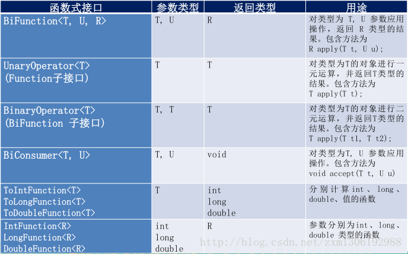
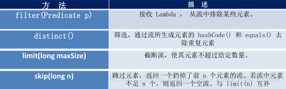
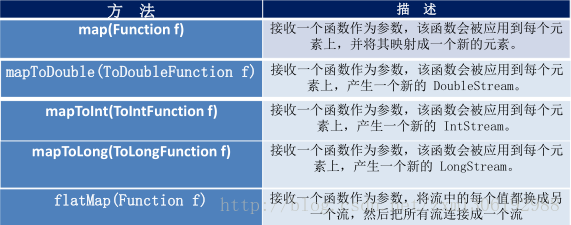
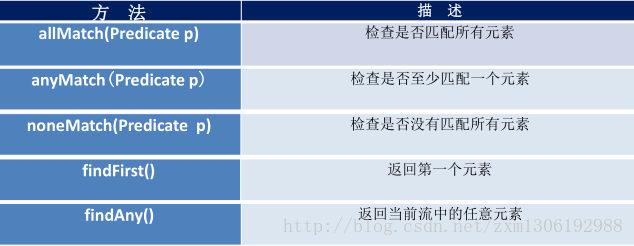
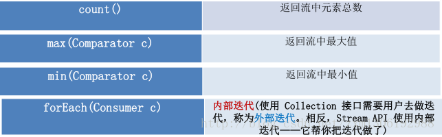
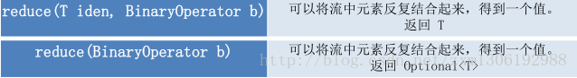
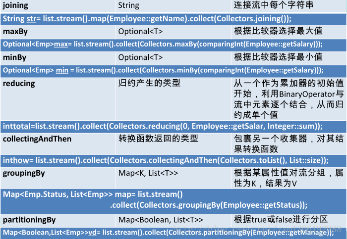
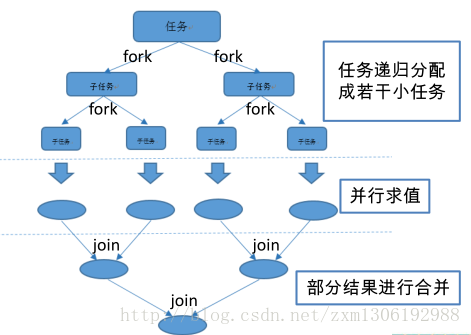
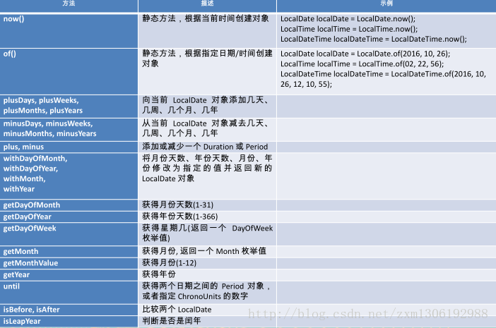
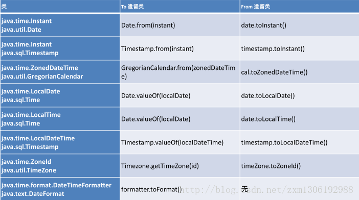

转自：https://blog.csdn.net/zxm1306192988/article/details/73744378

# Java8新特性-尚硅谷学习笔记

[toc]


2014年3月发布
公司往往不是追求技术的新，而且追求技术的稳定。所以大多用的之前的版本。

## Java 8 新特性简介

- 速度更快
    - 修改底层数据结构：如HashMap（数组-链表-红黑树），HashSet，ConcurrentHashMap（CAS算法
    - 修改垃圾回收机制：取消堆中的永久区（PremGen）->回收条件苛刻，使用元空间（MetaSpace）->直接使用物理内存->加载类文件
- 代码更少（增加了新的语法Lambda表达式）
- 强大的Stream API
- 便于并行
- 最大化减少空指针异常 Optional容器类
## 1 Lambda表达式

Lambda是一个匿名函数，可以把Lambda表达式理解为是一段可以传递的代码（将代码像数据一样进行传递）。可以写出更简洁、更灵活的代码。作为一种更紧凑的代码风格，使Java的语言表达能力得到了提升。

```java
public class TestLambda {

    //原来的匿名内部类
    @Test
    public void test1(){
        Comparator<Integer> com=new Comparator<Integer>(){
            @Override
            public int compare(Integer o1, Integer o2) {
                return Integer.compare(o1, o2);
            }
        };
        TreeSet<Integer> ts=new TreeSet<>(com);
    }

    //Lambda表达式
    @Test
    public void test2(){
        Comparator<Integer> com=(x,y)->Integer.compare(x,y);
        TreeSet<Integer> ts=new TreeSet<>(com);
    }

    List<Employee> employees=Arrays.asList(
            new Employee("张三",18,9496.2),
            new Employee("李四",52,2396.2),
            new Employee("王五",56,996.2),
            new Employee("赵六",8,94.2)
    );

    @Test
    public void test3(){
        //需求：获取当前公司中员工年龄大于35的员工信息
        List<Employee> emps=filterEmplyees1(employees);
        for(Employee e:emps){
            System.out.println(e);
        }
        System.out.println("---------------------");

        //需求：获取当前公司中员工工资大于2000的员工信息
        List<Employee> emps2=filterEmplyees2(employees);
        for(Employee e:emps2){
            System.out.println(e);
        }
    }

    public List<Employee> filterEmplyees1(List<Employee> list){
        List<Employee> emps=new ArrayList<Employee>();
        for (Employee emp : list) {
            if(emp.getAge()>=35){
                emps.add(emp);
            }
        }
        return emps;
    }

    public List<Employee> filterEmplyees2(List<Employee> list){
        List<Employee> emps=new ArrayList<Employee>();
        for (Employee emp : list) {
            if(emp.getSalary()>=2000){
                emps.add(emp);
            }
        }
        return emps;
    }

    @Test
    public void test4(){
        List<Employee> emps=filterEmplyees(employees,new FilterEmployeeByAge());
        for(Employee e:emps){
            System.out.println(e);
        }
        System.out.println("---------------------");
        List<Employee> emps2=filterEmplyees(employees,new FilterEmployeeBySalary());
        for(Employee e:emps2){
            System.out.println(e);
        }
    }

    //优化方式一：策略设计模式
    public List<Employee> filterEmplyees(List<Employee> list,MyPredicate<Employee> myPredicate){
        List<Employee> emps=new ArrayList<Employee>();
        for (Employee emp : list) {
            if(myPredicate.test(emp)){
                emps.add(emp);
            }
        }
        return emps;
    }

    //优化方式二：匿名内部类
    @Test
    public void test5(){
        List<Employee> list=filterEmplyees(employees, new MyPredicate<Employee>() {
            @Override
            public boolean test(Employee t) {
                return t.getSalary()>=2000;
            }
        });

        for (Employee employee : list) {
            System.out.println(employee);
        }
    }

    //优化方式三：Lambda表达式
    @Test
    public void test6(){
        List<Employee> list=filterEmplyees(employees, (e)->e.getSalary()>=2000);
        list.forEach(System.out::println);
    }

    //优化方式四：stream API
    @Test
    public void test7(){
        employees.stream()
                 .filter((e)->e.getSalary()>=2000)
                 .forEach(System.out::println);

        System.out.println("------------------");

        employees.stream()
                 .map(Employee::getName)
                 .forEach(System.out::println);
    }
}
```

**MyPredicate.java**

```java
public interface MyPredicate<T> {
    public boolean test(T t);
}
```

**FilterEmployeeBySalary.java**

```java
public class FilterEmployeeBySalary implements MyPredicate<Employee>{
    @Override
    public boolean test(Employee t) {
        return t.getSalary()>=2000;
    }
}
```


### Lambda表达式的基础语法

Java8中引入了一个新的操作符”->” 该操作符称为箭头操作符或Lambda操作符，箭头操作符将Lambda表达式拆分成两部分：
左侧：Lambda 表达式的**参数列表**
右侧：Lambda 表达式中所需执行的功能，即** Lambda 体**

语法格式一：无参数，无返回值
()->System.out.println(“Hello Lambda!”);

```java
    @Test
    public void test1(){
        //通过匿名内部类的方式实现接口
        Runnable r=new Runnable() {
            @Override
            public void run() {
                System.out.println("Hello World!");
            }
        };
        r.run();

        System.out.println("----------------------");
        //匿名内部类用代替匿名内部类
        Runnable r1=()->System.out.println("Hello Lambda!");
        r1.run();
    }
```

语法格式二：有一个参数，并且无返回值
(x)->System.out.println(x);

```java
@Test
public void test2(){
    Consumer<String> con=(x)->System.out.println(x);//对Consumer接口中有一个参数的accept方法的实现
    con.accept("啦啦啦");
}
```

语法格式三：若只有一个参数，小括号可以不写
x->System.out.println(x);

语法格式四：有两个以上的参数，有返回值，并且Lambda体中有多条语句

```java
@Test
public void test3(){
    Comparator<Integer> com=(x,y)->{
        System.out.println("函数式接口");
        return Integer.compare(x, y);
    };
}
```

语法格式五：若Lambda体中只有一条语句，大括号和 return 都可以省略不写

```java
@Test
public void test4(){
    Comparator<Integer> com=(x,y)->Integer.compare(x, y);
}
```

语法格式六：Lambda表达式的参数列表的数据类型可以省略不写，因为JVM编译器通过上下文推断出，数据类型，即“类型推断”
(Integer x,Integer y)->Integer.compare(x,y);

```java
左右遇一括号省
左侧推断类型省
```


### Lambda表达式需要“函数式接口”的支持

只包含一个抽象方法的接口，称为 函数式接口。

你可以通过 Lambda 表达式来创建该接口的对象。（若 Lambda表达式抛出一个受检异常，那么该异常需要在目标接口的抽象方法上进行声明）。

我们可以在任意函数式接口上使用 @FunctionalInterface 注解，这样做可以检查它是否是一个函数式接口，同时 javadoc 也会包含一条声明，说明这个接口是一个函数式接口。

作为参数传递 Lambda 表达式：为了将 Lambda 表达式作为参数传递，接收 Lambda 表达式的参数类型必须是与该 Lambda 表达式兼容的函数式接口的类型。

**MyFun.java**

```java
@FunctionalInterface
public interface MyFun {
    public Integer getValue(Integer num);
}
```


```java
//需求：对一个数进行运算
@Test
public void  test6(){
    Integer num=operation(100, (x)->x*x);
    System.out.println(num);

    System.out.println(operation(200, (y)->y+200));
}

public Integer operation(Integer num,MyFun mf){
    return mf.getValue(num);
}
```
练习：调用Collections.sort()方法，通过定制排序比较两个Employee(先按年龄比，年龄相同按姓名比)，使用Lambda作为参数传递

```java
    List<Employee> employees=Arrays.asList(
            new Employee("张三",18,9496.2),
            new Employee("李四",52,2396.2),
            new Employee("王五",56,996.2),
            new Employee("赵六",8,94.2)
    );

    @Test
    public void test1(){
         Collections.sort(employees, (e1,e2)->{
             if(e1.getAge()==e2.getAge()){
                 return e1.getName().compareTo(e2.getName());
             }else{
                 return Integer.compare(e1.getAge(), e2.getAge());
             }
         });

         for (Employee employee : employees) {
            System.out.println(employee);
        }
    }
```

为了免去用户每次使用Lambda表达式时，都自行创建函数式接口，Java提供了4大核心内置 函数式接口

```java
/**
 * 
 * java内置四大函数式接口
 * 
 * Consumer<T> :消费型接口
 *          void accept(T t);
 * 
 * Supplier<T> :供给型接口
 *          T get();
 * 
 * Function<T,R> :函数型接口
 *          R apply(T t);
 * 
 * Predicate<T> :断言型接口
 *          boolean test(T t);
 *
 */
public class TestLambda3 {

    //Consumer<T> 消费型接口：
    @Test
    public void test1(){
        happy(1000,(m) ->System.out.println("喜欢大宝剑，消费："+m+"元"));
    }
    public void happy(double money,Consumer<Double> con){
        con.accept(money);
    }

    //Supplier<T> 供给型接口:
    //需求：产生指定个数的整数，并放入集合中
    @Test
    public void test2(){
        List<Integer> numList=getNumList(10, ()->(int)(Math.random()*100));
        for (Integer num : numList) {
            System.out.println(num);
        }
    }
    public List<Integer> getNumList(int num,Supplier<Integer> sup){
        List<Integer> list=new ArrayList<>();
        for (int i = 0; i < num; i++) {
            Integer n=sup.get();
            list.add(n);
        }
        return list;
    }

    //Function<T,R> 函数型接口:
    @Test
    public void test3(){
        String newStr=strHandler("\t\t\t 啦啦啦德玛西亚  ", (str)->str.trim());
        System.out.println(newStr);

        String subStr=strHandler("无与伦比，为杰沉沦", (str)->str.substring(5,9));
        System.out.println(subStr);
    }
    //需求：处理字符串
    public String strHandler(String str,Function<String,String> fun){
        return fun.apply(str);
    }

    //Predicate<T> 断言型接口：
    @Test
    public void test4(){
        List<String> list=Arrays.asList("Hello","jj","Lambda","www","ok");
        List<String> strList=filterStr(list, (s)->s.length()>3);
        for (String string : strList) {
            System.out.println(string);
        }
    }
    //需求：将满足条件的字符串，放入集合中
    public List<String> filterStr(List<String> list,Predicate<String> pre){
        List<String> strList=new ArrayList<>();
        for ( String str : list) {
            if(pre.test(str)){
                strList.add(str);
            }
        }
        return strList;
    }
}
```

其他接口： 

  


### 方法引用与构造器引用

```java
/*
 * 一、方法引用：若Lambda体中的内容有方法已经实现了，我们可以使用“方法引用”（可以理解为方法引用时Lambda表达式的另一种表现形式）
 * 
 * 主要有三种语法格式：
 * 对象::实例方法名
 * 类::静态方法名
 * 类::实例方法名
 * 
 * 注意：
 * 1、Lambda体中调用方法的参数列表与返回值类型，要与函数式接口中抽象方法的函数列表和返回值类型保持一致！
 * 2、若Lambda参数列表中的第一个参数是 实例方法的调用者，而第二个参数是实例方法的参数时，可以使用ClassName::method
 * 
 * 
 * 二、构造器引用:
 * 格式：
 * ClassName::new
 * 
 * 注意：需要调用的构造器的参数列表要与函数式接口中抽象方法的参数列表保持一致！
 * 
 * 
 * 三：数组引用：
 *  Type::new;
 *  
 */
public class TestMethodRef { 

    //对象::实例方法名
    @Test
    public void test1(){
        PrintStream ps1=System.out;
        Consumer<String> con=(x)->ps1.println(x);//生成了一个实现了Consumer接口的类的对象

        PrintStream ps=System.out;
        Consumer<String> con1=ps::println;//相当于上面，引用了ps对象的println()方法

        Consumer<String> con2=System.out::println;
        con2.accept("abcdef");
    }

    @Test
    public void test2(){
        final Employee emp=new Employee();
        Supplier<String> sup=()->emp.getName();//代替匿名内部类
        String str=sup.get();
        System.out.println(str);

        Supplier<Integer> sup2=emp::getAge;
        Integer num=sup2.get();
        System.out.println(num);
    }

    //类::静态方法名
    @Test
    public void test3(){
        Comparator<Integer> com=(x,y)->Integer.compare(x,y);
        Comparator<Integer> com1=Integer::compare;
    }

    //类::实例方法名
    @Test
    public void test4(){
        BiPredicate<String,String> bp=(x,y)->x.equals(y);
        BiPredicate<String, String> bp2=String::equals;
    }


    //构造器引用
    @Test
    public void test5(){
        Supplier<Employee> sup=()->new Employee();

        //构造器引用方式
        Supplier<Employee> sup2=Employee::new;//使用无参构造器
        Employee emp=sup2.get();
        System.out.println(emp);

        Function<Integer,Employee> fun2=(x)->new Employee(x);
        Employee emp2=fun2.apply(101);
        System.out.println(emp2);

        BiFunction<String,Integer,Employee> bf=Employee::new;
    }

    //数组引用
    @Test
    public void test6(){
        Function<Integer,String[]> fun=(x)->new String[x];
        String[] strs=fun.apply(10);
        System.out.println(strs.length);

        Function<Integer,String[]> fun2=String[]::new;
        String[] str2=fun2.apply(20);
        System.out.println(str2.length);
    }
}
```

## 2 强大的 Stream API

位于包： java.util.stream .*

Stream 是 Java8 中处理集合的关键抽象概念，它可以指定你希望对集合进行的操作，可以执行非常复杂的查找、过滤和映射数据等操作。使用Stream API 对集合数据进行操作，就类似于使用 SQL 执行的数据库查询。也可以使用 Stream API 来并行执行操作。简而言之，Stream API 提供了一种高效且易于使用的处理数据的方式。

### 什么是 Stream
流 (Stream) 到底是什么呢 ？
是数据渠道，用于操作数据源（集合、数组等）所生成的元素序列。“集合讲的是数据，流讲的是计算！ ”

注意：
①Stream 自己不会存储元素。
②Stream 不会改变源对象。相反，他们会返回一个持有结果的新Stream。
③Stream 操作是延迟执行的。这意味着他们会等到需要结果的时候才执行。

### Stream的操作三步骤

- 创建Stream
    一个数据源（如：集合、数组），获取一个流
    
- 中间操作
    一个中间操作链，对数据源的数据进行处理
    
- 终止操作（终端操作）
    一个终止操作，执行中间操作链，并产生结果

#### 创建Stream

1.可以通过Collection 系列集合提供的stream()或parallelStream()方法

- default Stream< E> stream() : 返回一个顺序流
- default Stream< E> parallelStream() : 返回一个并行流

2.通过 Arrays 中的静态方法stream()获取数组流

- static < T> Stream< T> stream(T[] array): 返回一个流
  
    重载形式，能够处理对应基本类型的数组：
- public static IntStream stream(int[] array)
- public static LongStream stream(long[] array)
- public static DoubleStream stream(double[] array)

3.通过Stream 类中的静态方法of()，通过显示值创建一个流。它可以接收任意数量的参数。

- public static< T> Stream< T> of(T… values) : 返回一个流

4.创建无限流
可以使用静态方法 Stream.iterate() 和Stream.generate(), 创建无限流。

- 迭代
    public static< T> Stream< T> iterate(final T seed, final UnaryOperator< T> f)
- 生成
    public static< T> Stream< T> generate(Supplier< T> s)


```java
    //创建Stream
    @Test
    public void test1(){
        //1.可以通过Collection 系列集合提供的stream()或parallelStream()
        List<String> list = new ArrayList<>();
        Stream<String> stream1 = list.stream();

        //2.通过 Arrays 中的静态方法stream()获取数组流
        Employee[] emps=new Employee[10];
        Stream<Employee> stream2=Arrays.stream(emps);

        //3.通过Stream 类中的静态方法of()
        Stream<String> stream3=Stream.of("aa","bb","cc");

        //4.创建无限流
        //迭代
        Stream<Integer> stream4=Stream.iterate(0, (x) -> x+2);
        stream4.limit(10).forEach(System.out::println);

        //生成
        Stream.generate(() -> Math.random())
              .limit(5)
              .forEach(System.out::println);
    }
```


#### **中间操作**

多个中间操作可以连接起来形成一个流水线，除非流水线上触发终止操作，否则中间操作不会执行任何的处理！而在终止操作时一次性处理，成为“惰性求值”。

**１．筛选与切片 **
   


```java
    //中间操作

    List<Employee> employees=Arrays.asList(
            new Employee("张三",18,9999.99),
            new Employee("李四",58,5555.55),
            new Employee("王五",26,3333.33),
            new Employee("赵六",36,6666.66),
            new Employee("田七",12,8888.88),
            new Employee("田七",12,8888.88)
            );

    /*  筛选与切片
     *  filter--接收Lambda，从流中排除某些元素。
     *  limit--截断流，使其元素不超过给定数量。
     *  skip(n)--跳过元素，返回一个扔掉了前n个元素的流。若流中元素不足n个，则返回一个空流。与limit(n) 互补
     *  distinct--筛选，通过流所生成元素的 hashCode() 和 equals() 去掉重复元素
     */

    //内部迭代：迭代操作由 Stream API 完成
    @Test
    public void test1(){
        //中间操作：不会执行任何操作
        Stream<Employee> stream=employees.stream()
                                .filter((e) -> e.getAge()>35 );
        //终止操作：一次性执行全部内容，即 惰性求值
        stream.forEach(System.out::println);
    }
    //外部迭代
    @Test
    public void test2(){
        Iterator<Employee> it=employees.iterator();
        while(it.hasNext()){
            System.out.println(it.next());
        }
    }

    @Test
    public void test3(){//发现“短路”只输出了两次，说明只要找到 2 个 符合条件的就不再继续迭代
        employees.stream()
                 .filter((e)->{
                     System.out.println("短路！");
                     return e.getSalary()>5000;
                 })
                 .limit(2)
                 .forEach(System.out::println);
    }

    @Test
    public void test4(){
        employees.stream()
                 .filter((e)->e.getSalary()>5000)
                 .skip(2)//跳过前两个
                 .distinct()//去重，注意：需要Employee重写hashCode 和 equals 方法
                 .forEach(System.out::println);
    }
```


**２．映射 **
 

```java
    //中间操作
    /*
     * 映射
     * map--接收Lambda，将元素转换成其他形式或提取信息。接收一个函数作为参数，该函数会被应用到每个元素上，并将其映射成一个新元素。
     * flatMap--接收一个函数作为参数，将流中的每个值都换成另一个流，然后把所有流连接成一个流
     */
    @Test
    public void test5(){
        List<String> list=Arrays.asList("aaa","bbb","ccc","ddd");
        list.stream()
             .map((str)->str.toUpperCase())
             .forEach(System.out::println);

        System.out.println("------------------------");

        employees.stream()
                 .map(Employee::getName)
                 .forEach(System.out::println);

        System.out.println("------------------------");

        Stream<Stream<Character>> stream=list.stream()
                                             .map(TestStreamAPI2::filterChatacter);
        stream.forEach((sm)->{
            sm.forEach(System.out::println);
        });

        System.out.println("------------------------");

        Stream<Character> sm=list.stream()
                                 .flatMap(TestStreamAPI2::filterChatacter);
        sm.forEach(System.out::println);
    }

    public static Stream<Character> filterChatacter(String str){
        List<Character> list=new ArrayList<>();
        for (Character ch : str.toCharArray()) {
            list.add(ch);
        }
        return list.stream();
    }

    @Test
    public void test6(){//map和flatMap的关系  类似于 add(Object)和addAll(Collection coll)
        List<String> list=Arrays.asList("aaa","bbb","ccc","ddd");
        List list2=new ArrayList<>();
        list2.add(11);
        list2.add(22);
        list2.addAll(list);
        System.out.println(list2);
    }
```


**3．排序 **
 

```java
    //中间操作
    /*
     * 排序
     * sorted()-自然排序（按照对象类实现Comparable接口的compareTo()方法 排序）
     * sorted(Comparator com)-定制排序（Comparator）
     */
    @Test
    public void test7(){
        List<String> list=Arrays.asList("ccc","bbb","aaa");
        list.stream()
            .sorted()
            .forEach(System.out::println);

        System.out.println("------------------------");

        employees.stream()
                 .sorted((e1,e2)->{
                     if(e1.getAge().equals(e2.getAge())){
                         return e1.getName().compareTo(e2.getName());
                     }else{
                         return e1.getAge().compareTo(e2.getAge());
                     }
                 }).forEach(System.out::println); 
    }
```

#### **终止操作**

终止操作会从流水线生成结果。其结果可以是任何不是流的值，例如：List、Integer，甚至是void。

**１．查找与匹配 **
  


 

```java
    List<Employee> employees=Arrays.asList(
            new Employee("张三",18,9999.99,Status.FREE),
            new Employee("李四",58,5555.55,Status.BUSY),
            new Employee("王五",26,3333.33,Status.VOCATION),
            new Employee("赵六",36,6666.66,Status.FREE),
            new Employee("田七",12,8888.88,Status.BUSY)
            );
    /*
     * 查找与匹配
     * 
     */

    @Test
    public void test1(){
        boolean b1=employees.stream()//allMatch-检查是否匹配所有元素
                            .allMatch((e)->e.getStatus().equals(Status.BUSY));
        System.out.println(b1);//false

        boolean b2=employees.stream()//anyMatch-检查是否至少匹配一个元素
                            .anyMatch((e)->e.getStatus().equals(Status.BUSY));
        System.out.println(b2);//true

        boolean b3=employees.stream()//noneMatch-检查是否没有匹配所有元素
                            .noneMatch((e)->e.getStatus().equals(Status.BUSY));
        System.out.println(b3);//false

        Optional<Employee> op=employees.stream()//findFirst-返回第一个元素//Optional是Java8中避免空指针异常的容器类
                 .sorted((e1,e2)->Double.compare(e1.getSalary(), e2.getSalary()))
                 .findFirst();
        System.out.println(op.get());//Employee [name=王五, age=26, salary=3333.33, Status=VOCATION]

        Optional<Employee> op2=employees.parallelStream()//findAny-返回当前流中的任意元素
                                        .filter((e)->e.getStatus().equals(Status.FREE))
                                        .findAny();
        System.out.println(op2.get());//Employee [name=赵六, age=36, salary=6666.66, Status=FREE]

        Long count=employees.stream()//count-返回流中元素的总个数
                            .count();
        System.out.println(count);//5

        Optional<Employee> op3=employees.stream()//max-返回流中最大值
                                        .max((e1,e2)->Double.compare(e1.getSalary(), e2.getSalary()));
        System.out.println(op3.get());//Employee [name=张三, age=18, salary=9999.99, Status=FREE]

        Optional<Double> op4=employees.stream()//min-返回流中最小值
                                      .map(Employee::getSalary)
                                      .min(Double::compare);
        System.out.println(op4.get());//3333.33
    }
```


**2．归约 **
  
 备注：map和reduce的连接通常称为map-reduce 模式，因google用它来进行网络搜索而出名。

```java
    /*
     * 归约
     * reduce(T identity,BinaryOperator b) / reduce(BinaryOperator b)-可以将流中元素反复结合起来，得到一个值。
     */
    @Test
    public void test3(){
        List<Integer> list=Arrays.asList(1,2,3,4,5,6,7,8,9,10);
        Integer sum=list.stream()//reduce(T identity,BinaryOperator b)
                        .reduce(0, (x,y)->x+y);//0为起始值
        System.out.println(sum);

        System.out.println("--------------------------");

        Optional<Double> op=employees.stream()//reduce(BinaryOperator b)//没有起始值，map返回可能为空，所以返回Optional类型
                                     .map(Employee::getSalary)
                                     .reduce(Double::sum);
        System.out.println(op.get());
    }
```


**3．收集 **
 

Collector接口中方法的实现决定了如何对流执行收集操作（如收集到List、Set、Map）。但是Collectors实用类提供了很多静态方法，可以方便地创建常见收集器实例，具体方法与实例如下表：

 
 

```java
    /*
     * 收集
     * collect-将流转换为其他形式，接收一个Collector接口的实现，用于给Stream中元素做汇总的方法。
     */
    @Test
    public void test4(){
        List<String> list=employees.stream()
                                   .map(Employee::getName)
                                   .collect(Collectors.toList());
        list.forEach(System.out::println);

        System.out.println("----------------------------");

        Set<String> set=employees.stream()
                                 .map(Employee::getName)
                                 .collect(Collectors.toSet());
        set.forEach(System.out::println);

        System.out.println("----------------------------");

        HashSet<String> hs=employees.stream()
                                    .map(Employee::getName)
                                    .collect(Collectors.toCollection(HashSet::new));
        hs.forEach(System.out::println);

        System.out.println("----------------------------");

        //总和
        Long count=employees.stream()
                            .collect(Collectors.counting());
        System.out.println(count);

        //平均值
        Double avg=employees.stream()
                            .collect(Collectors.averagingDouble(Employee::getSalary));
        System.out.println(avg);

        //总和
        Double sum=employees.stream()
                            .collect(Collectors.summingDouble(Employee::getSalary));
        System.out.println(sum);

        //最大值
        Optional<Employee> max=employees.stream()
                                        .collect(Collectors.maxBy((e1,e2)->Double.compare(e1.getSalary(), e2.getSalary())));
        System.out.println(max.get());

        //最小值
        Optional<Double> min=employees.stream()
                                      .map(Employee::getSalary)
                                      .collect(Collectors.minBy(Double::compare));
        System.out.println(min.get());

        System.out.println("----------------------------");

        //分组
        Map<Status,List<Employee>> map=employees.stream()
                                                .collect(Collectors.groupingBy(Employee::getStatus));
        System.out.println(map);//{FREE=[Employee [name=张三, age=18, salary=9999.99, Status=FREE], Employee [name=赵六, age=36, salary=6666.66, Status=FREE]], VOCATION=[Employee [name=王五, age=26, salary=3333.33, Status=VOCATION]], BUSY=[Employee [name=李四, age=58, salary=5555.55, Status=BUSY], Employee [name=田七, age=12, salary=8888.88, Status=BUSY]]}

        //多级分组
        Map<Status,Map<String,List<Employee>>> map2=employees.stream()
                                                            .collect( Collectors.groupingBy( Employee::getStatus,Collectors.groupingBy((e)->{
                                                                if(e.getAge()<=35){
                                                                    return "青年";
                                                                }else if(e.getAge()<=50){
                                                                    return "中年";
                                                                }else{
                                                                    return "老年";
                                                                }
                                                            }) ) );
        System.out.println(map2);//{FREE={青年=[Employee [name=张三, age=18, salary=9999.99, Status=FREE]], 中年=[Employee [name=赵六, age=36, salary=6666.66, Status=FREE]]}, VOCATION={青年=[Employee [name=王五, age=26, salary=3333.33, Status=VOCATION]]}, BUSY={青年=[Employee [name=田七, age=12, salary=8888.88, Status=BUSY]], 老年=[Employee [name=李四, age=58, salary=5555.55, Status=BUSY]]}}

        //分区
        Map<Boolean,List<Employee>> map3=employees.stream()
                                                 .collect(Collectors.partitioningBy((e)->e.getSalary()>8000));
        System.out.println(map3);//{false=[Employee [name=李四, age=58, salary=5555.55, Status=BUSY], Employee [name=王五, age=26, salary=3333.33, Status=VOCATION], Employee [name=赵六, age=36, salary=6666.66, Status=FREE]], true=[Employee [name=张三, age=18, salary=9999.99, Status=FREE], Employee [name=田七, age=12, salary=8888.88, Status=BUSY]]}

        System.out.println("--------------------------------");

        DoubleSummaryStatistics dss=employees.stream()
                                             .collect(Collectors.summarizingDouble(Employee::getSalary));
        System.out.println(dss.getSum());
        System.out.println(dss.getAverage());
        System.out.println(dss.getMax());

        System.out.println("--------------------------------");
        String strr=employees.stream()
                             .map(Employee::getName)
                             .collect(Collectors.joining(","));
        System.out.println(strr);//张三李四王五赵六田七
     }
```


### Stream练习

```java
public class TestTransaction {
    List<Transaction> transaction=null;

    @Before
    public void before(){
        Trader raoul=new Trader("Raoul","Cambridge");
        Trader mario=new Trader("Mario","Milan");
        Trader alan=new Trader("Alan","Cambridge");
        Trader brian=new Trader("Brian","Cambridge");

        transaction=Arrays.asList(
                new Transaction(brian, 2011, 300),
                new Transaction(raoul, 2012, 1000),
                new Transaction(raoul, 2011, 400),
                new Transaction(mario, 2012, 710),
                new Transaction(mario, 2012, 700),
                new Transaction(alan, 2012, 950)
        );
    }

    //1.找出2011年发生的所有交易，并按交易额排序(从低到高)
    @Test
    public void test1(){
        transaction.stream()
                   .filter((e)->e.getYear()==2011)
                   .sorted((e1,e2)->Integer.compare(e1.getValue(), e2.getValue()))
                   .forEach(System.out::println);
    }

    //2.交易员都在哪些不同的城市工作过？
    @Test
    public void test2(){
        transaction.stream()
                   .map((e)->e.getTrader().getCity())
                   .distinct()//去重
                   .forEach(System.out::println);
    }

    //3.查找所有来自剑桥的交易员，并按姓名排序
    @Test
    public void test3(){
        transaction.stream()
                   .filter((e)->e.getTrader().getCity().equals("Cambridge"))
                   .map(Transaction::getTrader)
                   .sorted((e1,e2)->e1.getName().compareTo(e2.getName()))
                   .distinct()
                   .forEach(System.out::println);
    }

    //4.返回所有交易员的姓名字符串，按字母顺序排序
    @Test
    public void test4(){
        transaction.stream()
                   .map(Transaction::getTrader)
                   .map(Trader::getName)
                   .distinct()
                   .sorted()
                   .forEach(System.out::println);

        System.out.println("-------------------------");

        String str=transaction.stream()
                              .map((e)->e.getTrader().getName())
                              .distinct()
                              .sorted()
                              .reduce("", String::concat);
        System.out.println(str);//AlanBrianMarioRaoul

        System.out.println("-------------------------");

         transaction.stream()
                    .map((t)->t.getTrader().getName())
                    .flatMap(TestTransaction::filterCharacter)//返回的每个String合成一个流
                    .sorted((s1,s2)->s1.compareToIgnoreCase(s2))
                    .forEach(System.out::print);//aaaaaAaBiiilllMMnnoooorRRrruu
    }
    public static Stream<String> filterCharacter(String str){
        List<String> list=new ArrayList<>();
        for(Character ch:str.toCharArray()){
            list.add(ch.toString());
        }
        return list.stream();
    }

    //5.有没有交易员是在米兰工作的？
    @Test
    public void test5(){
        boolean b1=transaction.stream()
                              .anyMatch((t)->t.getTrader().getCity().equals("Milan"));
        System.out.println(b1);
    }

    //6.打印生活在剑桥的交易员的所有交易额
    @Test
    public void test6(){
        Optional<Integer> sum=transaction.stream()
                                         .filter((e)->e.getTrader().getCity().equals("Cambridge"))
                                         .map(Transaction::getValue)
                                         .reduce(Integer::sum);
        System.out.println(sum.get());
    }

    //7.所有交易中，最高的交易额是多少
    @Test
    public void test7(){
        Optional<Integer> max=transaction.stream()
                                         .map((t)->t.getValue())
                                         .max(Integer::compare);
        System.out.println(max.get());
    }

    //8.找到交易额最小的交易
    @Test
    public void test8(){
        Optional<Transaction> op=transaction.stream()
                                            .min((t1,t2)->Integer.compare(t1.getValue(), t2.getValue()));
        System.out.println(op.get());
    }
}
```


### 并行流与串行流

并行流就是把一个内容分成多个数据块，并用不同的线程分别处理每个数据块的流。

Java 8 中将并行进行了优化，我们可以很容易的对数据进行并行操作。Stream API 可以声明性地通过 parallel（） 与 sequential（） 在并行流与顺序流之间进行切换。

### 了解 Fork/Join 框架

Fork/Join 框架：就是在必要的情况下，将一个大任务，进形拆分（fork）成若干个小任务（拆到不可再拆时），再将一个个的小任务运行的结果进行join汇总。




Fork/Join 框架与传统线程池的区别：

采用“工作窃取”模式(work-stealing):
当执行新的任务时，它可以将其拆分成更小的任务执行，并将小任务加到线程队列中，然后再从一个随机线程的队列中偷一个并把它放在自己的队列中。

相对于一般的线程池实现,fork/join框架的优势体现在对其中包含的任务的处理方式上.在一般的线程池中,如果一个线程正在执行的任务由于某些原因无法继续运行,那么该线程会处于等待状态.而在fork/join框架实现中,如果某个子问题由于等待另外一个子问题的完成而无法继续运行.那么处理该子问题的线程会主动寻找其他尚未运行的子问题来执行.这种方式减少了线程的等待时间,提高了性能。

```java
public class ForkJoinCalculate extends RecursiveTask<Long>{

    private static final long serialVersionUID = 1234567890L;//序列号

    private long start;
    private long end;
    private static final long THRESHOLD=10000L;//临界值

    public ForkJoinCalculate(long start,long end) {
        this.start=start;
        this.end=end;
    }
    @Override
    protected Long compute() {
        long length=end-start;
        if(length<=THRESHOLD){
            long sum=0;
            for(long i=start;i<=end;i++){
                sum+=i;
            }
            return sum;
        }else{
            long middle=(start+end)/2;
            ForkJoinCalculate left=new ForkJoinCalculate(start, middle);
            left.fork();

            ForkJoinCalculate right=new ForkJoinCalculate(middle+1, end);
            right.fork();

            return left.join()+right.join();
        }
    }

}
```


```java
public class TestForkJoin {

    @Test
    public void test1(){
        Instant start=Instant.now();

        ForkJoinPool pool=new ForkJoinPool();
        ForkJoinTask<Long> task=new ForkJoinCalculate(0L, 10000000000L);
        long sum=pool.invoke(task);
        System.out.println(sum);

        Instant end=Instant.now();
        System.out.println("消耗时间"+Duration.between(start, end).toMillis()+"ms");//消耗时间3409ms
    }

    @Test//直接使用java8的并行流
    public void test2(){
        Instant start=Instant.now();

        Long sum=LongStream.rangeClosed(0L, 10000000000L)
                           .parallel()
                           .reduce(0,Long::sum);
        System.out.println(sum);

        Instant end=Instant.now();
        System.out.println("消耗时间"+Duration.between(start, end).toMillis()+"ms");//消耗时间2418ms
    }
}
```


## 3 Optional类

Optional< T>类(java.util.Optional) 是一个容器类，代表一个值存在或不存在。
原来用null表示一个值不存在，现在 Optional可以更好的表达这个概念。并且可以避免空指针异常。

常用方法：

>Optional.of(T t) : 创建一个 Optional 实例
Optional.empty() : 创建一个空的 Optional 实例
Optional.ofNullable(T t):若 t 不为 null,创建 Optional 实例,否则创建空实例
isPresent() : 判断是否包含值
orElse(T t) : 如果调用对象包含值，返回该值，否则返回t
orElseGet(Supplier s) :如果调用对象包含值，返回该值，否则返回 s 获取的值
map(Function f): 如果有值对其处理，并返回处理后的Optional，否则返回 Optional.empty()
flatMap(Function mapper):与 map 类似，要求返回值必须是Optional


```java
    @Test
    public void test5(){
        Man man=new Man();
        String name=getGodnessName(man);
        System.out.println(name);
    }
    //需求：获取一个男人心中女神的名字
    public String getGodnessName(Man man){
        if(man!=null){
            Godness g=man.getGod();
            if(g!=null){
                return g.getName();
            }
        }
        return "苍老师";
    }

    //运用Optional的实体类
    @Test
    public void test6(){
        Optional<Godness> godness=Optional.ofNullable(new Godness("林志玲"));
        Optional<NewMan> op=Optional.ofNullable(new NewMan(godness));
        String name=getGodnessName2(op);
        System.out.println(name);
    }

    public String getGodnessName2(Optional<NewMan> man){
        return man.orElse(new NewMan())
                  .getGodness()
                  .orElse(new Godness("苍老师"))
                  .getName();
    }
```


```java
//注意：Optional 不能被序列化
public class NewMan {

    private Optional<Godness> godness = Optional.empty();

    private Godness god;

    public Optional<Godness> getGod(){
        return Optional.of(god);
    }

    public NewMan() {
    }

    public NewMan(Optional<Godness> godness) {
        this.godness = godness;
    }

    public Optional<Godness> getGodness() {
        return godness;
    }

    public void setGodness(Optional<Godness> godness) {
        this.godness = godness;
    }

    @Override
    public String toString() {
        return "NewMan [godness=" + godness + "]";
    }

}
```


## 4 接口中的默认方法与静态方法

以前接口类中只允许有全局静态常量和抽象方法

1、Java8中允许接口中包含具有具体实现的方法，该方法称为“默认方法”，默认方法使用 default 关键字修饰。

接口默认方法的“类优先”原则：

若一个接口中定义了一个默认方法，而另一个父类或接口中又定义了一个同名的方法时

- 选择父类中的方法。如果一个父类提供了具体的实现，那么接口中具有相同名称和参数的默认方法会被忽略。
- 接口冲突。如果一个父接口提供一个默认方法，而另一个接口也提供了一个具有相同名称和参数列表的方法（不管方法是否是默认方法），那么必须覆盖该方法来解决冲突。


```java
interface MyFunc{
    default String getName(){
        return "hahaha";
    }
}

interface Named{
    default String getName(){
        return "hehehe";
    }
}

class MyClass implements MyFunc,Named{
    public String getName(){
        return Named.super.getName();
    }
}
```

2、Java8 中，接口中允许添加静态方法。

------

## 5 重复注解与类型注解

Java8 对注解处理提供了两点改进：可重复的注解及可用于类型的注解。

```java
@Target({TYPE, FIELD, METHOD, PARAMETER, CONSTRUCTOR, LOCAL_VARIABLE})//可以修饰的目标
@Retention(RetentionPolicy.RUNTIME)//生命周期
public @interface MyAnnotations {
    MyAnnotation[] value();
}
```


```java
@Repeatable(MyAnnotations.class)
@Target({TYPE, FIELD, METHOD, PARAMETER, CONSTRUCTOR, LOCAL_VARIABLE,TYPE_PARAMETER})//可以修饰的目标
@Retention(RetentionPolicy.RUNTIME)//生命周期
public @interface MyAnnotation {
    String value() default "atguigu";
}
```


```java
public class TestAnnotation {

    //checker framework框架提供此注解
    private /*@NonNull*/ Object obj=null;

    @Test
    public void test1() throws NoSuchMethodException, SecurityException{
        Class<TestAnnotation> clazz=TestAnnotation.class;
        Method m1=clazz.getMethod("show");
        MyAnnotation[] mas=m1.getAnnotationsByType(MyAnnotation.class);
        for(MyAnnotation myAnnotation:mas){
            System.out.println(myAnnotation.value());
        }
    }

    @MyAnnotation("Hello")
    @MyAnnotation("world")
    public void show(@MyAnnotation("abc")String str){

    }
}
```


## 6 新时间日期API

以前的时间API是线程不安全的，是可变的

多线程对日期进行处理要加锁

LocalDate、LocalTime、LocalDateTime 类的实例是不可变的对象，分别表示使用 ISO-8601日历系统的日期、时间、日期和时间。它们提供了简单的日期或时间，并不包含当前的时间信息。也不包含与时区相关的信息。
这里写图片描述

. 

```java
    //1.LocalDate    LocalTime   LocalDateTime  用法一样,用于让人读的时间日期
    @Test 
    public void test1(){
        LocalDateTime ldt=LocalDateTime.now();//获取当前日期时间
        System.out.println(ldt);

        LocalDateTime ldt2=LocalDateTime.of(2015,10,19,13,22,33);//指定一个日期时间
        System.out.println(ldt2);

        LocalDateTime ldt3=ldt.plusYears(2);//加2年
        System.out.println(ldt3);

        LocalDateTime ldt4=ldt.minusMonths(2);//减2个月
        System.out.println(ldt4);

        System.out.println(ldt.getYear());
        System.out.println(ldt.getMonthValue());
        System.out.println(ldt.getDayOfMonth());
        System.out.println(ldt.getHour());
        System.out.println(ldt.getMinute());
        System.out.println(ldt.getSecond());
    }

    //2.Instant:时间戳（以Unix元年： 1970年1月1日00:00:00到某个时间之间的毫秒值）
    @Test
    public void test2(){
        Instant ins1=Instant.now();//默认获取UTC时区的时间
        System.out.println(ins1);

        OffsetDateTime odt=ins1.atOffset(ZoneOffset.ofHours(8));//获取偏移日期时间，加8小时偏移
        System.out.println(odt);

        System.out.println(ins1.toEpochMilli());//获取与Unix元年间隔毫秒数

         Instant ins2=Instant.ofEpochSecond(60);//较Unix元年加60秒
         System.out.println(ins2);//1970-01-01T00:01:00Z
    }

    //3.Duration:计算两个时间之间的间隔，Period：计算两个日期之间的间隔
    @Test
    public void test3(){
        Instant ins1=Instant.now();
        try {
            Thread.sleep(1000);
        } catch (InterruptedException e) {
        }
        Instant ins2=Instant.now();
        Duration duration=Duration.between(ins1, ins2);
        System.out.println(duration.toMillis());//1000

        System.out.println("------------------------------");

        LocalTime lt1=LocalTime.now();
        try {
            Thread.sleep(1000);
        } catch (InterruptedException e) {
        }
        LocalTime lt2=LocalTime.now();
        System.out.println(Duration.between(lt1, lt2).toMillis());//1001

        System.out.println("------------------------------");

        LocalDate ld1=LocalDate.of(2015, 1, 1);
        LocalDate ld2=LocalDate.now();
        Period period=Period.between(ld1, ld2);
        System.out.println(period.getYears());//2
        System.out.println(period.getMonths());//6
        System.out.println(period.getDays());//19
    }
```


```java
    //TemporalAdjuster:时间校验器
    @Test
    public void test5(){
        LocalDateTime ldt=LocalDateTime.now();
        System.out.println(ldt);//2017-07-20T19:28:57.822

        LocalDateTime ldt2=ldt.withDayOfMonth(10);
        System.out.println(ldt2);//2017-07-10T19:28:57.822

        LocalDateTime ldt3=ldt.with(TemporalAdjusters.next(DayOfWeek.SUNDAY));//调整为下个周日
        System.out.println(ldt3);//2017-07-23T19:31:39.479

        //自定义：下一个工作日
        LocalDateTime ldt5=ldt.with((l)->{
            LocalDateTime ldt4=(LocalDateTime)l;
            DayOfWeek dow=ldt4.getDayOfWeek();//获取当前星期
            if(dow.equals(DayOfWeek.FRIDAY)){//如果是周5，下个工作日即加3天
                return ldt4.plusDays(3);
            }else if(dow.equals(DayOfWeek.SATURDAY)){//如果是周6，下个工作日即加2天
                return ldt4.plusDays(2);
            }else{
                return ldt4.plusDays(1);//其他，下个工作日即为明天
            }
        });
        System.out.println(ldt5);//2017-07-21T19:37:05.533
    }
```


```java
    //DateTimeFormatter:格式化时间/日期
    @Test
    public void test6(){
        DateTimeFormatter dtf=DateTimeFormatter.ISO_DATE;
        LocalDateTime ldt=LocalDateTime.now();

        String strDate=ldt.format(dtf);
        System.out.println(strDate);

        System.out.println("------------------------");

        DateTimeFormatter dtf2=DateTimeFormatter.ofPattern("yyyy年MM月dd日 HH:mm:ss");//自定义格式化格式
        String strDate2=dtf2.format(ldt);
        System.out.println(strDate2);//2017年07月20日 19:49:53

        LocalDateTime newDate=ldt.parse(strDate2,dtf2);//以指定格式解析字符串，重新获得LocalDateTime类型
        System.out.println(newDate);//2017-07-20T19:49:53
    }
```


```java
    //ZonedDate、ZonedTime、ZonedDateTime
    @Test
    public void test7(){
        Set<String> set=ZoneId.getAvailableZoneIds();//获取支持的所有时区
        set.forEach(System.out::println);

        LocalDateTime ldt=LocalDateTime.now(ZoneId.of("Europe/Monaco"));//获取指定时区的日期时间类型
        System.out.println(ldt);//2017-07-20T14:01:23.417

        LocalDateTime ldt2=LocalDateTime.now(ZoneId.of("Europe/Monaco"));
        ZonedDateTime zdt=ldt2.atZone(ZoneId.of("Europe/Monaco"));//获取带时区的时间类型
        System.out.println(zdt);//2017-07-20T14:01:23.420+02:00[Europe/Monaco]//与UTC时间有2个小时的时差
    }
```

与传统日期处理的转换 
 . 