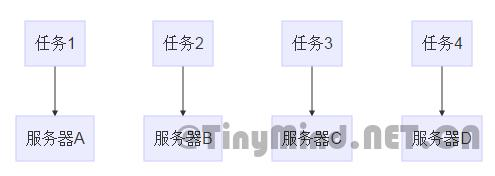
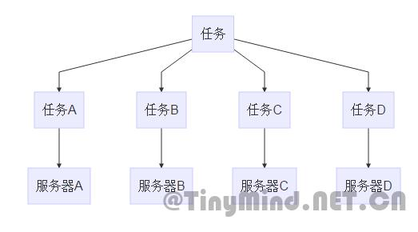
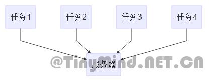
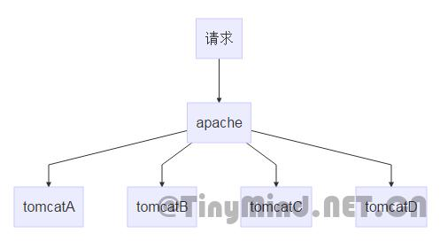

# web服务器集群是什么？分布式是什么？集中式是什么？例子缺点


文章来源：https://www.tinymind.net.cn/articles/b2c55c5e147f67

# 概述

集群和分布式都是从集中式*进化*而来的。分布式和集群会相互合作的，同时的集群和分布式。在这里重点说说集群

## 集群是什么？

集群能提高单位时间内处理的任务数量，提升服务器性能 有多台服务器去处理任务，但是**每个任务都是由一台服务器独立完成的** 



## 分布式是什么？

分布式能缩短单个任务处理的时间 跟集群一样，也有多台服务器去处理任务，但是每个任务由多台服务器**合作完成**，每台服务器负责完成大任务中的一个小任务 



## 集中式是什么？

集中式就是最传统的那种，**所有任务由一台大机完成** 



# 集群场景

可以在一台物理服务器上集群多个应用服务器，每个应用服务器独立工作。再在前端分配一个中央控制服务器，负责把发送到这台物理服务器的请求，按照一定权重分发给各个应用服务器。

## 例子

以tomcat为例子，可以采用**1\*apache+N\*tomcat**的模式 apache作为门面，在前端用**负载均衡**把请求发给各个tomcat服务器 



### 好处

通常集群32位的服务器来代替单个64位的服务器，这样能**尽量发挥出硬件的性能**

1. 在64位的程序中，由于指针膨胀以及内存对齐，会造成内存浪费。
2. 在单个64位的服务器宕机的时候，所产生的快照很大，不好分析
3. 大内存的服务器，意味着要对更大的内存区域进行垃圾收集，那么会增大GC的时间，会加长服务器的停顿

### 难点

由于http请求是无状态的，那么对于会话级别的事务，如何保持用户的状态？ 在单个服务器中，提供了session-sessionID的机制来保存用户的状态 那么现在有多台服务器，如何记录用户的状态？ 有两个大方向：

1. session粘性
2. 共享session

#### session粘性

这种方式也成为亲和式集群，给session创造粘性，意思是让**用户每次都访问的同一个应用服务器** 这样就要在前端服务器apache中记录下，用户首次访问的是哪个tomcat，将用户后面发送的请求都发送到这个tomcat上去 这样带来的后果是，各个服务器**负载不均衡**，因为只在用户首次访问的时候，采用了负载均衡分发，但是这个影响也不会那么明显

------

```javascript
worker.controller.sticky_session=true|false
worker.controller.sticky_session_force=true|false
```

这是在apache对于session粘性的配置 worker.controller.sticky_session，为true会开启session粘性机制，为false关闭 worker.controller.sticky_session_force，为true意味着即使这个服务器宕机了，也仍然发送到这个服务器，为false则会选择发送其他到其他服务器 建议选择前者为true，后者为false。这样既能达到session粘性，又能在服务器宕机的时候继续提供服务

优点：

1. 占用的内存少，因为只记录了sessionID以及对应发送的服务器

缺点：

1. 如果服务器宕机了，在这个服务器上的session信息都会丢失

#### 同步session

这种方式需要在一个地方存放session的所有信息，并且能让每个服务器节点都能访问得到这些session 这种方式大概有三种方案：

1. cookie同步
2. 数据库同步
3. 内存数据库同步

##### cookie同步

cookie同步是将session的所有信息存放在客户端，每次请求的时候，将session也发送上来 优点：

1. 不占用服务器内存
2. 服务器宕机不会丢失session信息

缺点：

1. 放在客户端，不安全
2. 受浏览器的限制，浏览器禁用cookie
3. 增大流量，变相拉低响应时间
4. session序列化和反序列都需要额外的时间

##### 数据库同步

将session信息存放在一个都能访问到的数据库 优点：

1. 服务器宕机不会丢失session信息

缺点：

1. 占用的内存大
2. 增大数据库负担
3. session序列化和反序列都需要额外的时间
4. 访问数据库会需要额外的时间

##### 内存数据库同步

将session信息存放在一个都能访问到的内存数据库中，比如redis、memcached 优点：

1. 服务器宕机不会丢失session信息
2. 访问的速度快

缺点:

1. 占用内存大
2. session序列化和反序列都需要额外的时间

#### 总结

session同步最好的是第三种，内存数据库同步 session同步的好处是不怕单个服务器宕机，但是他占用的资源、速度也比session粘性要大

## 缺点

1. 节点对共享资源的竞争，如磁盘文件
2. 节点对同一资源进行操作带来的问题，如对同一文件进行读写
3. 32位的节点受最大内存的限制
4. 节点内资源池的闲置。如连接池，可能会出现某些节点的连接池用满，某些节点还有可用连接。可以考虑配置同一资源池，集中式JNDI
5. 节点内的本地缓存重复，因为每份节点都有一份本地缓存。可以考虑采用缓存数据库统一存放缓存，如redis
6. 浪费内存，节点越多，重复加载的类越多，jvm中的方法区内容差不多，但是每个节点都有一份。